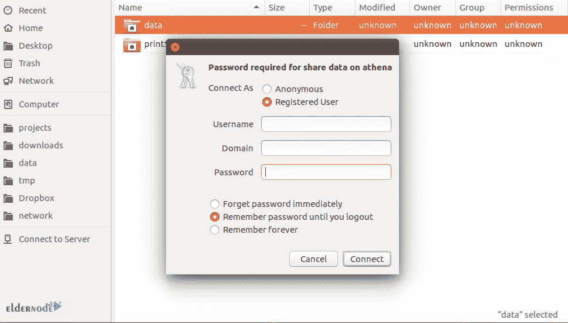

# 如何在 Ubuntu 20.04 - Eldernode 博客上安装 Samba

> 原文：<https://blog.eldernode.com/install-samba-on-ubuntu-20-04/>


Samba 是用于 Linux 和 Unix 的免费标准 Windows 互操作性程序套件。它是根据 GNU 通用公共许可证授权的。作为将 Linux/Unix 服务器和桌面无缝集成到 Active Directory 环境中的一个重要组件，您可以将它用作域控制器或常规域成员。作为网络管理员，Samba 在设置、配置以及选择系统和设备方面为您提供了灵活性和自由度。在本文中，你将学习如何在 Ubuntu 20.04 上安装 Samba。如果你正准备购买一台新的 [Linux VPS](https://eldernode.com/linux-vps/) 或者你需要拥有自己的 [Ubuntu VPS](https://eldernode.com/ubuntu-vps/) 服务器，你可以以你能想象的最快速度购买你需要的东西。

为了让本教程更好地发挥作用，请考虑以下**先决条件**:

拥有 sudo 权限的非 root 用户。

要设置，请遵循我们在 Ubuntu 20.04 上的[初始服务器设置。](https://blog.eldernode.com/initial-server-setup-on-ubuntu-20/)

## **教程在 Ubuntu 20.04 上安装 Samba**

Samba 使运行 Unix 的计算机能够参与进来，使用与 Microsoft Windows 相同的网络协议进行通信，并且从 Windows 客户机的角度看，在网络上表现为另一个 Windows 系统。Samba 允许您访问共享文件、打印机和其他网络资源。它还能让你从笔记本电脑上访问桌面文件，并与 Windows 和 macOS 用户共享文件。如果你想在同一子网上配置 Windows 和 Ubuntu 机器，它们应该能够通过网络通信。

和我们一起来看看在 Ubuntu 20.04 上设置 Samba 文件服务器的步骤。

## **逐步在 Ubuntu 上安装 Samba 20.04 | 18.04**

### **如何安装桑巴:**

首先，运行以下命令来安装 Samba:

```
sudo apt update
```

```
sudo apt install samba
```

您现在可以检查是否已经成功安装了**。因此，键入:**

```
`whereis samba`
```

**一旦您查看下面的*输出*，这意味着一切正常。**

```
`samba: /usr/sbin/samba /usr/lib/samba /etc/samba /usr/share/samba /usr/share/man/man7/samba.7.gz /usr/share/man/man8/samba.8.gz`
```

### ****如何设置桑巴****

**这样你就可以**创建一个目录**给它共享。Som 运行:**

```
`mkdir /home/<username>/sambashare/`
```

**一旦你运行上面的命令，它将在你的主目录下创建一个新的文件夹 ***sambashare*** ，你稍后将共享它。**

**Samb 的配置文件位于 ar***/etc/samba/SMB . conf***。使用下面的命令编辑文件，将新目录添加为共享目录。**

```
`sudo nano /etc/samba/smb.conf`
```

**然后，您必须将下列行添加到文件的底部:**

```
`[sambashare]`
```

```
`comment = Samba on Ubuntu`
```

```
`path = /home/username/sambashare`
```

```
`read only = no`
```

```
`browsable = yes`
```

****注意**:看一下增加的内容的附加说明:**

***评论*:简要描述你的份额。**

***路径*:你共享的目录。**

***只读*:只有当该指令的值为*否*时，才授予修改共享文件夹内容的权限。**

***可浏览*:设置为 yes 时，文件管理器如 Ubuntu 的默认文件管理器会将此共享列在“网络”下**

**现在，你可以按下 *Ctrl-O* 保存，按下 *Ctrl-X* 退出 *nano* 文本编辑器。**

**当您配置了新的共享时，您可以保存它并重新启动 Samba 以使它生效:**

```
`sudo service smbd restart`
```

**运行以下命令来更新防火墙规则，以允许 Samba 流量:**

```
`sudo ufw allow samba`
```

### ****如何设置用户账号并连接共享****

**Samba 不使用系统帐户密码，因此您需要为您的用户帐户设置一个 Samba 密码:**

```
`sudo smbpasswd -a username`
```

****注意**:要保存用户名，它应该属于一个系统账户。**

****

### ****如何连接分享****

**因为你正在使用 Ubuntu，你应该打开默认的文件管理器，点击*连接到服务器*。然后输入*SMB://IP-address/samba share*。**

**请注意， *ip 地址*是 Samba 服务器的 ip 地址，而 *sambashare* 是共享的名称。**

**最后，系统会提示您输入凭据。所以，输入它们来连接。**

## ****结论****

**在本文中，您了解了如何在 Ubuntu 20.04 上安装 Samba。从现在开始，您可以共享一个或多个目录树和一个或多个分布式文件系统树。如果您在网络上的 Windows 客户端中的服务器上安装了打印机，您也可以共享它们。如果你愿意，可以在[如何在 Linux/Windows 上安装 Samba](https://blog.eldernode.com/install-samba-on-linux-windows/)上阅读更多关于 Samba 的内容。**