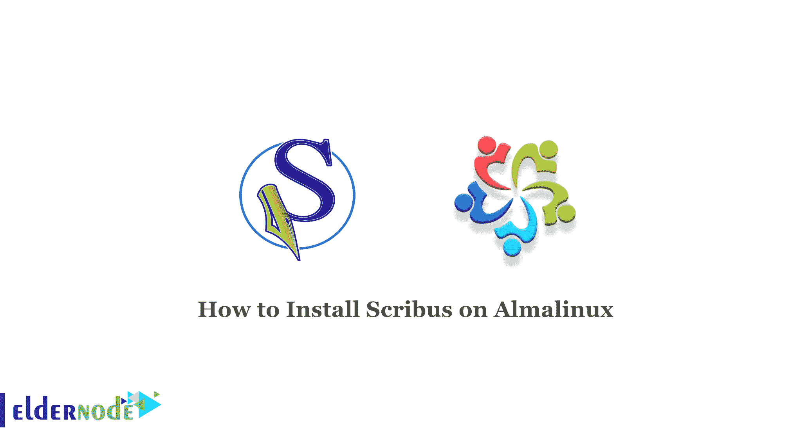

# 如何在 Almalinux 8 - Eldernode 博客上安装 Scribus

> 原文：<https://blog.eldernode.com/install-scribus-on-almalinux/>



如果你需要在你的 Linux 服务器上做一个广告项目，你不能使用像微软 Publisher 或类似的工具。幸运的是，有一款开源操作系统软件叫做 Scribus。在本文中，我们将教你如何在 AlmaLinux 上安装 Scribus。想买一个便宜的有即时激活功能的 Linux VPS，在[的 Eldernode](https://eldernode.com/) 上订购你需要的东西。

## 教程逐步在 Almalinux 上安装 Scribus

Scribus 是 InDesign 等 Adobe 应用程序的替代产品。是一个健壮的免费开源桌面出版软件，可以在多种平台上使用。拥有许多强大的功能，如支持 CMYK 颜色、PDF 创建工具、LaTeX 支持等。Scribus 是许多 Linux 操作系统的标准桌面出版工具。

## **在 AlmaLinux 8.4 | AlmaLinux 8.5 上安装 Scribus**

a)首先，您应该使用以下命令更新您的本地软件包索引:

```
sudo dnf update
```

b)然后运行以下命令安装所需的软件包:

```
sudo dnf install wget make cmake -y
```

c)现在是时候在您的 Rocky Linux 上下载 Scribus 了。您可以使用以下命令来完成此操作:

```
wget https://sourceforge.net/projects/scribus/files/scribus-devel/1.5.8/scribus-1.5.8.tar.gz/download
```

d)在此步骤中，您可以使用以下命令提取下载的文件:

```
sudo tar xzvf download
```

e)现在，您应该通过以下命令切换到提取的目录:

```
cd scribus-1.5.8
```

f)使用以下命令在 AlmaLinux 上安装 Scribus:

```
sudo ./configure  sudo make  sudo make install
```

g)检查 Scribus 版本，方法是在您的 AlmaLinux 上验证其安装:

```
scribus --version
```

h)最后，您可以通过输入以下命令来启动 Scribus:

```
scribus
```

最后，Scribus 窗口将出现在您的屏幕上。

## `结论`

`本文向您介绍了 Scribus，并一步步教您如何在 AlmaLinux 8.4 和 AlmaLinux 8.5 上安装它。我希望这篇教程对你有用。如果您有任何问题或建议，可以在评论区联系我们。`