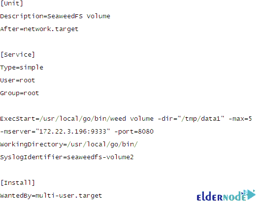

# 如何在 Debian 10 - Eldernode 博客上安装 SeaweedFS 集群

> 原文：<https://blog.eldernode.com/install-seaweedfs-cluster-on-debian-10/>


SeaweedFS 是一个开源的分布式对象存储和文件系统，用于快速存储和服务数十亿个文件。对于 blobs、对象、文件和数据仓库，这是一个简单且高度可伸缩的存储系统。Blob 存储具有 O(1)磁盘寻道、本地分层、云分层。你可能知道 Ceph、GlusterFS 和 HDFS，SeaweedFS 类似于这些文件系统。但是它可以很容易地与云集成，并且无需任何客户端更改即可实现快速访问。此外，它在设置和操作方面都非常快速和简单。在本文中，您将学习如何在 Debian 10 上安装 SeaweedFS 集群。如果您准备购买完全托管的 VPS，请在 [Eldernode](https://eldernode.com/) 上订购您考虑的软件包，并购买您自己的 **[Linux VPS](https://eldernode.com/linux-vps/)** 。

## **教程在 Debian 10 上安装 SeaweedFS 集群**

### **介绍 SeaweedFS**

SeaweedFS 是一个独立的 Apache 许可的项目。它提供了一些显著的**特性**，比如自动主服务器故障转移、自动输入 TTL 到期、并行处理、处理大小文件、对任何文件的低延迟访问等等。正如你所读到的，SeaweedFS 有两个目标。**存储数十亿文件**和**快速提供文件**。作为一个对象存储，SeaweedFS 能够有效地处理小文件。这样，中央主机管理而不是管理中央主机中的所有文件元数据，管理卷服务器上的卷，并且这些卷服务器管理文件及其元数据。此外，添加/删除服务器不会导致任何数据重新平衡，除非由管理命令触发。

## **在 Debian 10 | Debian 9** 上安装 SeaweedFS 集群

让我们通过本指南的步骤来回顾一下 SeaweedFS 在 Debian 10 上的安装。

*第一步:*

首先，你必须安装**最新的软件和补丁**。此外，您将在这里安装您需要的工具:

```
sudo apt update
```

```
sudo apt install vim curl wget zip git -y
```

```
sudo apt install build-essential autoconf automake gdb git
```

```
libffi-dev zlib1g-dev libssl-dev -y
```

*第二步:*

要获取并安装 Go，可以用两种方法继续。

**方法一:**

您可以从 APT 存储库中安装它。所以，运行:

```
sudo apt install golang
```

**方法二:**

此外，您可以从源代码中提取并手动安装。要获取最新的 Go tarball 版本，请访问 [Go 下载页面](https://golang.org/dl/)。

```
cd ~
```

```
wget -c https://golang.org/dl/go1.15.5.linux-amd64.tar.gz -O
```

```
 - | sudo tar -xz -C /usr/local
```

*第三步:*

当您成功地通过了上面两个步骤后，将 **"/usr/local/go/bin"** 目录添加到 PATH 环境变量中，这样服务器将会找到 go 可执行二进制文件。为此，您可以将下面一行附加到 **/etc/profile** 文件或 **$HOME/。配置文件**文件。

***注意*** :在**全系统安装**中，您可以将下面一行添加到 **/etc/profile** 文件中:

```
echo "export PATH=$PATH:/usr/local/go/bin" | sudo tee -a /etc/profile
```

而对于**当前用户安装**，建议您添加到 **$HOME/。简介:**

```
echo "export PATH=$PATH:/usr/local/go/bin" | tee -a $HOME/.profile
```

*第四步:*

新的 PATH 环境变量可以加载到当前的 shell 会话中，这取决于您在上一步中编辑的源文件。

```
source ~/.profile
```

或者

```
source /etc/profile
```

*第五步:*

因为您需要将必要的文件放入您的服务器，所以使用 GitHub 中所有可用的资源。因此**，克隆存储库**并继续安装:

```
cd ~
```

```
git clone https://github.com/chrislusf/seaweedfs.git
```

*第六步:*

是时候**下载、编译和安装 SeaweedFS** 了。当您克隆了所有源代码后，导航到新目录并通过运行以下命令安装 SeaweedFS 项目:

```
$ cd ~/seaweedfs
```

```
$ make install
```


*第七步:*

现在，你可以在你的 **$GOPATH/bin** 目录中找到可执行文件“ **weed** ”。如您所见，安装完成后，weed 在您当前的主目录下创建了 **$GOPATH** 。所以，你可以在这里找到 weed“~**/go/bin/weed**”。要解决此问题，请将 SeaweedFS 二进制文件复制到在*步骤 2* 中安装 Go 的早期位置，如下所示:

```
sudo cp ~/go/bin/weed /usr/local/bin/
```

*第八步:*

因为" **weed** "命令在 PATH 环境变量中，所以您可以轻松地配置 SeaweedFS:

```
$ weed version
```

```
version 30GB 2.12 6d30b21b linux amd64
```

## **如何在 Debian Linux 上使用 SeaweedFS**

默认情况下，主节点运行在端口 9333 上，卷节点运行在端口 8080 上。通过分别在端口 8080 和 8081 上启动一个主节点和两个卷节点，您可以更好地理解这一点。因此，正如您所猜测的，它们应该从不同的机器上启动，但是您可以使用一台服务器作为示例。如果您打算在不同的服务器上启动卷，请确保 **-mserver** IP 地址指向主服务器。此外，请考虑主服务器上的端口必须可以从卷服务器/节点到达。

***注意*** : SeaweedFS 使用 HTTP REST 操作来读取、写入和删除。响应采用 JSON 或 JSONP 格式。

### **如何使用 SeaweedFS**T3 在 Debian 10 上启动主服务器

默认情况下，主节点运行在端口 9333 上。有两种方法可以启动主服务器。让我们在下面回顾一下它们:

**方法 1:手动启动主服务器**

```
weed master &
```


**方法 2:使用 Systemd** 启动主服务器

此外，您还可以使用 Systemd 通过创建其单元文件来启动主服务器:

```
sudo tee /etc/systemd/system/seaweedmaster.service<<EOF 
```


文件更新后，重新加载守护程序并启动主程序。

```
sudo systemctl daemon-reload
```

```
sudo systemctl start seaweedmaster
```

```
sudo systemctl enable seaweedmaster
```

然后检查其状态。

```
systemctl status seaweedmaster -l
```


### **如何使用 SeaweedFS** 在 Debian 10 上启动卷服务器

**当主服务器准备好并等待卷时，您现在可以放心地使用以下命令启动卷。让我们首先创建示例目录:**

```
`mkdir /tmp/{data1,data2,data3,data4}}`
```

**现在，您可以创建第一批卷。**

****选项 1:手动方式****

```
`weed volume -dir="/tmp/data1" -max=5 -`
```

```
`mserver="localhost:9333" -port=8080 &`
```

****

**然后创建第二个:**

```
`weed volume -dir="/tmp/data2" -max=10 -`
```

```
`mserver="localhost:9333" -port=8081 &`
```

****

****选项 2:使用 SystemD****

**如果需要更多的卷文件来使用 Systemd 启动卷，您需要创建两个或更多的卷文件。看看下面的解释，了解更多信息。**

****对于第一卷:****

```
`sudo vim /etc/systemd/system/seaweedvolume1.service`
```

****

**此时，用正确的值替换卷路径，然后启动并启用:**

```
`sudo systemctl daemon-reload`
```

```
`sudo systemctl start seaweedvolume1.service`
```

```
`sudo systemctl enable seaweedvolume1.service`
```

**检查状态:**

```
`$ systemctl status seaweedvolume1`
```

****

****对于第二卷:****

```
`sudo vim /etc/systemd/system/seaweedvolume2.service`
```

****

**更新文件后，如图所示重新加载守护进程。**

```
`sudo systemctl daemon-reload`
```

```
`sudo systemctl start seaweedvolume2`
```

```
`sudo systemctl enable seaweedvolume2`
```

**然后检查它们的状态**

```
`sudo systemctl status seaweedvolume2`
```

****

### ****如何用 SeaweedFS** 在 Debian 10 上写一个样本文件**

****在本节中，您将上传一个文件到 SeaweedFS 对象存储是很有趣的。因此，您必须向 **/dir/assign** 发送 HTTP POST、PUT 或 GET 请求，以获取文件 ID (fid)和卷服务器 URL:****

```
**`$ curl http://localhost:9333/dir/assign`**
```

```
**`{"fid":"7,0101406762","url":"Your_file_ID:8080","publicUrl":"Your_file_ID:8080","count":1}`**
```

****接下来，您需要存储文件内容。因此，从响应中向 **URL + '/' +文件 ID** (fid)发送一个 HTTP 多部分 POST 请求。我们的 fid 是 70101406762，URL 是 Your_file_ID:8080。让我们发出这样的请求。您将得到如下所示的响应:****

```
**`$ curl -F [[email protected]](/cdn-cgi/l/email-protection)/home/tech/teleport-logo.png http://Your_file_ID:8080/7,0101406762`**
```

```
**`{"name":"teleport-logo.png","size":70974,"eTag":"ef8deb64899176d3de492f2fa9951e14"}`**
```

### ******如何在 Debian 10 上访问 SeaweedFS******

****要访问 SeaweedFS，请使用 URL*http://your-server-IP*:8080/7，016bad1bc0。这样，您将查看存储在 SeaweedFS 对象存储中的文件。请看下图，它显示了你上传的文件。****

********

## ****结论****

****在本文中，您了解了如何在 Debian 10 上安装 SeaweedFS 集群。SeaweedFS 的架构相当简单，实际数据存储在存储节点的卷中。SeaweedFS 不像分布式文件系统那样管理块，而是管理主服务器中的数据卷。****