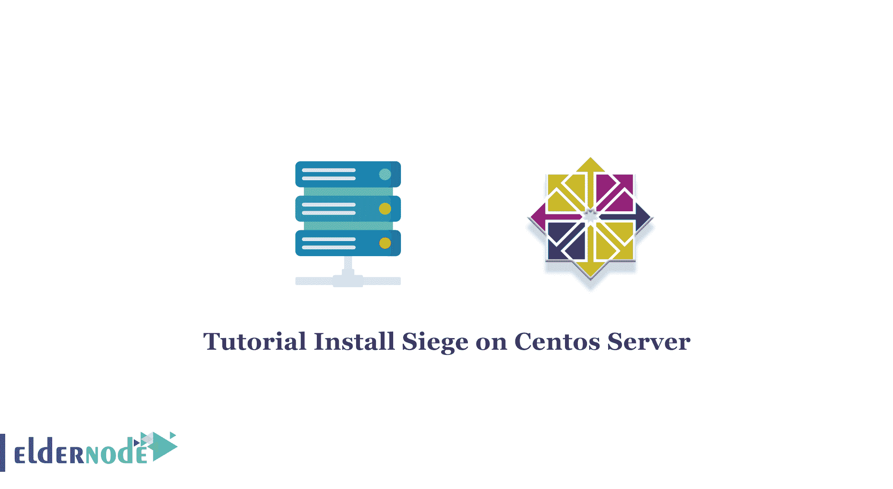

# 教程安装围攻 Centos 7 和 8 - Eldernode 博客

> 原文：<https://blog.eldernode.com/install-siege-on-centos/>



web 服务器在压力下能够处理的流量对于规划网站或应用程序的未来增长至关重要。您可以在您的服务器上运行一个负载测试，并使用一个叫做“围攻”的工具来查看您的系统在不同的环境下是如何工作的。在这篇文章中，我们将教你如何在 Centos 7 和 8 上安装围攻。想买一个便宜的有即时激活功能的 Linux VPS，在[的 Eldernode](https://eldernode.com/) 上订购你需要的东西。

## **如何在 Centos 7 | Centos 8 上安装攻城**

步骤 1)您必须使用以下命令安装并启用存储库:

```
yum install epel-release
```

现在，您可以通过以下命令安装围城:

```
yum install siege
```

您需要安装必要的开发包，以便能够从源代码构建围城:

```
yum groupinstall 'Development Tools'
```

接下来，你可以下载围攻:

```
wget http://download.joedog.org/siege/siege-latest.tar.gz
```

```
tar -zxvf siege-latest.tar.gz
```

在这一步中，您需要将文件 cd 到文件夹中并编译它们:

```
cd siege-*/
```

```
sudo ./configure --prefix=/usr/local --with-ssl=/usr/bin/openssl
```

```
sudo make && make install
```

结论

本文教你，如何一步步在 Centos 7 和 [Centos](https://blog.eldernode.com/tag/centos/) 8 上安装攻城。围攻是一个强大的工具，用于测量系统在高负载时的可靠性，当网站处于压力之下时，web 开发人员可以使用它来测试他们的代码。我希望这篇教程对你有用。

## Conclusion

This article taught you, how to install Siege on Centos 7 and [Centos](https://blog.eldernode.com/tag/centos/) 8 step by step. Siege is a powerful tool for measuring system reliability during high loading and can be used by web developers to test their code when the site is under duress. I hope this tutorial was useful for you.