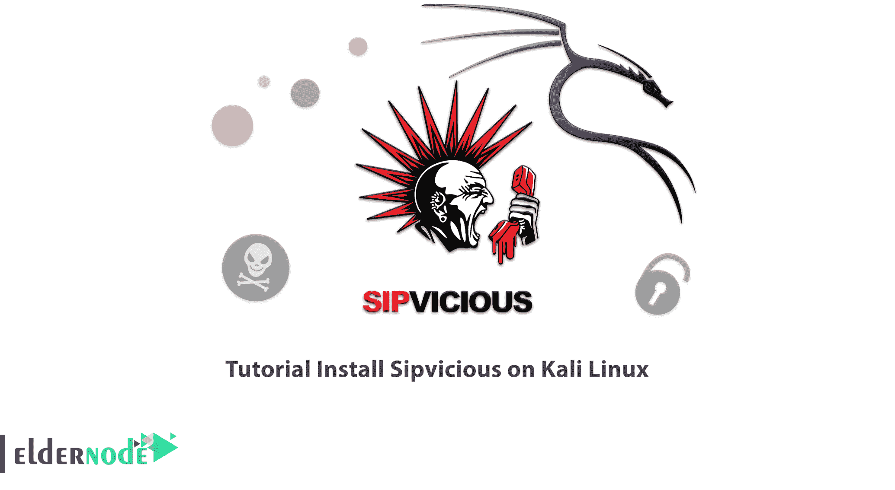

# 教程在 Kali Linux - Eldernode 博客上安装 sipvetice

> 原文：<https://blog.eldernode.com/install-sipvicious-on-kali-linux/>



是一套用于审计基于 SIP 的 VoIP 系统的安全工具。下面我们来回顾一下 sipvithe 的工作方法及其各种工具，并学习**如何在 Kali Linux** 上安装 sipvithe。如果你想购买 [**Linux VPS**](https://eldernode.com/linux-vps/) 服务器，你可以在 [Eldernode](https://eldernode.com/) 中看到可用的软件包。

## **如何在 Kali Linux 上安装 sipvithe**

### **西普威西如何运作**

这些安全工具的工作方式是，它们允许您找到 SIP 服务器，枚举 SIP 扩展，并最终破解它们的密码。

Sipvicious 工具包括:

1 –> SV crack

2 –> SV crash

3 –> SV map

4 –> SV report

5 –> Svwar

在这篇来自 [Kali Linux 培训](https://blog.eldernode.com/tag/kali-linux/)系列的文章的续篇中，我们打算教你如何在 Kali Linux 上安装 sip vice 及其工具。

## **在 Kali Linux 上安装 sip vious**

运行下面的命令在 Kali Linux 上安装 sip vice:

```
sudo apt install sipvicious
```

现在，我们将回顾一下 Sipvicious 的不同工具:

### **如何使用 sipchave**的 Svcrack 工具

Svcrack 是一个 SIP 服务的在线密码猜测工具，它使用哈希认证系统破解密码。通过运行以下命令，您可以使用它来猜测 SIP 设备的在线密码:

```
svcrack -h
```

### **如何使用****SV crash****sipvithe**工具

Svcrash 用消息响应 Svwar 和 Svcrack SIP 消息，并使旧版本崩溃。运行以下命令来使用它:

```
svcrash -h
```

### **如何使用**的 Svmap 工具**sip vious**

Svmap 是一个 SIP 扫描器，它在给定的网络上搜索 SIP 设备。使用下面的命令运行它:

```
svmap -h
```

### **如何使用** **Svreport** **工具的** **Sipvicious**

Svreport 管理由其他工具创建的会话，并将它们导出为 pdf、xml、csv 和纯文本。您可以使用以下命令来运行它:

```
svreport -h
```

### **如何使用** **Svwar** **工具中的****sip vious**

Svwar 识别 PBX 中的活动延长线，并可以确定该延长线是否需要认证。使用以下命令运行它:

```
svwar -h
```

## **常见问题**

[sp _ easy agreement]

## 结论

在本文中，我们介绍了 Sipvicious，这是一套用于审计基于 SIP 的 VoIP 系统的安全工具。此外，您还了解了 sipvitheline 是如何工作的，以及如何在 Kali Linux 上安装 sipvitheline。