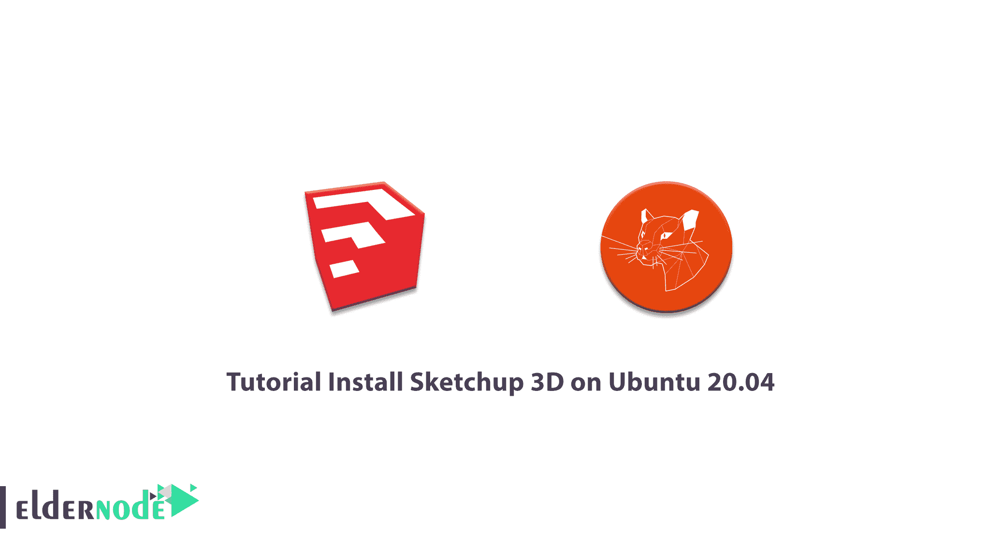
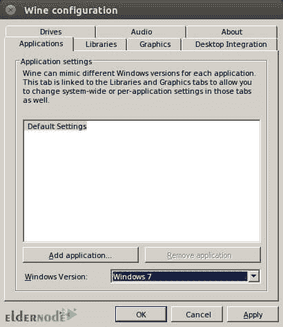
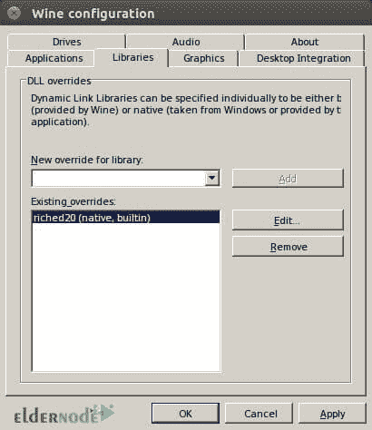
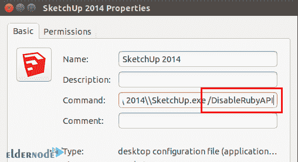

# 教程在 Ubuntu 20.04 上安装 Sketchup 3D-elder node 博客

> 原文：<https://blog.eldernode.com/install-sketchup-3d-on-ubuntu-20-04/>



Sketchup 是 3D 设计中最有用的软件之一。Sketchup 软件的特征和能力已经使得 Sketchup 的许多用户在各种领域中使用它们，例如在展台构造、室内设计、工业设计等领域中的设计和展示。在各种项目中。Sketchup 是一个简单而实用的软件，它通过在 AutoCAD 中创建的设计，以一种连续的方式来实现你在设计中想要的许多模式和想法。建筑师可以使用 Sketchup 软件轻松创建自己的设计。在本文中，我们尝试**教程在 Ubuntu 20.04** 上安装 Sketchup 3D。你可以在 [Eldernode](https://eldernode.com/) 看到购买 [Ubuntu VPS](https://eldernode.com/ubuntu-vps/) 服务器的套餐。

## **如何在 Ubuntu 20.04 上安装 Sketchup 3D**

SketchUp 软件是创造高质量和令人满意的设计的最合适的选择之一。SketchUp 可以为 3D 建模绘制巧妙的设计，并为设计添加位置、尺寸和深度等项目。该软件是制作和编辑 3D 模型的最强大的软件之一。除了无数的功能之外，它还有一个用户友好的外观，这使得用户可以与该软件正常通信。

了解 SketchUp 软件的独特功能，可以更准确、更快速地创作出有创意、独特的设计。使用 SketchUp 软件，您可以提高 3D 设计的效率。通过这种方式，可以更快更好地向客户展示您的设计。

跟随我们学习如何在 Ubuntu 20.04 上安装这个应用程序。

### **Sketchup 3D 软件特点:**

**1。Sketchup 中的简单性和低容量**

Sketchup 软件的一个最重要的特点是它的简单性以及该软件的低容量和易学性。另外，SketchUp 有很好的用户界面，很多用户喜欢它的环境，可以很容易的学习这个软件。

**2。Sketchup 中的 3D 库**

SketchUp 中有方便的 3D 库，用户可以在其中创建自己的设计并与其他用户共享。

**3。在 SketchUp 中点击鼠标中键**

在 SketchUp 软件中，可以使用中键单击激活 Sketchup 中的回路工具。这个功能节省时间，是这个软件中非常有价值的快捷方式。通过按下鼠标中键，可以激活回路工具，而不需要任何额外的移动。

**4。在 Sketchup 中生成详细地图**

SketchUp 不仅仅是一个 3D 绘图软件，还可以用来设计细节图。这样就可以在地图中很好的指定各种高度和细节，区块，以及很多布局。在这个软件中，可以创建结果的草稿和幻灯片。

**5。Sketchup 创建各种模型的准确性**

SketchUp 创建各种模型的精度可以考虑在千分之一英寸左右。由于这个原因，使用 SketchUp，可以实现非常精确和详细的模型。

### **在 Ubuntu 20.04 上安装 Sketchup 3D | Ubuntu 18.04**

我们计划用 [Wine](https://blog.eldernode.com/install-wine-5-20-on-ubuntu-20-10/) 在 Ubuntu 20.04 上安装 Sketchup。Wine 是一个免费的开源兼容软件，允许用户在 macOS 和 Linux 上运行 T2 的 Windows 应用程序。因此，您可以使用以下命令开始安装过程:

```
wget https://dl.winehq.org/wine-builds/Release.key
```

```
sudo apt-key add Release.key
```

现在，您需要使用以下命令下载并添加葡萄酒存储库密钥:

```
sudo mkdir -pm755 /etc/apt/keyrings
```

```
sudo wget -O /etc/apt/keyrings/winehq-archive.key https://dl.winehq.org/wine-builds/winehq.key
```

***注意:*** 如果在这个阶段遇到错误，可以通过执行以下命令来修复:

```
wget -nc https://dl.winehq.org/wine-builds/winehq.key
```

```
sudo apt-key add winehq.key
```

```
sudo apt update
```

您可以通过输入以下命令下载 wineHQ 源文件:

```
sudo wget -NP /etc/apt/sources.list.d/ https://dl.winehq.org/wine-builds/ubuntu/dists/focal/winehq-focal.sources
```

完成上述步骤后，您现在可以安装 Wine:

```
sudo apt-get update
```

```
sudo apt-get install --install-recommends wine-staging winehq-staging
```

现在，您需要运行以下命令来配置 Wine:

```
winecfg
```

下一步，您必须转到**应用程序**部分。然后把 Windows 版本换成 Windows 7。



然后，转到**库**选项卡，创建一个名为“ **riched20** 的新库



下一步，您必须转到**下载**部分。然后选择 exe 文件，用列表中选择的第一个选项打开该文件。等待安装过程完成。然后点击**完成**。

现在你需要右击 Sketchup 启动器。然后转到属性并附加“ **/DisableRubyAPI** ”。



完成上述步骤后，您现在应该以“**mfc100u.dll**”的名称获取库。将其复制并移动到**酒**文件夹中。然后同时按下 **Ctrl + H** 来激活 Nautilus 中的隐藏文件夹。在下一步中，您必须转到主文件夹，转到**。wine/drive _ c/windows/system32/**文件夹，并将其移动到此列表中。

通过正确遵循本文中的步骤，您将会看到 **SketchUp** 已经成功安装在您的系统上。

## 结论

SketchUp 软件是一种 3D 建模软件，具有多种应用，包括建筑、室内设计、土木和机械工程、电影制作和视频游戏设计。有一个名为 3D Warehouse 的免费装配模型(如窗户、门、汽车)的在线开源库，用户可以在其中放置他们的模型。SketchUp 软件具有拖动层的能力，并且可以以不同的风格渲染层。在本文中，我们试图介绍和展示 Sketchup 3D 软件的功能，然后在 Ubuntu 20.04 上安装 Sketchup 3D。如果对 Autodesk 软件感兴趣，可以参考文章[如何在 Ubuntu 20.04](https://blog.eldernode.com/install-autodesk-maya-2020-on-ubuntu-20-04/) 上安装 Autodesk Maya 2020。