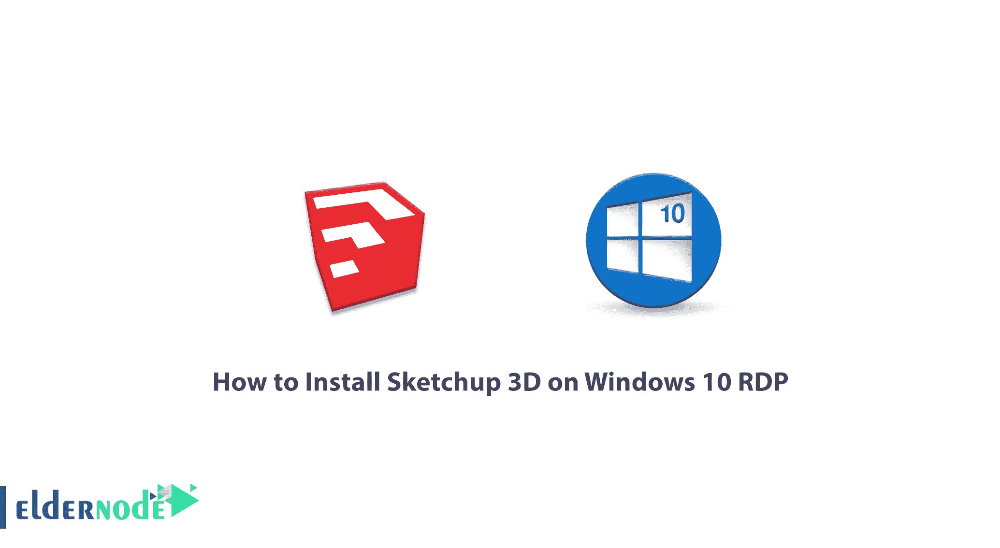
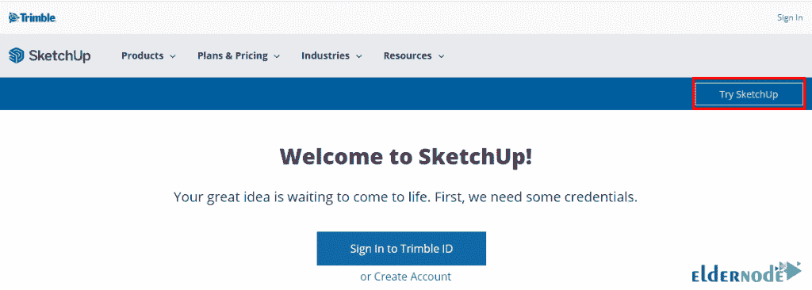
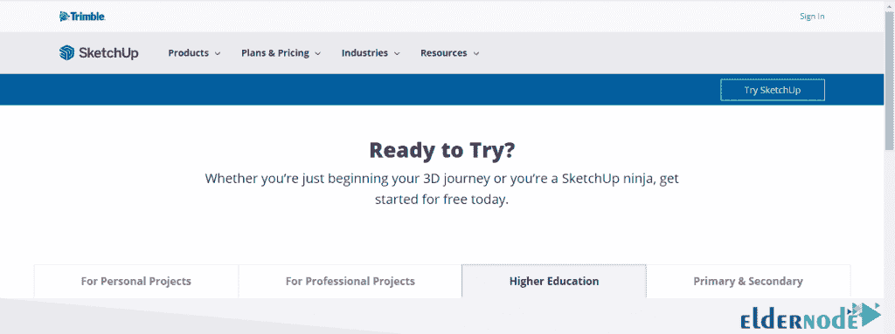
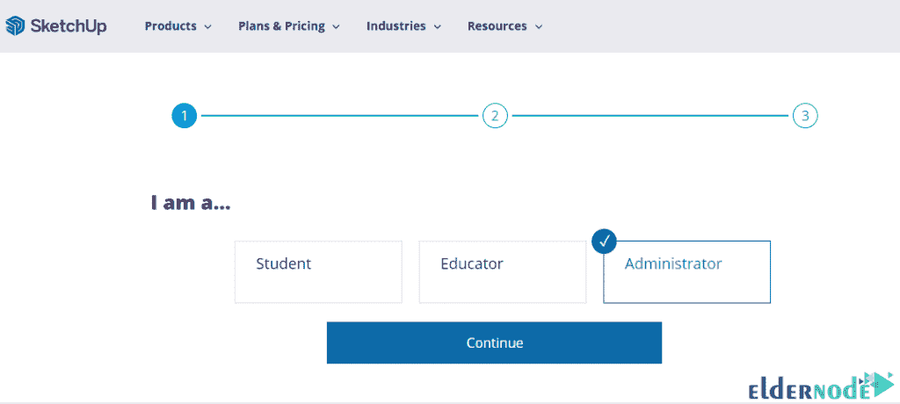
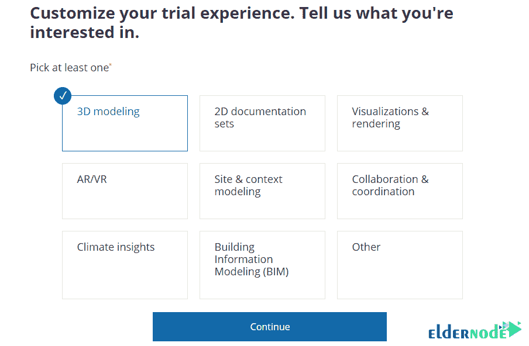
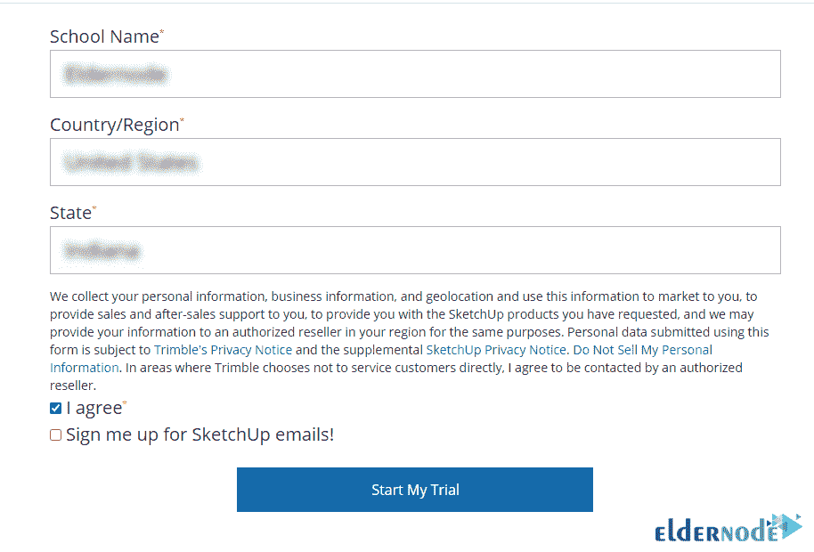
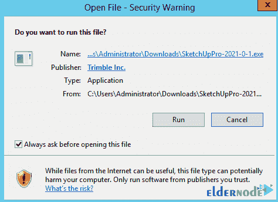
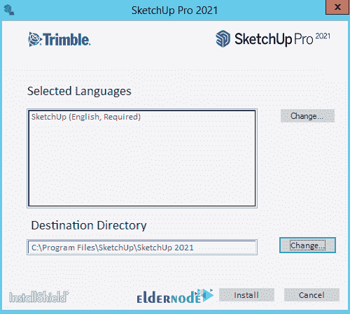
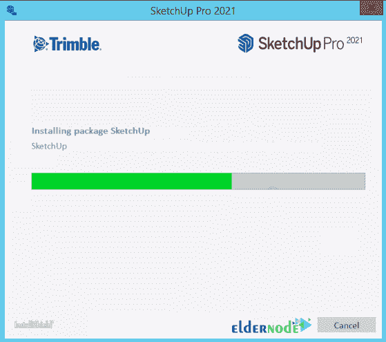

# 如何在 Windows 10 上安装 Sketchup 3D RDP-elder node 博客

> 原文：<https://blog.eldernode.com/install-sketchup-3d-on-windows-10-rdp/>

SketchUp 是一款功能强大的三维建筑建模软件。如今，有许多 3D 软件，每个都有不同的特性和功能，并相互竞争最完整软件的头衔。与此同时，SketchUp 软件已经成为最简单的建筑模拟软件之一，在其中 3D 建模可以快速完成。在这篇文章中，我们试图学习如何在 Windows 10 RDP 上安装 Sketchup 3D。你可以访问 [Eldernode](https://eldernode.com/) 提供的包来购买 [Windows 10 RDP](https://eldernode.com/windows-10-rdp/) 服务器。

## **教程在 Windows 10 上安装 Sketchup 3D RDP**

SketchUp 软件是最简单快捷的三维建筑建模软件之一，主要用于初始设计体积的构思和建模。当然，在许多插件的帮助下，最精确的体积可以快速建模。

番茄酱软件在建筑、道路建设和城市规划、室内装饰设计、展馆设计以及机械工程(工业设计)、装置、游戏开发、土木工程和木材工业、中密度纤维板和木工方面有许多应用。

SketchUp 在建筑中的其他用途包括:

–塔楼、建筑、立面、地面等的 3D 建模。

–室内设计、装饰、展览摊位等

–3D 建模和打印

–制作和生产建筑动画

–创建 3D 模型的 2D 地图

–借助 SketchUp 插件对建筑项目进行 VR 或 360 度渲染

–从不同公司的产品和目录设计中建模 3D 对象

### **SketchUp 软件功能**

**1。精确而有原则的建模**

与大多数人不同，SketchUp 中的建模和设计可以基于最精确的尺寸和测量来完成。它的范围不限于示意图和近似建模。在 SketchUp 中建模后，你将能够得到它的详细地图。

**2。快速简单的建模**

SketchUp 通过引入一种称为推/拉工具的工具，实际上是 SketchUp 标识符，彻底改变了 3D 建模过程。因为只有用鼠标拖动或按下标高，才能提高标高或创建体积。

**3。专用插件**

虽然 SketchUp 本身的建模非常快速和简单，但它有插件和扩展，可以执行最复杂的建模。这也是为什么很多专业设计师也是这个强大软件的粉丝。

**4。相对高质量的输出**

在专门为 SketchUp 制作的 Inscape 或 V-Ray 插件的帮助下，你可以创建照片或动画形式的效果图或质量。

**5。轻松访问现成的 3D 对象**

在使用 SketchUp 的时候，你不会觉得局限或者缺乏现成的对象。因为有一个最全的现成模型数据库免费提供给你。

跟随我们学习如何在 [Windows](https://blog.eldernode.com/tag/windows/) 10 RDP 上安装 Sketchup 3D。

### **在 Windows 10 上安装 Sketchup 3D RDP**

要在 Windows 10 RDP 上轻松安装 Sketchup 3D，您必须遵循以下步骤。第一步，你必须进入 [Sketchup 下载页面](https://www.sketchup.com/download/all)，点击页面顶部的**尝试 SketchUp** 。

在打开的页面上，选择**高等教育**选项卡。然后点击**标签下方的**开始免费试用。

下一步，点击**用 Google** 登录。

如下图所示，有 3 个选项。从这些选项中选择**管理员**，点击**继续**。

现在你必须在下一步从下图的选项中选择 **3D 建模**选项。然后你必须点击**继续**。

在这一步中，填写必填字段后，勾选**“我同意”**选项，然后点击**开始我的试用**。

如下图所示，SketchUp 的下载将开始。

导航到下载的文件。然后双击它然后点击**运行**。

点击**安装**。

*

最后，点击 **Finish** 成功完成安装过程。

## 结论

如今，学习建筑软件是在建筑领域取得成功的必要支柱之一。建筑模拟软件有很多，每一个都给你不同的能力。与此同时，Sketchup 是一个简单、快速而完整的 3D 软件。在这篇文章中，我们试图了解如何在 Windows 10 RDP 上安装 Sketchup 3D。也可以参考[教程在 Ubuntu 20.04 上安装 Sketchup 3D](https://blog.eldernode.com/install-sketchup-3d-on-ubuntu-20-04/)如果有兴趣分发 Ubuntu 的话。