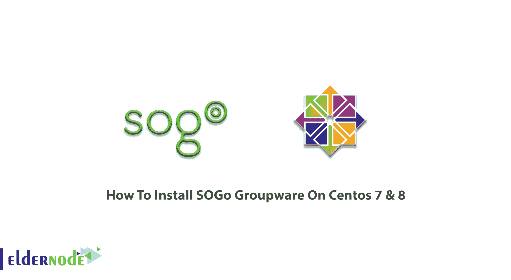

# 如何在 Centos 7 & 8 - Eldernode 博客上安装 SOGo 群件

> 原文：<https://blog.eldernode.com/install-sogo-groupware-on-centos/>



**SOGo** 是一款开源的协作软件服务器。它的原名是可扩展 OpenGroupware.org，简单且可扩展。它帮助您在社区中共享您的日历、地址簿和邮件。SOGo 是在 GNU GPL/LGPL v2 及以上版本下发布的。SOGo 可以安装在 Linux 或 BSD 服务器上，并依赖于成熟的标准组件，如 PostgresSQL、OpenLDAP 和 Apache HTTP Server。在本文中，你将学习**如何在 Centos 7 & 8** 上安装 SOGo 群件。您可以在 [Eldernode](https://eldernode.com/) 上选择自己喜欢的套餐，购买自己的 [CentOS VPS](https://eldernode.com/centos-vps/) 。

为了让本教程更好地发挥作用，请考虑以下**先决条件**:

拥有 sudo 权限的非 root 用户。

要进行设置，请遵循 CentOS 8 上的[初始服务器设置。](https://blog.eldernode.com/initial-set-up-centos-8/)

## **如何在 Centos 7 上安装 SOGo 群件&8**

使用 SOGo 可以让你从任何浏览器访问你的电子邮件、约会或联系人。它支持 CalDAV、CardDAV、GroupDAV、iMIP 和 iTIP，并重用现有的 IMAP SMTP 和数据库服务器。

### **在 Centos 7 |**Centos 8上安装 SOGo 群件

让我们浏览一下本指南的步骤，看看在 CentOS 7 & 8 上安装 SOGo 的过程及其依赖项。您可以应用于 Red Hat 或 CentOS 7 和 8 发行版的基于 RPM 的安装。

### **软件下载**

首先，您需要一个合适的支持合同来访问产品构建。然后，收到用户名和密码后，您就可以继续配置了。

你可以使用 *yum* 工具安装 SOGo。创建*/etc/yum . repos . d/inverse . repo*配置文件，内容如下:

```
[SOGo]    name=Inverse SOGo Repository
```

```
baseurl=https://<username>:<password>@packages.inverse.ca/SOGo/release/5/rhel/7/$basearch
```

```
gpgcheck=1
```

逆向用它的 GPG 密钥签署它的 RPM 包。完整性验证会在软件包安装时自动进行。因此，您需要做的就是将密钥导入到您的 rpm 钥匙串中:

```
rpm --import "https://pgp.mit.edu/pks/lookup?op=get&search=0xCB2D3A2AA0030E2C"
```

使用下面的命令将 EPEL 添加到您的软件包源代码并安装软件包。

***上 RHEL/CentOS 7:***

```
rpm -ivh https://dl.fedoraproject.org/pub/epel/epel-release-latest-7.noarch.rpm
```

***上 RHEL/CentOS 8:***

```
yum install https://dl.fedoraproject.org/pub/epel/epel-release-latest-8.noarch.rpm
```

**注**:SOGo 所依赖的部分软件可用；e 来自资源库“Enterprise Linux 的额外包”(EPEL)。

由于 SOGo 依赖于 Inverse 提供的 GNUdtep 包，并且不得使用 EPEL 的包，因此调整存储库定义以排除这些包:

```
sed -i '/enabled=1/a \
```

```
exclude=gnustep*' /etc/yum.repos.d/epel.repo
```

### **软件安装**

现在您可以安装 SOGo 及其依赖项了，因为 yum 配置文件已经创建。为此，请运行以下命令:

```
yum install sogo
```

通过这种方式，安装了 SOGo 及其依赖项，如 GNUstep、SOPE 包和 Memcached。安装基本软件包后，安装适合您的环境的适当的数据库连接器。
现在，你必须为 postgresql 数据库系统安装 sope49-gdl1-postgresql，为 mysql 安装 sope49-gdl1-mysql，或者为 oracle 安装 sope49-gdl1-oracle。要安装，请键入:

```
yum install sope49-gdl1-postgresql
```

一旦完成，SOGo 将完全安装在旅游 CentOS 服务器。

## 结论

在本文中，您了解了如何在 Centos 7 & 8 上安装 SOGo 群件。从现在开始，您拥有了 SOGo，这是您的基础架构中缺失的组件。它位于您的服务器中间，为您的用户提供一个统一和完整的界面来访问他们的信息。完成您的 [CentOS](https://blog.eldernode.com/tag/centos/) 知识，并在[老年节点社区](https://community.eldernode.com/)上与您的朋友讨论。