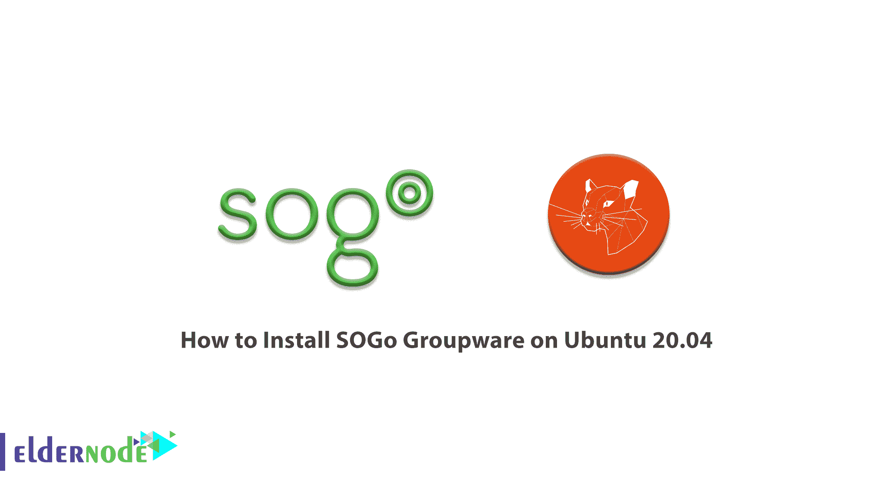

# 如何在 Ubuntu 20.04 - Eldernode 博客上安装 SOGo 群件

> 原文：<https://blog.eldernode.com/install-sogo-groupware-on-ubuntu/>



SOGo 群件是一个免费的现代可扩展的群软件服务器。SOGo 通过 web 浏览器使用本地客户端(如 Mozilla Thunderbird 和 Lightning)提供日历、地址簿和共享电子邮件。该计划有一个可扩展的架构，适合部署成千上万的用户。使用 SOGo 连接和 SOGo 集成与 Mozilla Thunderbird 和 Lightning 的高级集成也是该软件的特点。在本文中，我们尝试学习**如何在 Ubuntu 20.04** 上安装 SOGo 群件。你可以在 [Eldernode](https://eldernode.com/) 看到购买 [Ubuntu VPS](https://eldernode.com/ubuntu-vps/) 服务器的包

## **教程在 Ubuntu 20.04 上安装 SOGo 群件**

考虑到 SOGo 重用了基础设施中的许多组件，它需要:

–数据库服务器( [MySQL](https://blog.eldernode.com/install-mysql-on-linux-ubuntu-20-04/) 、 [PostgreSQL](https://blog.eldernode.com/tutorial-postgresql-installation-ubuntu-20/) 或 Oracle)

–LDAP 服务器(OpenLDAP、Novell eDirectory、Microsoft Active Directory 等)

–SMTP 服务器(Postfix、Sendmail 等)

–IMAP 服务器(Courier、Cyrus IMAP 服务器、Dovecot 等)

在接下来的章节中跟随这篇文章学习如何在 Ubuntu 20.04 上安装 SOGo 群件。

### **在 Ubuntu 20.04 上安装 SOGo 群件| Ubuntu 18.04**

您需要反向支持协议，然后才能开始安装以访问生产结构。因此，在收到您的用户名和密码后，您必须继续进行配置。在这一步中，您需要首先将密钥输入到您的**钥匙链**中。然后，您可以使用以下命令更新本地配置:

```
sudo apt-key adv --keyserver keys.gnupg.net --recv-key 0x810273C4
```

```
sudo apt-get update
```

应该注意的是，Inverse 建议使用 HTTPS 进行存储库通信。同样有趣的是，所有的逆向库都有 HTTPS 功能。因此，您可以将以下存储库的所有大型存储库替换为它们的 HTTPS://副本。如果 **apt** 工具不支持 HTTPS，您必须使用以下命令安装额外的软件包:

```
sudo apt-get install apt-transport-https
```

请注意，它是在您的 **sources.list** 配置文件中启用的。为此你可以去 **/etc/apt/sources.list** 。

因为对 SOGo 守护进程的 HTTP 请求是由您的 web 服务器发送的，所以建议您此时使用以下命令安装 **Apache2** :

```
sudo apt-get install apache2
```

### **如何在 Ubuntu 20.04 上配置 SOGo 库**

要在 Ubuntu 上安装 **SOGo v5** ，你可以很容易地将以下命令添加到 **/etc/apt/sources.list** :

```
deb https://<username>:<password>@packages.inverse.ca/SOGo/release/4/ubuntu/ focal focal
```

将上面的命令添加到列表后，在下一步中，我们将安装 SOGo。

### **如何在 Ubuntu 20.04 上安装 SOGo**

在这个阶段，我们准备安装 SOGo。你可以按照下面的命令在 Ubuntu 20.04 上轻松安装 SOGo:

```
sudo apt-get update
```

```
sudo apt-get install sogo
```

## 结论

SOGo 使用 CalDAV、CardDAV、GroupDAV、HTTP、IMAP 和 SMTP 等标准协议与 SOGo 平台或其子组件进行通信。也支持支持 Microsoft ActiveSync 协议的移动设备。在本文中，我们试图向您介绍如何在 Ubuntu 20.04 上安装 SOGo 群件。