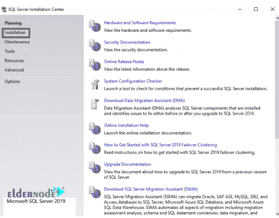

# 教程在 Windows Server 上安装 SQL Server 2019 Developer Edition-elder node

> 原文：<https://blog.eldernode.com/install-sql-server-developer-edition-on-windows-server/>

教程在 Windows Server 上安装 SQL Server 2019 开发人员版。Microsoft SQL Server 是用于在 Windows 服务中构建和管理数据库的软件。这个数据库与 Windows Server 操作系统完全兼容，大多数为 Windows 操作系统提供 [VPS 服务器](https://eldernode.com/windows-vps/)或[专用服务器](https://eldernode.com/dedicated-server/)的人都在他们的服务器上使用 SQL Server 数据库。

在本教程中，我们将在 Windows Server 2019 上安装 SQL Server 2019 开发人员版。

### 如何在 Windows Server 2019 上安装 SQL Server 2019 开发者版

**1。T3 第一步是[下载 SQL Server 2019 开发者版](https://www.microsoft.com/en-us/sql-server/sql-server-downloads)。然后参考下载文件所在的路径。**

**2。T3 选择想要的文件，点击安装启动程序下载安装包。**

正如你在下图中看到的，你前面有 **3 个选项**。建议您选择自定义选项，开始在 Windows Server 2019 上安装 SQL Server 2019 开发者版。

**3。** 在下一步中，您需要指定保存下载文件的路径。然后点击安装开始安装。

这一步可能需要几分钟时间。

*

**4。** 安装完成后会打开一个新窗口。点击安装，如下图所示。

**5。在窗口右侧的**，点击新建 SQL Server 单机安装或添加功能到现有安装。

**6。** 下一步你可以从 **开发者****评测****快递**中选择一个选项。窗口中给出了这些选项的说明。

**7。T3 确认**协议**，点击下一步。**

**8。** 在这一步，你可以选择微软更新选项或者不选择。

点击下一个。

**9。** 如果你的防火墙正在运行，你可能会看到一个 Windows 防火墙的警告标志。此警告提醒您在安装完成后打开适当的端口。

点击下一个。

> 

**10。** 在下一个窗口中你会看到 SQL Server 提供的特性。选择您需要的选项，点击下一步。

**11。** 命名你的实例，点击下一个。

如何在 SQL Server 中配置服务器

**12。** 在这里指定服务账号和整理配置。点击下一个。

## 

**13。** 这一步让你有机会为管理员账户设置密码和选择其他管理员账户。您还可以选择将使用的身份验证机制。您可以选择混合模式身份验证，其中用户可以来自某个域，也可以在 SQL 实例中手动添加。

然后输入密码。

还有其他标签叫做**数据目录**、 **TempDB** 、 **MaxDOP** 、**内存**和**文件流**。
您可以通过这些选项卡自定义您的设置。

完成上述设置后，点击下一步。

**注意:** 不要忘记添加管理员用户。

**14。** 下一步，选择一个管理员，设置服务器模式，点击下一步。

**15。** 对您选择的软件包进行适当设置并安装后，点击下一步。

**16。** 审核完成下一步工作总结后点击安装。请等待服务器安装完成。

安装完成后，点击关闭让 SQL Server 准备就绪。

**尊敬的用户**，我们希望您能喜欢这个[教程](https://eldernode.com/category/tutorial/)，您可以在评论区提出关于本次培训的问题，或者解决[老年人节点培训](https://eldernode.com/blog/)领域的其他问题，请参考[提问页面](https://eldernode.com/ask)部分，并尽快提出您的问题。腾出时间给其他用户和专家来回答你的问题。

好运。

**Dear user**, we hope you would enjoy this [tutorial](https://eldernode.com/category/tutorial/), you can ask questions about this training in the comments section, or to solve other problems in the field of [Eldernode training](https://eldernode.com/blog/), refer to the [Ask page](https://eldernode.com/ask) section and raise your problem in it as soon as possible. Make time for other users and experts to answer your questions.

Goodluck.