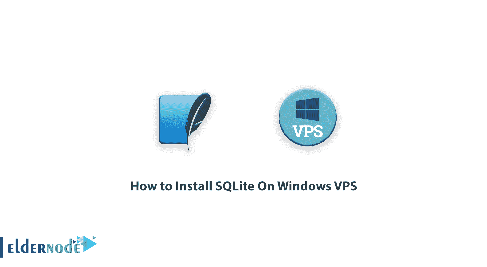
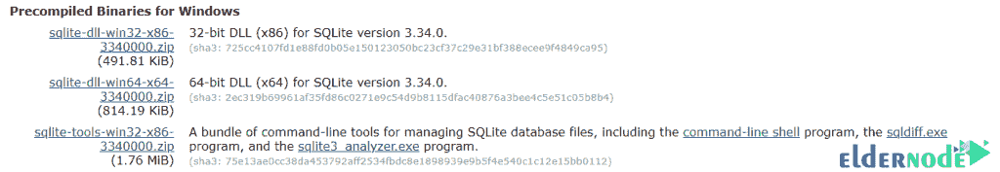
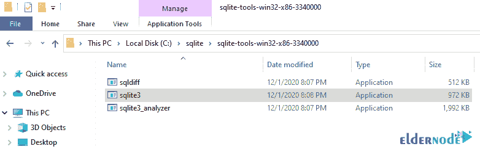
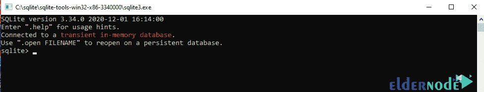

# 如何在 Windows VPS - Eldernode 博客上安装 SQLite

> 原文：<https://blog.eldernode.com/install-sqlite-on-windows-vps/>

数据存储和检索是不同系统编程时的基本需求之一。根据您的需要，有几种工具和方法可以实现这一点。从将信息存储在文本文件中这样的简单方法到使用 Oracle 这样的大型软件。存储和检索数据的工具之一是调用 SQLite。这个软件是最流行的文件存储系统。SQLite 以其对各种操作系统的支持而闻名，包括 Windows、Linux、Android 和 Mac OS，并且免费且功能强大。在这篇文章中，我们试图教你如何在 Windows VPS 上安装 SQLite。你可以访问 [Eldernode](https://eldernode.com/) 提供的包来购买 [Windows VPS](https://eldernode.com/windows-vps/) 服务器。

## **教程在 Windows VPS 上安装 SQLite**

SQLite 是用 C 语言编程的，并且在不断改进和发展。因此，它具有非常高的速度和效率。SQLite 是一个公共领域许可软件。这意味着它没有产权，任何个人或组织都可以不受任何限制地以任何方式使用它。

SQLite 是一个文件存储系统。因此，在多个客户希望使用信息的环境中使用它可能会面临问题。反而会在手机软件、网站等没有大流量的环境下取得不错的表现。

一些内容管理系统，比如 Drupal，给开发者和网站所有者提供了使用 SQLite 设计网站的选项。许多软件程序，如 Mozilla [Firefox](https://blog.eldernode.com/install-firefox-on-rdp-admin/) 、[谷歌 Chrome](https://blog.eldernode.com/install-google-chrome-on-rdp-admin/) 、Windows 10、Skype 和 [Dropbox](https://blog.eldernode.com/dropbox-on-linux-ubuntu-20-10/) ，都使用 SQLite 来存储它们的一些数据。SQLite 的另一个应用是结构化和庞大的数据传输。通过在 Windows VPS 上安装 SQLite，继续阅读本文。

## **在 Windows VPS 上安装 SQLite**

遵循以下步骤将为在 [Windows](https://blog.eldernode.com/tag/windows/) VPS 中使用 SQLite 数据库管理系统铺平道路。在本主题的后续部分，请和我们一起学习安装 SQLite 的步骤。

第一步，你要参考 [SQLite 下载](https://www.sqlite.org/download.html)链接。然后，您需要从 Windows 部分下载**预编译的二进制文件。因此，在这一部分，您必须单击与下图类似的所需选项来开始下载。**

如上图所示，指定的下载包称为命令行(CLP)程序。CLP 是一个命令行应用程序，允许用户访问 SQLite 数据库管理系统和所有 SQLite 功能。用户可以使用该工具创建和管理 SQLite 数据库。

应该注意的是，根据您系统的基础设施，您应该选择 32 位(x86)或 64 位(x64)版本。

下载完文件后，您需要转到该路径。然后右键点击 ZIP 文件，解压到 **C:\SQLite** 。

**注意:**您必须首先在 c 盘上创建一个名为 sqlite 的文件夹。

将文件解压到上述位置后，您会看到三个选项: **sqldiff** 、 **sqlite3** 和 **sqlite3_analyzer** 。双击 **sqlite3** 。

执行此文件后，软件将在命令行中打开，您可以执行所需的 SQL 语句:

结论

## SQLite 是一个以库的形式用 C 写的小型关系数据库管理系统(约 350 KB)，是一个关系数据库。SQLite 是世界上数量最多的活动安装程序，因为它用于各种应用程序、web 浏览器、操作系统以及智能手机、硬件板等设备。这个数据库通过支持事务、高速度和小库容量，以及免费和开源来支持跨平台程序员。在本文中，我们试图教您如何在 Windows VPS 上安装 SQLite。

SQLite is a small relational database management system (about 350 KB) written in C in the form of a library and is a relational database. SQLite is the largest number of active installers in the world due to its use in a variety of applications, web browsers, operating systems as well as devices such as smartphones, hardware boards, etc. This database supports cross-platform programmers by supporting transactions, high speed and small library volume, as well as being free and open source. In this article, we tried to teach you how to install SQLite on a Windows VPS.