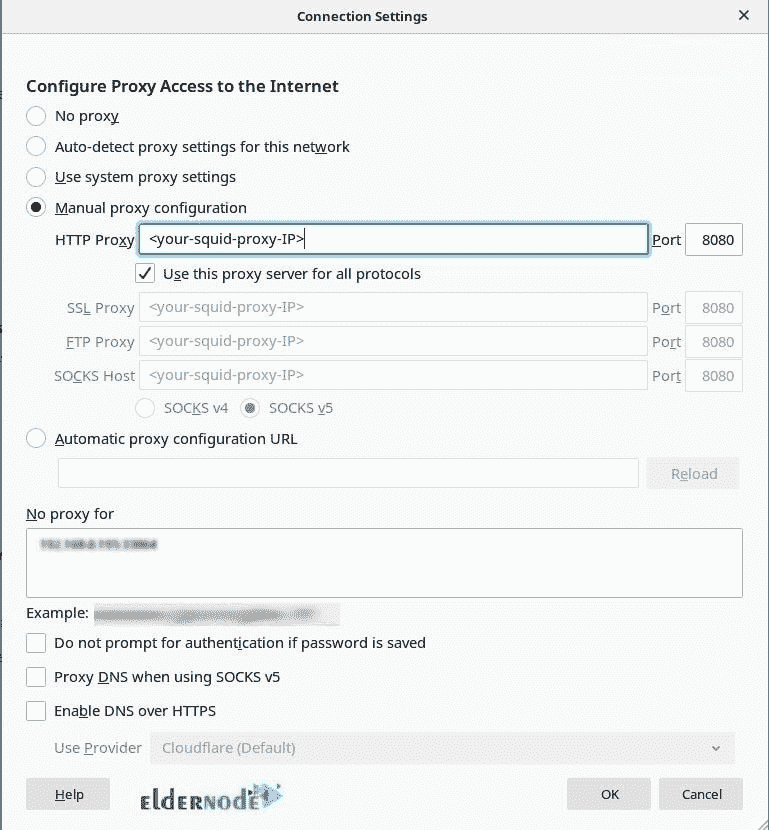
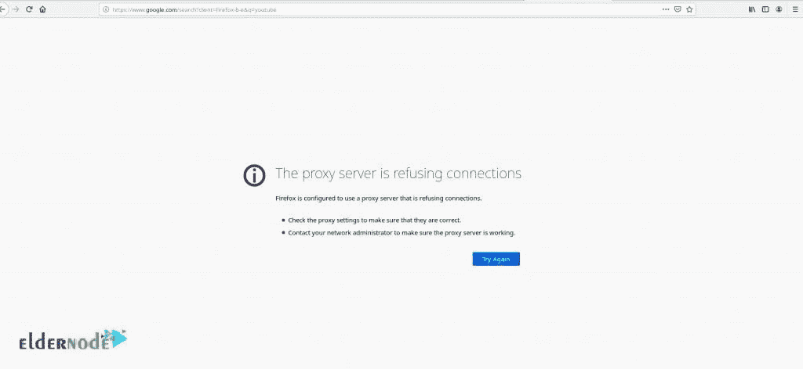
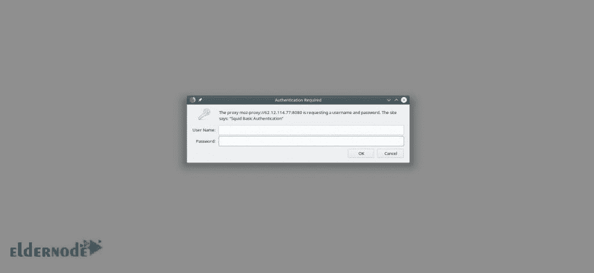

# 如何在 Ubuntu 20.04 LTS 上安装 Squid 代理服务器-[视频]

> 原文：<https://blog.eldernode.com/install-squid-proxy-server-on-ubuntu-20-04/>


Squid 是一个代理服务器，或者充当代理和缓存服务器。捕捉和转发 HTTP web 浏览器是 Squid 做的事情。当它将请求转发到所需的目的地时，它还可以保存它们的内容。感觉你的 web 服务器速度更高，缓存 web，DNS 是使用 Squid 的第一个特性。加入我们这篇文章，学习如何在 Ubuntu 20.04 LTS 版上安装 Squid 代理服务器。squid 最初被设计为在类 Unix 系统上作为守护程序运行。要购买你的 [Linux VPS](https://eldernode.com/linux-vps/) ，看看 [Eldernode](https://eldernode.com/) 上提供的软件包。

## **教程在 Ubuntu 20.04 上安装 Squid 代理服务器 LTS**

为了让本教程更好地发挥作用，请考虑以下**先决条件**:

拥有 sudo 权限的非 root 用户。

要进行设置，请遵循我们在 Ubuntu 20.04 上的[初始服务器设置。](https://blog.eldernode.com/initial-server-setup-on-ubuntu-20/)

## **在 Ubuntu 20.04 | Ubuntu 18.04** 上安装 Squid 代理服务器

新版本的 Squid 可以在 Windows 上使用。Squid 是免费的，在 GNU 通用公共许可证下发布。让我们通过本指南的步骤来学习如何在 [Ubuntu](https://blog.eldernode.com/tag/ubuntu/) 上安装 Squid。

第一步:

首先，**通过运行以下命令将**您的系统软件包更新到最新版本:

```
sudo apt-get update
```

```
sudo apt-get upgrade
```

第二步:

一旦系统更新，您可以轻松快速地安装 Squid。因为 **Squid 包**在 Ubuntu 20.04 默认库中是可用的。

```
sudo apt-cache policy squid
```

另外，如果您愿意，您可以使用下面的命令来搜索 **Squid 包**:

```
apt show squid
```

第三步:

使用下面的命令**安装 Squid** 。一旦“Active: active (running)”显示在输出中，squid 就安装好了。

```
sudo apt-get install -y squid
```

```
sudo systemctl start squid
```

```
sudo systemctl enable squid
```

```
sudo systemctl status squid
```

第四步:

在这一步，您将**在 Ubuntu 20.04 上配置 Squid 代理服务器**。

默认的 Squid 代理配置文件位于 ar*/etc/squide/squide . conf*中。nd */etc/squid/conf.d/* 目录。配置文件可以由文本编辑器编辑。尽管配置中提供了一些最低设置，但您可以对其进行一些更改。但是在修改它之前，创建一个原始文件的备份。

```
sudo cp /etc/squid/squid.conf /etc/squid/squid.conf.orig
```

现在，用你最喜欢的文件编辑器打开文件，在 */etc/squid/squid/conf* 中调整你的自定义设置。

```
sudo vim /etc/squid/squid.conf
```

第五步:

是时候**改变 Squid 默认端口**了。它的默认端口是 3128。打开 squid.conf 文件并查找 http_port 行以向其发出警报。在下面，您可以将其更改为您考虑的端口号，然后保存文件。

```
#http_port 3128
```

```
http_port 8080
```

要确保允许端口通过防火墙，请键入:

```
sudo ufw allow 8080/tcp
```

```
sudo ufw enable
```

第六步:

现在，您应该**设置 Squide 缓存大小**。使用以下设置来设置您的首选高速缓存。例如，如果 256MB 就足够了:

```
cache_mem 256 MB
```

第七步:

然后，您可以通过**指定要使用的 DNS 名称服务器**。您需要定义自己的 DNS 服务器。使用以下命令来完成此操作。

```
dns_nameservers 8.8.8.8 8.8.4.4
```

第八步:

在这一部分中，我们将介绍一个访问控制列表**一个访问控制列表**一个控制列表**一个控制列表**。是关于 **Squid ACL 和 http_access** 的。您可能需要允许来自特定网络或 IP 地址的访问，而拒绝其他访问，因为代理服务器对通过它的内容是有选择性的。使用 **ACL** 帮助您定义什么是允许的，什么是拒绝的。因此，要添加您选择的规则，请编辑 *squid.conf* 。****

第九步:

您可以**为 Squid 代理服务器**定义 ACL。使用 ACL，您可以选择允许哪些内容通过代理服务器，不允许哪些内容通过。这些语句定义了这些权限，应该以 ***acl*** 开头，后跟规则的名称。名称后是 ***acltype*** 和**自变量**或**文件**。文件必须只包含一个项目。

```
acl aclname acltype argument..  acl aclname acltpe “file”…
```

您可以通过在每行开头添加#来选择禁用。看看下面的例子，看看如何创建新的规则。

允许局域网通过 Squid 代理服务器。

创建了 ***acl*** 规则

```
acl my_lan src 192.168.100.0/24
```

您可以使用 **http_access** 指令基于定义的规则来允许/拒绝。如果您决定允许:

```
http_access allow my_lan
```

当您随时创建 ACL 访问规则时，最新的规则应该是 **deny all** 。如果您在允许所有必需的站点时不这样做，您可能会阻止自己访问某些必需的站点。

```
http_access deny all
```

第十步:

在与许多网站合作时，要在 Squide 代理服务器中**拒绝对特定网站的访问，请尝试将它们全部放在一个文件中，然后调用它。这有助于你做得更容易，更有条理。如果没有，列出 ***acl*** 规则中的引用。让我们看一个例子。要在 squide 目录中创建一个名为 *deniedsite.squid* 的文件，您应该运行:**

```
sudo vim /etc/squid/deniedsites.squid
```

然后添加您希望拒绝的站点。在下文中，我们以网站为例。

```
facebook.com
```

```
youtube.com
```

当您打开 *squid.conf* 时，为您决定拒绝的站点创建一个 *acl* 规则，并添加一个拒绝规则。最后，您可以保存文件。

```
acl deniedsites dstdomain “/etc/squid/deniedsites.squid”  http_access deny deniedsites
```

要列出 *acl* 乐途中的站点，运行:

```
acl deniedsites dstdomain facebook.com youtubecom  http_access deny deniedsites
```

不要忘记在任何时候进行更改时重新启动 squid 服务器。

```
systemctl restart squid
```

第十一步:

您可以使用关键字来**阻止流量。创建一个包含关键字的文件，并创建一个 *acl* 规则来拒绝流量，您可以使用文件名。然后添加您的关键字并保存。**

```
sudo vim /etc/squid/keywords.squid.
```

```
gamble  nudes
```

然后，退出 *squid.conf* 以创建 acl 并拒绝规则保存。

**注意**:记得重启 squid。

acl 关键字 URL _ regex-I "/etc/squid/keywords . squid "
http _ access 拒绝关键字

键入下面的命令以打开 Squid 代理服务器中的端口。

```
acl Safe_ports port <port-number>
```

第十二步:

另外，**可以屏蔽 Squid 代理服务器**上的输出流量。代理服务器暴露代理的 IP 地址而不是你自己的地址来隐藏你的身份。当然，它也可以通过 HTTP 传出流量让它为人所知。您可以通过编辑 ***squid.conf*** 文件禁用此功能，并通过头文件禁用*。检查上带有 **#via 的行，然后取消注释，从*** 上的 ***变为 ***关*** 。***

```
# via on
```

```
via off
```

请考虑您应该禁用代理，以便不在已转发的 HTTP 请求中附加客户端 IP 地址。为此，修改 **squid.conf** 文件中的以下行。因此，如果您需要隐藏您的 squid 代理服务器，请删除 Squid 代理头。在标记中添加以下行；请求 _ 标题 _ 访问。

```
request_header_access From deny all  request_header_access Server deny all  request_header_access WWW-Authenticate deny all  request_header_access Link deny all  request_header_access Cache-Control deny all  request_header_access Proxy-Connection deny all  request_header_access X-Cache deny all  request_header_access X-Cache-Lookup deny all   request_header_access X-Forwarded-For deny all  request_header_access Pragma deny all  request_header_access Keep-Alive deny all
```

现在，保存 *squid.conf* ，同样不要忘记重启 squid。

```
systemctl restart squid
```

第十三步:

您可以**检查 Squide 配置错误**。使用下面的命令查看配置文件中的错误。

```
sudo squid -k parse
```

第十四步:

现在，您已经准备好**配置客户端通过 Squid 代理服务器**进行连接。用户身份验证的配置是您应该首先做的。在 squide.conf 文件中启用 HTTP 身份验证，然后安装 apache2-utils。

```
apt install -y apache2-utils
```

为了存储用户，您需要创建一个文件，该文件必须由默认的 Squid 用户*代理*拥有。例如，我们将其命名为“passwd”

```
touch /etc/squid/passwd  chown proxy: /etc/squid/passwd
```

然后，您可以添加用户。在这里，我们称之为 noodi。

```
htpasswd /etc/squid/passwd noodi  New password:  Re-type new password:  Adding password for user lornahtpasswd /etc/squid/passwd noodi  New password:  Re-type new password:  Adding password for user noodi
```

然后，在 **squid.conf** 文件中添加以下几行。记得保存文件并重启 squid。

```
auth_param basic program /usr/lib/squid/basic_ncsa_auth /etc/squid/passwd  auth_param basic children 5  auth_param basic realm Squid Basic Authentication  auth_param basic credentialsttl 2 hours  acl auth_users proxy_auth REQUIRED  http_access allow auth_users
```

为了确保使用正确的路径并且不存在错误，您可以通过运行以下命令来检查 basic_ncsa_auth 的位置:

```
dpkg -L squid | grep ncsa_auth
```

您可以测试您的 Squid 代理是否正常工作。转到您的客户端 web 浏览器并配置手动代理验证。打开你偏好的浏览器，点击三个工具条，然后点击**编辑**下的**偏好**。点击**网络设置**下的**设置**。点击**手动代理配置**单选按钮，并在页面出现时填写您的代理服务器详细信息。此外，在“**无**代理”下，您可以根据需要排除其他 IP 地址的代理。



要确认您的 Squid 代理设置是否有效，请再次打开浏览器并尝试搜索受限站点，当您看到一个页面说“代理服务器拒绝连接”时，这意味着这一部分的所有操作都已成功完成。



若要检查身份验证状态，请打开另一个网站(无限制)。并检查输入用户名和密码后是否会提示您进行身份验证。我的意思是，与上一部分相反，这次你应该可以访问这个网站。

### **学习在 Ubuntu 服务器上设置 Squid 代理服务器**



## 结论

在本文中，您了解了如何在 Ubuntu 20.04 LTS 上安装 Squid 代理服务器。如果您已经仔细完成了所有步骤，安装应该会成功。因为当另一个服务器请求相同的信息时，Squid 会为请求提供相同的内容，所以它可以提高下载速度并节省带宽。如果你有兴趣阅读更多内容，可以找到我们关于如何在 Kali Linux 上配置 Burp 套件的文章。