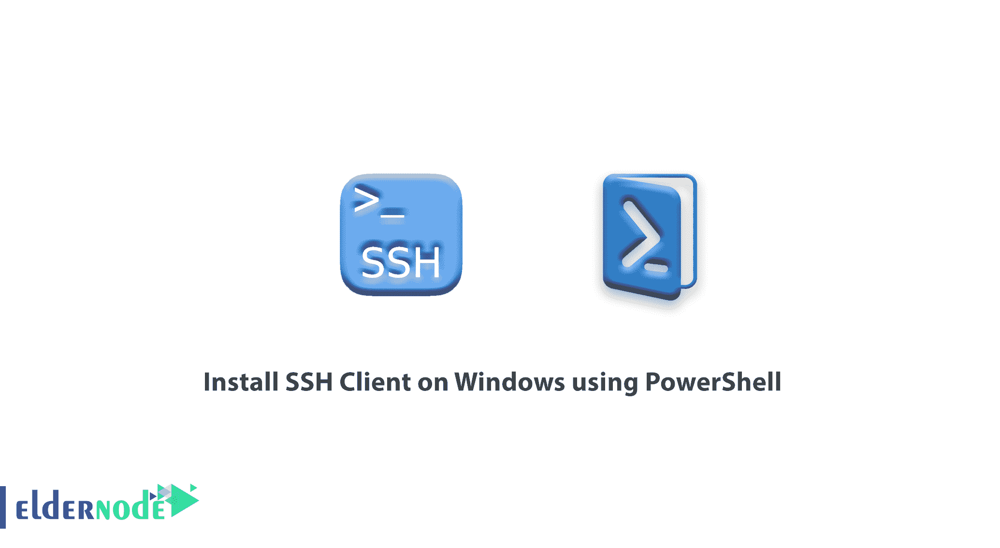
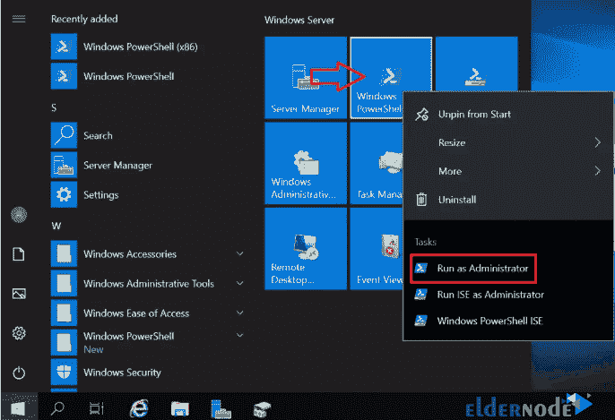
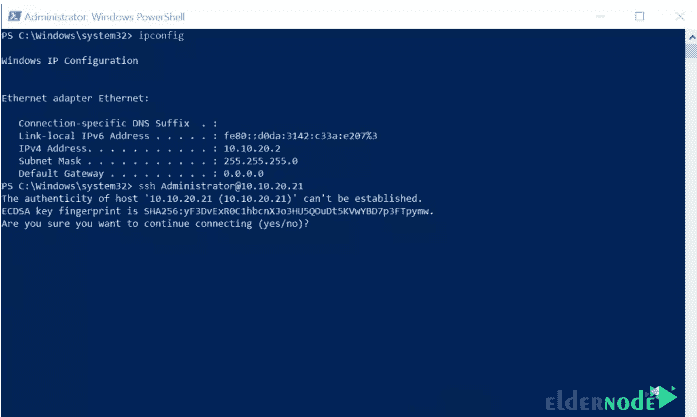

# 如何使用 PowerShell - Eldernode 在 Windows 上安装 SSH 客户端

> 原文：<https://blog.eldernode.com/install-ssh-client-on-windows-using-powershell/>



如何使用 PowerShell 在 Windows 上安装 SSH 客户端？连接 Linux 有几种方式，包括 **putty** 和 **Kitty** 。但是您可以连接到您的 Windows 服务器并使用它，而无需使用 Windows 中的其他软件。

在本文中，您可以通过在 Powershell 中运行以下命令来**安装**[OpenSSH 服务器](https://en.wikipedia.org/wiki/OpenSSH) 和客户端。你可以从 eldernode 选择你最完美的 [Windows VPS 服务器](https://eldernode.com/windows-vps/)包。

## 使用 PowerShell 在 Windows 上安装 SSH 客户端

**1。** 用管理员权限打开你的 Powershell 来做这个。



**2。** 在 PowerShell 中运行以下命令。

```
## Install  OpenSSH.Server   **Add-WindowsCapability -Online -Name OpenSSH.Server~~~~0.0.1.0**    ## Install  OpenSSH.Client  **Add-WindowsCapability -Online -Name OpenSSH.Client~~~~0.0.1.0**    ## Change server start-up to Automatic   **Set-Service -Name sshd -StartupType ‘Automatic’ **    ## Start the Server and change start-up to Automatic  **Start-Service sshd** 
```

**3。** 使用 SSH 客户端连接 SSH 服务器，如下图所示。现在我们在一个 IP 为 10.10.20.2 的服务器上，我们正在连接到 10.10.20.21。

**4。** 点击 **是** 然后输入你的账号密码。



**5。** 我们已经使用 PowerShell 成功安装了 OpenSSH 服务器和客户端。

**另请参见:**

**尊敬的用户**，我们希望您能喜欢这个[教程](https://eldernode.com/category/tutorial/)，您可以在评论区提出关于本次培训的问题，或者想解决[老年人节点培训](https://eldernode.com/blog/)领域的其他问题，请参考[提问页面](https://eldernode.com/ask)部分，并尽快提出您的问题。腾出时间给其他用户和专家来回答你的问题。

在 Windows Server 2019 上启用 RDP。

好运。

Enable RDP on Windows Server 2019.

Goodluck.