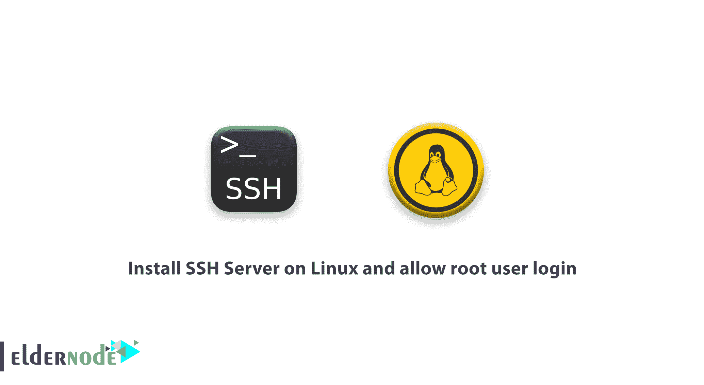

# 在 Linux 上安装 SSH 服务器，并允许 Root 用户登录

> 原文：<https://blog.eldernode.com/install-ssh-server-on-linux-and-allow-root-user-login/>



[更新] SSH 或 Secure Shell 是一种网络通信协议，使两台计算机能够进行通信。这是安装在 Linux 服务器上最简单也是最敏感的服务之一，当然，还有安全考虑。作为管理员甚至用户，该网络为您提供了一种通过不安全的网络访问计算机的安全方式。SSH 用于在两台计算机之间建立安全直接的连接。此外，为了“登录”并在远程计算机上执行操作，有时为了传输数据，您需要使用 SSH。本文介绍了在 Linux 上安装 SSH 服务器并允许 Root 用户登录。通过访问 [Eldernode](https://eldernode.com/) 上的各种软件包来选择和订购自己的**[Linux VP](https://eldernode.com/linux-vps/)**。

## **教程在 Linux 上安装 SSH 服务器并允许 Root 用户登录**

SSH 使您能够为 Linux 提供加密访问的服务。SSH 最初是一个 Unix 应用程序，也在所有的 Linux 发行版和 macOS 上实现。但是，如果安装了相关的程序，SSH 也可以在 Windows 上使用。在下文中，您将学习更多关于 SSH 的知识，以及在 Linux 上安装 SSH 的方法。

### **在 Linux 上安装 SSH 的先决条件**

为了让本教程更好地工作，请考虑以下先决条件:

对您的服务器的根访问权(_ u)

_ 终端(Linux)

### **什么是 SSH 服务器，为什么需要它？**

安全外壳是操作系统的一部分。它提供安全的网络服务和[强密码](https://blog.eldernode.com/how-to-create-strong-password/)认证和[公钥认证](https://blog.eldernode.com/configure-ssh-authentication-linux/)，以及通过开放网络(如互联网)连接的两台计算机之间的加密数据通信。数据、命令、文本和文件可以用 SSH 传输。
Shell 是基于文本的命令行、终端或控制台。图形用户界面也称为外壳。SSH 支持相同的功能，例如登录到远程系统并在其上运行终端会话。您可以使用安全的 shell 来代替不安全的终端仿真或登录程序，例如 Telnet、remote login 和 remote shell。使用 SSH 允许您拥有一个加密的连接，并确保在指定的计算机之间是否建立了连接。

让我们回顾一下 SSH 和 OpenSSH 之间的一些区别:

1-正如你在上面读到的，OpenSSH 是免费和开源的。但是 SSH 是一个封闭源代码的加密网络协议。

2-虽然 SSH 是在 1995 年作为 SSH-1 协议发布的，并试图取代 TELNET、rlogin、ftp 和 rsh 协议，但 OpenSSH 是在 1999 年发布的，不是一个协议，而是为自由软件爱好者创建的。

3-SSH 使用最多的命令是 *ssh* 、 *ssh-keygen* 、 *ssh-agent* 、 *ssh-keyscan* 、 *scp* 、 *sftp* 和 *sshd* 。而 OpenSSH 使用最多的命令是 *Ssh-keygen* 、 *ssh-copy-id* 、 *ssh-add* 、 *ssh-agent* 、 *scp* 、 *sftp* 和 *sshd* 。

## **如何在 Linux 上安装 SSH 服务器**

首先，您需要熟悉 OpenSSH。OpenSSH 是一组免费的开源计算机工具，用于通过使用 SSH 协议在计算机网络上提供安全和加密的通信。它最初是作为 OpenBSD 操作系统的一部分开发的，提供安全通信。请注意，OpenSSH 不是一个协议，而是一组使用 SSH 协议的计算机程序。

为了在服务器上获得 SSH，您需要运行 OpenSSH 包。OpenSSH 预装在各种版本的 Linux 上，适用于客户端和服务器端。但是，您需要使用 [Ubuntu](https://blog.eldernode.com/tag/ubuntu/) 作为操作系统，以便能够在 Linux 上安装 OpenSSH 并检查它是否已安装。要在 [Debian](https://blog.eldernode.com/tag/debian/) 、Ubuntu 或 Linux Mint 上安装 OpenSSH，使用下面的命令:

```
sudo apt-get install openssh-server openssh-client
```

软件包安装完成后，运行以下命令检查服务是否正在运行:

```
service sshd status
```

### **如何在 Linux 上配置 OpenSSH**

要开始配置 OpenSSH，您需要编辑 **/etc/ssh/sshd_config** 文件。因此，制作原始文件的副本，然后配置 OpenSSH。为此，请打开一个终端并运行下面的命令来制作原始 sshd 配置文件的副本:

```
sudo cp /etc/ssh/sshd_config /etc/ssh/sshd_config.original_copy
```

如果我弄错了，你可以在复制的文件上更改你想要的设置，然后重新使用它。

### **如何连接 OpenSSH**

当您正确完成安装和配置步骤后，就该检查您的 OpenSSH 服务器是否工作正常了。为此，您可以通过运行以下命令来使用 Netcat 工具:

```
nc -v -z 127.0.0.1 22
```

此外，您可以使用另一种方式连接到 OpenSSH，从您的**本地主机**通过您的 **OpenSSH 客户端**进行连接，或者使用 Nmap 进行[端口扫描。](https://blog.eldernode.com/scan-ports-using-connect-scan-on-nmap/)

或者在您的客户端计算机中，使用以下命令通过 SSH 进行连接。

```
ssh [[email protected]](/cdn-cgi/l/email-protection)
```

***注意* :** 使用远程计算机的用户名和[的 IP 地址](https://blog.eldernode.com/find-server-public-ip-linux/)。

一旦你面对“*你确定要继续连接(是/否)*的警告，输入**是**。然后，如果您在远程计算机上键入您的用户的密码，您将登录到远程 Linux 计算机。

默认情况下，该服务运行在 **TCP 端口 22** 上，但是您可以更改它。要设置 OpenSSH 监听 **TCP 端口 13** ，用您喜欢的文本编辑器打开 sshd_config 文件并运行:

```
What ports, IPs and protocols we listen for  Port 13
```

要让配置文件中的更改生效，运行以下命令并**重启**OpenSSH 服务器:

```
sudo /etc/init.d/ssh restart
```

重启 OpenSSH 后，您可以检查配置文件中的更改是否完成，以及 OpenSSH 服务器是否监听端口 13。要再次执行此操作，请使用 netcat 命令:

```
nc -v -z 127.0.0.1 13
```

最后，修改 **/etc/issue.net** 文件的内容，并在 sshd 配置文件中添加下面一行，如果您希望 OpenSSH 服务器显示一个漂亮的登录横幅的话:

```
Banner /etc/issue.net
```

## **如何允许 Root 用户登录 Linux**

现在，您可以通过打开文件 **/etc/ssh/sshd_config** 来启用 SSH root 登录:

```
vi /etc/ssh/sshd_config
```

然后，搜索下一行，将 *'#'* 放在开头，**保存**文件。

```
PermitRootLogin no
```

接下来，要重新启动 **sshd** 服务，运行:

```
/etc/init.d/sshd restart
```

此时，您应该能够以 root 用户身份登录。

## 结论

在本文中，您了解了如何在 Linux 上安装和使用 OpenSSH。然后，您回顾了启用 SSH root 登录的方法。请注意，如果您在系统上有大量用户帐户，您可以限制 SSH 用户登录。如果你有兴趣了解更多，请参考 [Ubuntu 20.04](https://blog.eldernode.com/enable-root-login-via-ssh-in-ubuntu-20-04/) 和 [Debian 10](https://blog.eldernode.com/enable-root-login-via-ssh-in-debian/) 中的通过 SSH 启用 root 登录。