# 教程在 IIS Web 服务器上安装 SSL 证书- Eldernode

> 原文：<https://blog.eldernode.com/install-ssl-on-iis-web-server/>

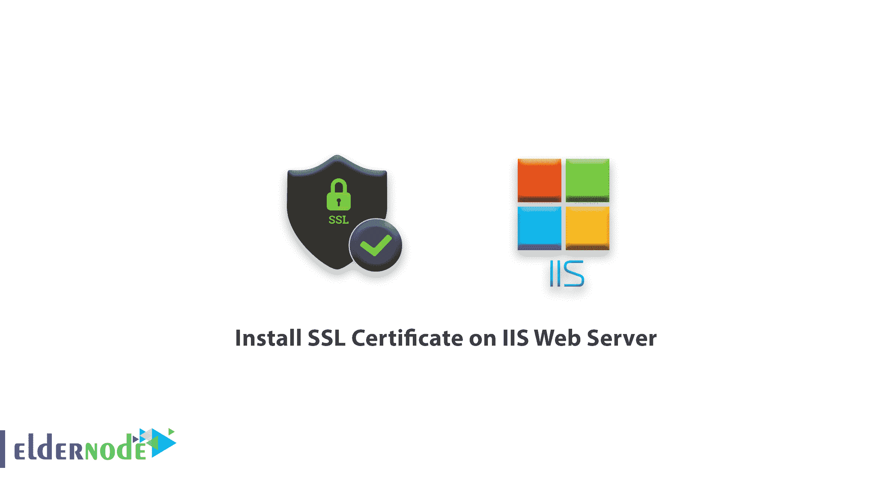

教程在 IIS Web 服务器上安装 SSL 证书。SSL 安全证书代表安全套接字层。SSL 的使用是为了在用户和网站之间提供安全性，并创建一个加密端口来让用户放心。
为了确保用户的信心，使用通过 SSL 或安全证书的安全连接，浏览器在 URL 中使用 https 和一个锁图标和绿色条代替 http。SSL 技术确保所有数据在浏览器中保持加密状态。

在之前的文章中，我们教过你如何在 cpanel 中安装 SSL。在本文中，我们将教你如何在 IIS Web 服务器中安装 SSL。

您可以从 eldernode 选择您最理想的 [Windows VPS Server](https://eldernode.com/windows-vps/) 软件包。

## A)将证书添加到 MMC

使用 Win+R 组合键打开运行程序。

**1。**输入 MMC，点击确定。

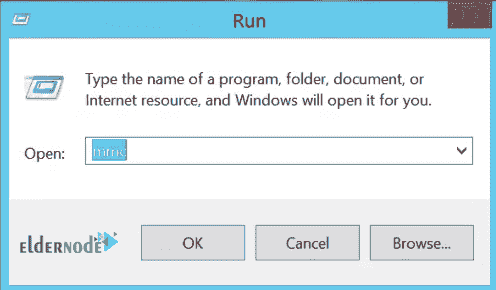

**2。**在新的 MMC 控制台窗口上点击文件，然后点击添加/删除管理单元。

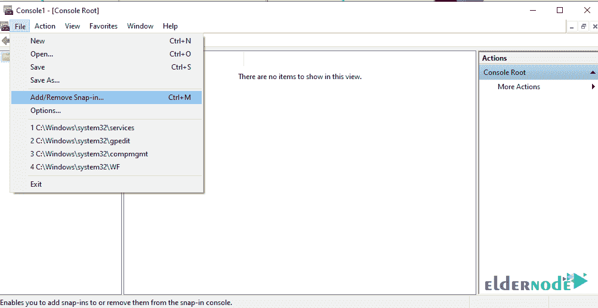

**3。**在添加/删除管理单元窗口中，首先点击证书，然后点击添加。

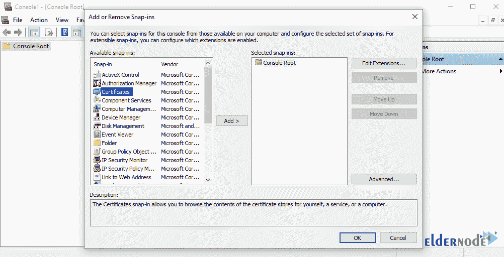

一个如下图所示的新窗口将会打开，名为证书 管理单元。

**4。**点击电脑账户按钮，点击下一步。

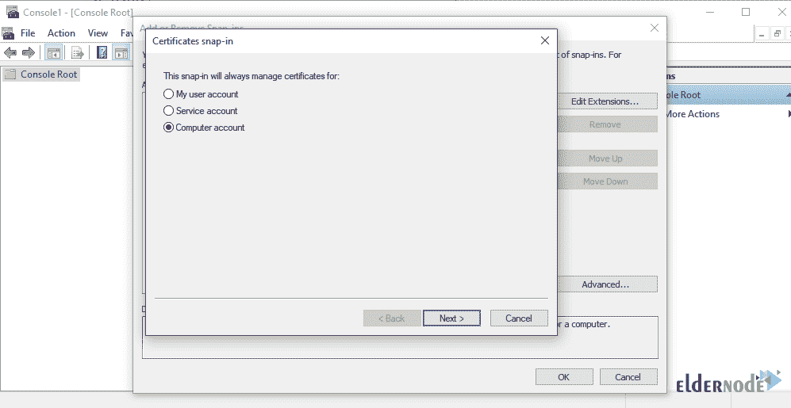

**5。**选择本地电脑，点击结束。

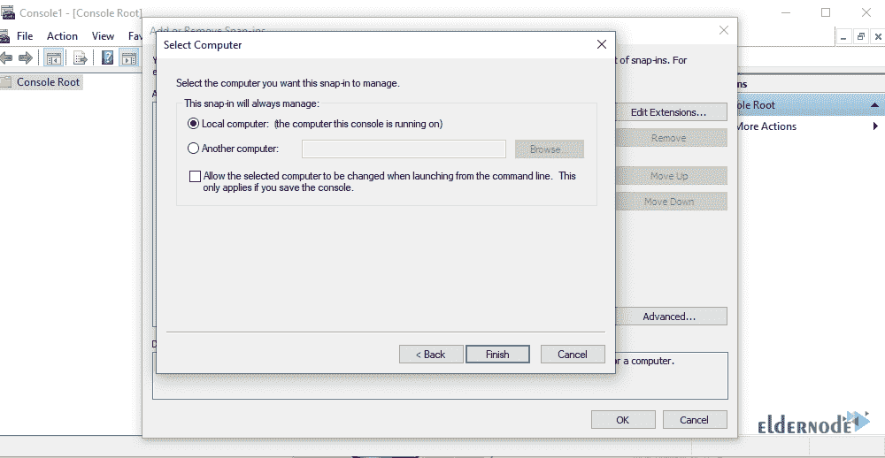

**6。**点击确定关闭添加或移除管理单元窗口。

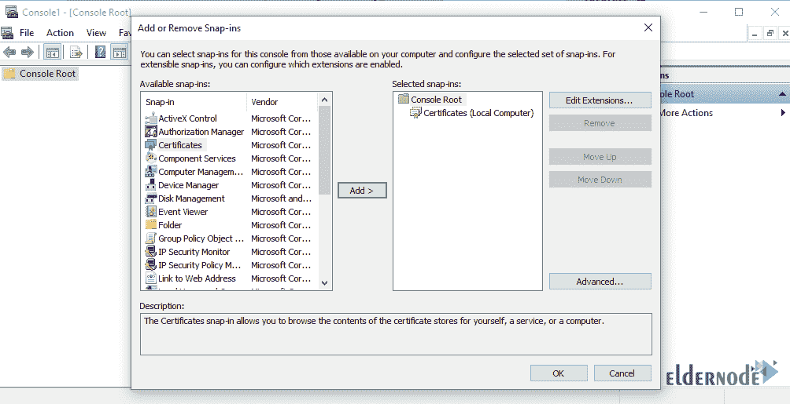

## B)导入证书

7 .**。**点击证书下拉菜单。

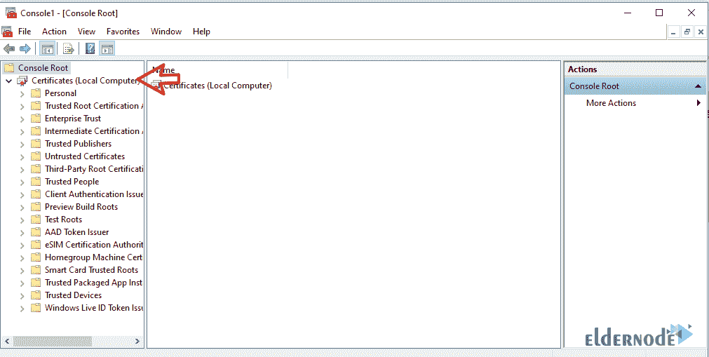

**8。**点击个人下拉然后**右键**点击证件 > 所有任务 > 导入。

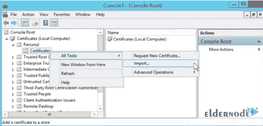

**9。**在下图中，点击浏览，浏览你的 SSL 文件。

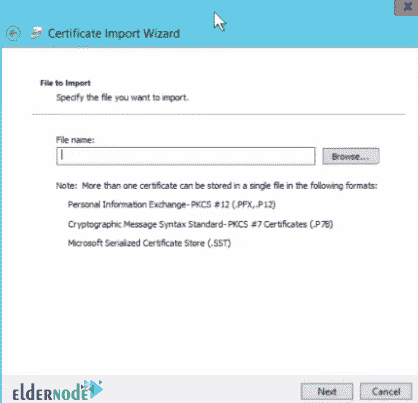

*

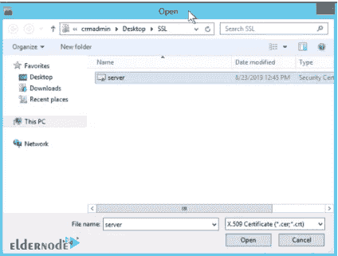

找到您想要的文件后，打开它查看 SSL 证书，如下所示。

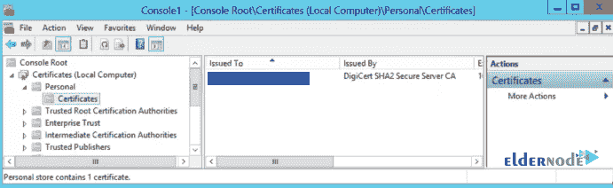

## C)向 IIS 添加证书

是时候在你的 [IIS Windows Web 服务器](https://en.wikipedia.org/wiki/Internet_Information_Services) 上安装你的证书了。

10。使用 Windows 键搜索 IIS 管理器。

**11。**打开 IIS 管理器后，选择默认网站，从页面右侧选择绑定。

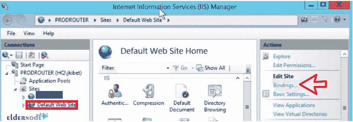

**12。在**站点绑定**窗口中，点击编辑。**

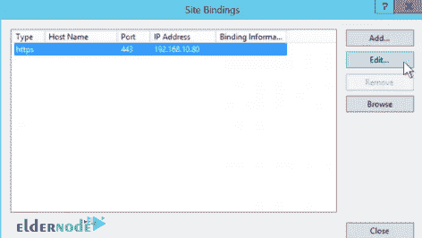

确保您的 IP 和端口是正确的。您也可以输入一个主机名。

在 SSL 证书区域，点击下拉箭头并检查您记录的 SSL 证书的友好名称是否可用。选中后，点击确定。

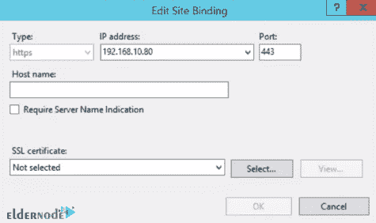

## D)重启 IIS 服务器

在最后一步，您需要重新启动您的 IIS 站点。为此，打开你的 IIS 管理器窗口，点击重启。

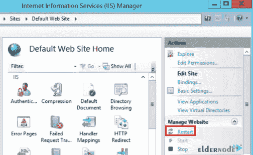

**尊敬的用户**，我们希望您能喜欢这个[教程](https://eldernode.com/category/tutorial/)，您可以在评论区提出关于本次培训的问题，或者解决[老年人节点培训](https://eldernode.com/blog/)领域的其他问题，请参考[提问页面](https://eldernode.com/ask)部分，并尽快提出您的问题。腾出时间给其他用户和专家来回答你的问题。

好运。