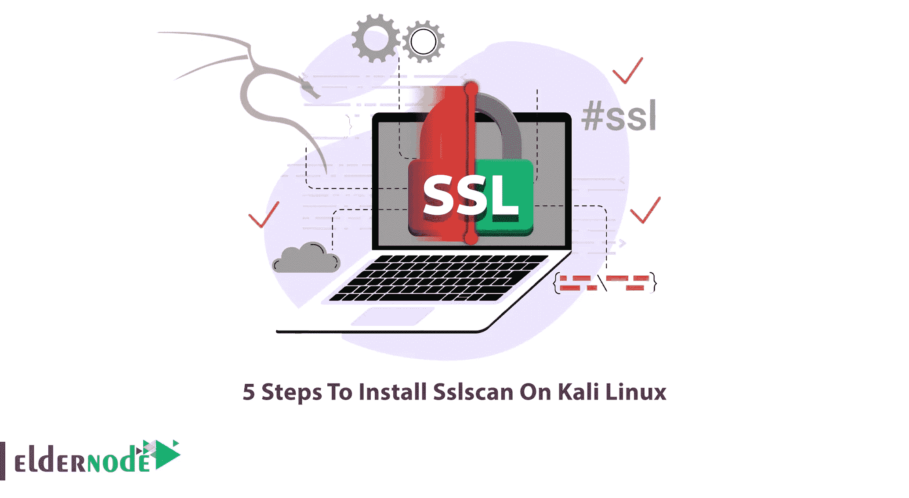

# 在 Kali Linux 上安装 Sslscan 的 5 个步骤

> 原文：<https://blog.eldernode.com/install-sslscan-on-kali-linux/>



如你所知，Kali Linux 是最流行的安全操作系统之一，它有许多工具。其中一个工具是 SSLScan 工具，用于检查网站的 SSL。在本文中，我们将向您解释在 Kali Linux 上安装 Sslscan 的 5 个步骤。如果你想买一台 [Linux VPS](https://eldernode.com/linux-vps/) 服务器，你可以访问 [Eldernode](https://eldernode.com/) 网站上提供的套装。

## **什么是 Sslscan？**

SSLScan 是开源的，在 Kali Linux 中默认可用。使用这个工具，您可以在服务上做各种事情。您可以做的第一件事是识别所使用的 SSL 版本。在接下来的步骤中，您可以找到加密类型和许多其他关于所用 SSL 的信息。

有些人认为，仅仅使用 SSL/TLS 加密的 HTTPS 是完全安全的，任何试图窃听的黑客只会得到一堆毫无意义的数据和数字。这个问题不确定。必须正确配置 HTTPS 服务器，以提供强大的加密级别，保护用户及其传输的数据免受 MITM 攻击。在 SSL 协议的实现和设计中有许多可以识别的漏洞。因此，安全通信测试是强制性的，也是渗透测试的要素之一。

## **如何在 Kali Linux 上安装 SSL scan**

默认情况下，Kali Linux 上提供 Sslscan 工具。但是在本文的剩余部分，我们将教你在 [Kali Linux](https://blog.eldernode.com/tag/kali-linux/) 上安装 Sslscan 的 5 个基本步骤。

### **1)依赖安装 Sslscan**

在我们想了解如何安装 Sslscan 之前，有必要了解运行该工具所需的依赖项。这些先决条件是:

```
- libc6
```

```
- zlib1g
```

### **2)** **安装 Sslscan**

在这一节中，我们将向您展示如何在 Kali Linux 上安装 Sslscan。只需在 kali 终端中运行以下命令就可以做到这一点。请注意，SSLScan 的设计简单、干净、快速。

```
sudo apt install sslscan
```

### **3)如何使用** **Sslscan**

现在已经成功安装了 Sslscan，是时候使用它了。您可以通过运行以下命令来实现这一点:

```
sslscan -h
```

```
sslscan [options] [host:port | host]
```

### **4)Sslscan**中使用的选项

在本节中，我们将向您介绍 Sslscan 选项。您可以使用这些选项做您需要的事情:

**–targets =<file>**包含要检查的主机列表的文件。主机可以提供端口(主机:端口)
**–sni-name =<name>**SNI 主机名
**–IP v4，-4** 仅使用 IP v4
**–ipv6，-6** 仅使用 IPv6

**–Show-certificate**显示完整的证书信息
**–Show-client-CAs**显示 TLS 客户端授权的可信 ca
**–no-check-certificate**不警告弱证书算法或密钥
**–ocsp**请求来自服务器的 ocsp 响应
**–PK =<file>**包含私钥的文件或包含私钥/证书对的 PKCS#12 文件

**–SSL 2**仅检查 SSLv2 是否启用
**–SSL 3**仅检查 SSLv3 是否启用
**–TL S10**仅检查 TLSv1.0 密码
**–TL S11**仅检查 TLSv1.1 密码
**–TLS 12**仅检查 TLSv1.2 密码
**–TLS 13**仅检查 TLSv1.3 密码

****–无密码详细信息**禁用 EC 曲线名称和 EDH/RSA 密钥长度输出
**–无密码套件**不检查支持的密码套件
**–无压缩**不检查 TLS 压缩(犯罪)
**–无回退**不检查 TLS 回退 SCSV
**–无组**不枚举密钥交换组
**–无心跳出血****

****–STARTTLS-FTP**STARTTLS 设置 FTP
–STARTTLS-IMAPSTARTTLS 设置 IMAP
–STARTTLS-IRCSTARTTLS 设置 IRC
–STARTTLS-LDAPSTARTTLS 设置 LDAP
–STARTTLS-MYSQLSTARTTLS 设置 MYSQL
**–STARTTLS****

### ****5)使用 Sslscan** 的例子**

**在全面介绍了 Sslscan 及其选项之后，您现在可以使用下面的示例，并根据您的需要对其进行自定义:**

```
`sslscan 127.0.0.1`
```

```
`sslscan [::1]`
```

## **结论**

**Sslscan 工具用于识别弱 ssl 配置。该工具可以识别和发现薄弱的哈希协议和算法以及犯罪和心脏出血漏洞。在本文中，我们试图教您如何在 Kali Linux 上安装 Sslscan。**