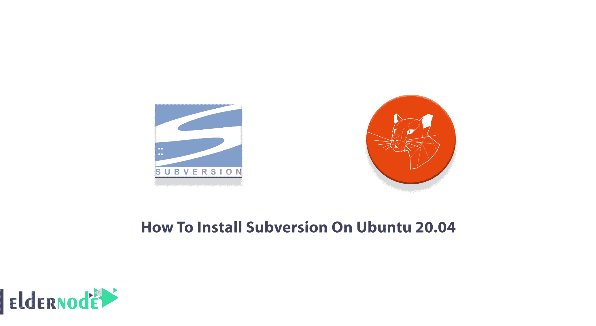
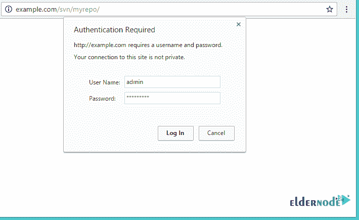

# 如何在 Ubuntu 20.04 上安装 Subversion-elder node 博客

> 原文：<https://blog.eldernode.com/install-subversion-on-ubuntu/>



Subversion 通常缩写为 SVN。它是一个开源的版本控制系统，用于管理和跟踪跨项目的代码和资产的变更。Subversion 是当今许多可用的版本控制选项之一。使用 Subversion，您可以访问对服务器上的文件和文件夹所做更改的完整历史记录，还可以恢复旧版本的文件。在这篇文章中，你将一步步学习如何在 Ubuntu 20.04 ，21.04 上安装 Subversion。在 [Eldernode](https://eldernode.com/) 上订购您想要的软件包，并购买您自己的 **[Ubuntu VPS](https://eldernode.com/ubuntu-vps/) 主机。**

## **教程在 Ubuntu 20.04 上安装 Subversion**

作为一名开发人员，您可能渴望使用 Subversion，因为它跨网络运行，并提供软件的最新更改。在撰写本文时，Apache Subversion 1.14.1 已经发布。和我们一起看看在 20.04 版本的 Ubuntu 上安装 Subversion 的过程。

### **在 Ubuntu 20.04 上安装 Subversion 的先决条件**

为了让本教程更好地工作，请考虑以下先决条件:

_ 拥有 Sudo 权限的非 root 用户。要进行设置，请遵循 Ubuntu 20.04 上的[初始服务器设置。](https://blog.eldernode.com/initial-server-setup-on-ubuntu-20/)

_ 指向您的 IP 地址的有效域名。

_ 服务器上配置的静态 IP 地址。

## **在 Ubuntu 20.04 上安装并配置 Subversion(SVN)**

Subversion 已经存在了一段时间，但仍有许多人在使用它。设置和管理 SVN 很容易。让我们通过本指南的步骤来学习如何安装和配置 Subversion。

*第一步:*

svn 服务器要求一个[Apache](https://blog.eldernode.com/apache-web-server-ubuntu-20/)web 服务器使用 HTTP URLs 访问 SVN 服务器。因此，首先，使用以下命令在您的系统上安装 Apache 服务器:

```
sudo apt update
```

```
sudo apt -y install apache2 apache2-utils
```

然后，要安装 **Apache SVN** ，运行:

```
sudo apt -y install vim tree subversion libsvn-dev libapache2-mod-svn subversion-tools
```

然后，使用命令启用 SVN 需要的 Apache 模块:

```
sudo a2enmod dav dav_svn
```

```
sudo systemctl restart apache2
```

要检查配置语法，运行:

```
sudo apachectl -t
```

最后，通过运行下面的命令重启Apache 2 服务:

```
sudo systemctl restart apache2
```

*第二步:*

在这一步中，您将创建 SVN 用户。用户认证信息保存在***/etc/Apache 2/dav _ SVN . passwd***上。Ao，要创建您的 admin Subversion 用户，请运行:

```
sudo htpasswd -cm /etc/apache2/dav_svn.passwd admin
```

然后，提供您的管理员用户密码。

**使用的选项:**

-c: 新建一个文件。

-m: 强制对密码进行 MD5 加密(默认)。

*注意* : 添加其他用户时，不要使用 *-c 选项* ，只需通过-m 来修改文件:

```
sudo htpasswd -m /etc/apache2/dav_svn.passwd user1
```

```
sudo htpasswd -m /etc/apache2/dav_svn.passwd user2
```

```
sudo htpasswd -m /etc/apache2/dav_svn.passwd user1
```

*第三步:*

成功安装后，您需要为它创建一个新的存储库。你可以把你的库放在 */var/lib/svn/* 目录下。要创建一个 SVN 存储库，运行:

```
sudo mkdir -p /var/lib/svn/sudo mkdir -p /var/lib/svn/
```

然后，使用下面的命令创建一个存储库:

```
sudo svnadmin create /var/lib/svn/<repo-name>
```

接下来，将目录 /var/lib/svn 的所有者设置为*www-data*user&group:

```
sudo chown -R www-data:www-data /var/lib/svn
```

```
sudo chmod -R 775 /var/lib/svn
```

### **如何在 Ubuntu 20.04 上访问 SVN Web 界面**

要在浏览器中访问存储库，请使用 HTTP URLs。当它提示您进行身份验证时，请使用在步骤 2:

```
http://server_ip_or_hostname/svn/<reponame>
```

*注意* : 记住在上面的命令中输入你的系统主机名、域名或者 IP 地址。

然后，您可以使用创建的用户名和密码登录。



## 结论

在本文中，您了解了如何在 Ubuntu 20.04 上安装 Subversion。如果你已经成功地通过了所有必要的步骤，那么最新版本的 Subversion 应该已经安装在你的 Ubuntu 系统上了。