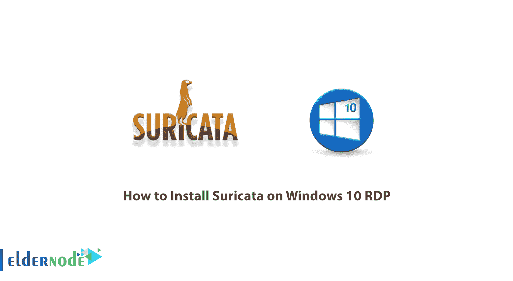

# 如何在 Windows 10 上安装 Suricata RDP-elder node 博客

> 原文：<https://blog.eldernode.com/install-suricata-on-windows-10/>



Suricata 是一个入侵检测和预防系统。该工具自我介绍为一个完整的安全监控生态系统。与其他工具相比，Suricata 的一个最重要的特性是它向上工作到应用层。这使得 Suricata 能够识别其他工具可能忽略的风险，因为它们被分成多个包。在这篇文章中，我们将教你如何在 Windows 10 RDP 上安装 Suricata。需要注意的是，如果你想购买一台 **[Windows VPS](https://eldernode.com/windows-vps/)** 服务器，可以访问 [Eldernode](https://eldernode.com/) 中提供的软件包。

## **教程在 Windows 10 上安装 Suricata RDP**

Suricata 的功能不仅限于应用层。它也适用于较低的级别和协议，如 TLS、ICMP、TCP 和 UDP。Suricata 还检查 HTTP、FTP 和 SMB 协议，以发现异常请求形式的隐藏入侵企图。应该注意的是，Suricata 还使用了提取文件的功能，以便管理员可以检查可疑的文件。

请注意，Suricata 的设计非常巧妙，它将工作负载分布在多个处理器内核和芯片上，以实现最佳性能。它还会将其部分工作负载转移到显卡，这对于服务器来说是一个很好的功能。

在本文的剩余部分，和我们一起一步一步地解释如何在 Windows 10 RDP 上安装 Suricata。

## **在 Windows 10 RDP 服务器上安装 Suricata**

在这一节中，我们将讨论如何在 Windows 10 RDP 上安装 Suricata。为此，请按顺序执行以下步骤。第一步是[下载 Suricata for Windows](https://suricata-ids.org/download/) 。


在打开的窗口中，点击**运行**。


然后点击**下一个**。


勾选**我接受……**，点击**下一步**接受许可协议。


在下一步中，您可以选择要安装的方法。然后点击**下一个**。


点击**安装**。


*


最后你还要点击**完成**。


一旦您成功地安装了 Suricata，您现在应该创建一个包含您的配置、规则和测试捕获的文件夹。注意，这个文件夹是 **C:\Suricata** 。您需要在该文件夹中创建一个文件夹日志、规则和项目。


在 **Rules** 文件夹中，您必须将 Rules 文件夹的内容复制到 Suricata 程序的目录中。

**Threshold.config** 是一个空文件。

**suricata.yaml** 是在 suricata 应用程序列表中找到的 suricata.yaml 的副本。

***注:*** 你可以在 GitHub 上找到我对 [suricata.yaml 的修改。](https://github.com/DidierStevens/Beta/commit/d7694645131bd9b684048bdcb7324c56cae5c3fd#diff-81363487a187e70558fcfb0c8cbb8c40)

在下一步中，对于每个项目或测试，您应该在文件夹项目中创建一个文件夹。像这样的 **mimikatz** 文件夹:


在这里，我们使用下面的 BAT 文件来用我们的规则和捕获文件启动 Suricata:

```
C:\Program Files (x86)\Suricata\suricata.exe” -c ..\..\suricata.yaml -S mimikatz.rules -l logs -k none -v -r drsuapi-DsGetNCChanges.pcap  pause
```

1.通过选项 **-S** ，我们可以使用我们的规则文件 mimikatz.rules(不加载任何其他规则文件)。

2.选项 **-l** logs 使用我们的本地日志目录来写入日志文件。

3. **-k** 无禁用校验和检查。

4. **-v** 表示啰嗦。

5. **-r** 。pcap 读取我们的捕获文件供 Suricata 处理。

重要的一点是，如果您遇到类似下面的错误信息，您应该遵循下面的步骤。


### **如何在 Windows 10 上安装 WinPcap**

访问 [WinPcap 网站](https://www.winpcap.org/)并下载。然后到你下载文件的地方双击。

在打开的窗口中，点击下一个的**。**


然后点击**我同意**确认许可协议。


点击**安装**开始安装 WinPcap。


最后，点击**完成**。


### **如何在 Windows 10 服务器上运行 Suricata**

请注意，您可以[从新兴威胁](https://rules.emergingthreats.net/open/suricata-4.0/emerging.rules.zip)下载规则。然后将规则文件夹中的文件解压到 **C:\Suricata\rules** 文件夹中。


您可以在没有显式规则的情况下处理捕获文件，如下图所示:


## 结论

Suricata 是由 OISF 开发的开源入侵检测引擎。测试版于 2009 年末发布，标准版于 2010 年年中发布。该引擎可用作入侵检测系统(IDS)、入侵防御系统(IPS)或网络[安全](https://blog.eldernode.com/tag/security/)监视器。Suricata 使用一套广泛的规则和签名语言来监控网络流量。在这篇文章中，我们试图教你如何一步一步地在 Windows 10 RDP 上安装 Suricata。