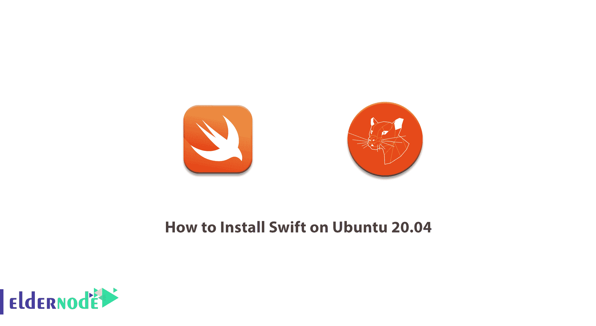

# 如何在 Ubuntu 20.04 - Eldernode 博客上安装 Swift

> 原文：<https://blog.eldernode.com/install-swift-on-ubuntu-20-04/>



Swift 是苹果最新编程语言的名字，它想取代面向对象的 C 编程语言。这种语言将成为构建 Mac OS X 和 IOS 应用程序的主要语言。因为这种编程语言和其他流行的编程语言一样有组合，所以非常容易学。最初，Swift 仅适用于苹果设备，不能在 Windows、Linux 和其他操作系统上使用。但随着编程语言越来越受欢迎，越来越多的用户要求苹果在其他平台上发布 Swift，最终决定 Swift 将是开源的。在本文中，我们尝试学习**如何在 Ubuntu 20.04** 上安装 Swift。你可以使用 [Eldernode](https://eldernode.com/) 提供的软件包购买一台 [Ubuntu VPS](https://eldernode.com/ubuntu-vps/) 服务器。

## **教程在 Ubuntu 20.04 上安装 Swift**

2007 年，当苹果推出第一代 iPhone 时，其专有平台(iOS)的应用开发市场蓬勃发展。编程语言实际上是设计和开发应用程序最重要的因素。这个领域中非常年轻的语言之一是 Swift 编程语言。

Swift 是一种多模式、面向对象的函数式语言，由克里斯·拉特纳设计，用于对 Objective-C 进行故障排除。该语言还通过 Cocoa 和 Cocoa Touch 框架访问用 Objective-C 编写的旧代码。

其实开发这种语言的主要目的其实是为了增加安全性，修复 bug 和短代码。由于 Xcode 中的编译器，开发人员将能够轻松创建自己的应用程序。关注我们，了解如何在 [Ubuntu](https://blog.eldernode.com/tag/ubuntu/) 20.04 上安装 Swift。

### **Swift 编程语言的特点**

在本节中，我们将提到 Swift 编程语言的一些基本特征:

**1。面向协议的编程模式**

该协议实际上与面向对象语言中的类相同，只是它的性能比它们好。Inherit 在面向对象语言中不太好用，但另一方面，通过协议很容易做到。

**2。选择变量的选项**

当变量遇到 nil 和 null 错误时，程序员通过在代码结构中放置一个问号来防止应用程序被挂起。

**3。密码和密码解密**

所有应用程序都基于数据传输工作。因此，数据安全是程序员最关心的问题之一。应用程序连接到许多网络和 API，因此它们发送或接收的数据必须加密或解密。Swift 的多样化语言库具有许多功能来确保代码安全。

**4。名为 Xcode** 的集成软件开发环境

使用苹果开发的 Xcode，开发者可以修复 Swift 语言中的问题和错误。此外，Xcode 软件支持 C、C ++、 [Python](https://blog.eldernode.com/install-python-3-ubuntu-20/) 、 [Java](https://blog.eldernode.com/install-java-apt-ubuntu-20/) 、AppleScript、 [Ruby](https://blog.eldernode.com/install-ruby-centos8/) 等语言的全部源代码。

### **在 Ubuntu 20.04 上安装 Swift**

要在 Ubuntu 上安装 Swift，只需遵循以下步骤。第一步，在使用以下命令安装 Swift 之前，您需要安装必要的依赖项:

```
sudo apt install clang libpython2.7 libpython2.7-dev
```

安装完所需的依赖项后，我们将去下载 Swift。要下载 Swift，您必须运行以下命令:

```
wget https://swift.org/builds/swift-5.3-release/ubuntu2004/swift-5.3-RELEASE/swift-5.3-RELEASE-ubuntu20.04.tar.gz
```

现在您需要使用以下命令提取 tar 文件:

```
tar xzf swift-5.3-RELEASE-ubunutu20.04
```

然后，您需要将提取的文件移动到“共享”目录:

```
sudo mv swift-5.3-RELEASE-ubunutu20.04 /usr/share swift
```

在下一步中，您需要使用以下命令将 Swift 路径设置为系统路径环境变量。注意，如果使用 bash 改变 **~/。zshrc** 到 **~/。bashrc** 。

```
echo "export PATH=/usr/share/swift/usr/bin:$PATH" >> ~/.zshrc
```

```
source ~/.zshrc
```

最后，在安装 Swift 后，您可以通过运行以下命令来检查版本，并确保其成功安装:

```
swift -v
```

## 结论

Swift 是苹果新的开源编程语言的名字，你可以在任何操作系统上使用。苹果使得在 Ubuntu 上与 Swift 合作变得很容易。所以我们决定在本文中学习如何在 Ubuntu 20.04 上安装 Swift。