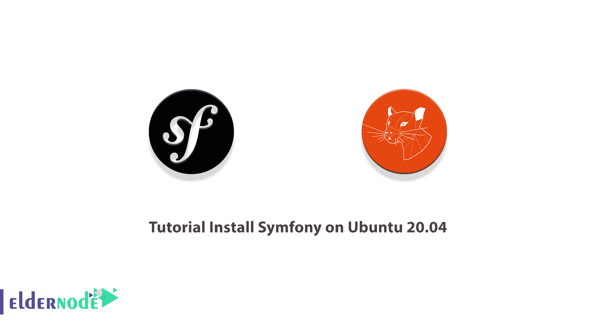

# 教程在 Ubuntu 20.04 和 21.04 上安装 Symfony-elder node 博客

> 原文：<https://blog.eldernode.com/install-symfony-on-ubuntu/>



PHP 是服务器端编程最重要的语言之一，被许多程序员使用。这种语言有许多框架，这些框架为程序员提供了许多可能性。Symfony 是基于 MVC 架构的 PHP 组件集合，也是唯一完全符合 PHP 标准的框架。Symfony 很容易在大多数平台上安装和配置，它最好的特性是能够重用它的 PHP 组件。在本文中，我们要向大家介绍的是教程**在 Ubuntu 20.04** ，21.04，18.04 上一步步安装 Symfony。如果你想购买一台 **[Ubuntu VPS](https://eldernode.com/ubuntu-vps/)** 服务器，你可以访问 [Eldernode](https://eldernode.com/) 中提供的软件包。

## **教程在 Ubuntu 20.04 上安装 Symfony**

Symfony 有许多用户关联，比其他框架如 [Laravel](https://blog.eldernode.com/install-laravel-on-ubuntu-20-04-lts/) 更容易让专业和有经验的开发者使用。这些因素使得 Symfony 成为继 Laravel 和 CodeIgniter 之后第三个最受开发者欢迎的框架。在这篇文章的续篇中，加入我们来教你如何在 [Ubuntu](https://blog.eldernode.com/tag/ubuntu/) 20.04 上安装 Symfony。

### **Symfony 简介**

Symfony 框架是最受信任的 PHP 语言框架之一，也是实现 web 应用程序的绝佳选择。Symfony 有很多特点。这个框架的插件称为 bundles，是 PHP 文件、图像、JavaScript 代码等的集合。可以用来实现网站的各个部分，比如博客。这些包可以被修改，并且可以在其他项目中使用。

Symfony 还有一些组件可以加速任何项目的通用部分的实现，这样程序员就可以花更多的时间来实现更复杂和定制的部分。使用捆绑包和组件有助于减少项目依赖性，使更改更加容易，使 Symfony 在基于 web 的项目中更加灵活。

在这篇文章的续篇中，我们将教你如何在 Ubuntu 20.04 上安装 Symfony。

### **在 Ubuntu 20.04 上安装 Symfony 之前的技术要求**

在安装 Symfony 之前，您需要提供以下先决条件:

_ [安装 PHP](https://blog.eldernode.com/install-and-configure-php-on-ubuntu-20-04/) 7.2.5 或更高版本以及这些 PHP 扩展:Ctype、iconv、JSON、PCRE、Session、SimpleXML、Tokenizer

_ 安装[编写器](https://blog.eldernode.com/install-composer-debian-10/)。

## **如何在 Ubuntu 20.04 上安装 Symfony | Ubuntu 21.04**

要在 Ubuntu 20.04 上安装 Symfony，必须在第一步使用以下命令更新系统:

```
sudo apt update
```

```
sudo apt upgrade
```

如前所述，安装 Symfony 的先决条件之一是安装 PHP。您可以使用以下命令安装 PHP:

```
sudo apt install php php-json php-ctype php-curl php-mbstring php-xml php-zip php-tokenizer php-tokenizer libpcre3 --no-install-recommends
```

您也可以通过执行以下命令安装 GIT 、 Zip 、和 Unzip :

```
sudo apt install git zip unzip
```

成功安装必要的工具后，您现在可以使用以下命令下载并安装 Symfony-cli :

```
wget https://get.symfony.com/cli/installer -O - | bash
```

### **如何在 Ubuntu 20.04 上设置 Symfony**

根据上一步的说明成功安装 Symfony 后，我们现在要配置和设置它。您可以使用以下命令将 Symfony 安装路径添加到 PATH user 中:

```
export PATH="$HOME/.symfony/bin:$PATH".
```

现在，您可以通过运行以下命令来应用更改:

```
source ~/.bashrc
```

在下一步中，您可以使用以下命令在 Git 中配置您的电子邮件和用户名:

```
git config --global user.email "Your_Email_Address"
```

```
git config --global user.name "Your_User_Name"
```

最后，您可以通过执行以下命令创建一个新项目:

```
symfony new example --full
```

您可以运行以下命令来启动本地 web 服务器:

```
cd example
```

```
symfony server:start
```

在最后一步，您可以通过以下地址查看您的项目:

```
http://localhost:8000/
```

## 结论

Symfony 有很多更新，以前的版本与新版本配合得很好，所以开发者不会有问题。此外，由于拥有活跃的社区和开放源代码，这个框架使得开发人员可以很容易地对其进行修改，并使其可供其他用户用于各种用途。在本文中，我们试图在介绍 Symfony 之后，教大家如何在 Ubuntu 20.04 上安装 Symfony。