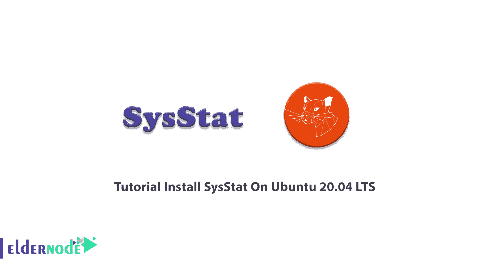

# 教程在 Ubuntu 20.04 上安装 SysStat LTS-elder node 博客

> 原文：<https://blog.eldernode.com/install-sysstat-on-ubuntu-20-04/>



System Static 是一个针对 Linux 的性能监控工具集合，可以调试 Linux 系统上的性能问题。SysStat 是开源的、免费的、功能强大的，可以在 Unix 和类似 Unix 的操作系统上使用。使用 SysStat，您可以实时查看系统性能数据，或者分析保存的档案中的数据。我们将为您呈现在 Ubuntu 20.04 LTS 上安装 SysStat 的**教程。不要错过 [Eldernode](https://eldernode.com/) 的 2021 年热卖优惠，购买最合适的套餐。购买您自己的 [Linux VPS](https://eldernode.com/linux-vps/) 并和我们在一起！**

## **如何在 Ubuntu 20.04 上安装 SysStat LTS**

为了让本教程更好地工作，请考虑以下先决条件:

拥有 sudo 权限的非 root 用户。

要进行设置，请遵循我们在 Ubuntu 20.04 上的[初始服务器设置。](https://blog.eldernode.com/initial-server-setup-on-ubuntu-20/)

让我们通过本指南的步骤来学习 SysStat 在您的 [Ubuntu](https://blog.eldernode.com/tag/ubuntu/) 系统上的安装和配置。

### **SysStat 实用程序**

SysStat 是用 C 语言编写的，提供了许多实用程序，如 **sar** 、 **tapestat** 、 **cifsiostat** 、 **pidstat** 、 **mpstat** 和 **iostat** 。每个实用程序都运行一个任务来收集系统使用活动和系统性能。

### **在 Ubuntu 20.04 上安装并配置 SysStat | Ubuntu 18.04**

*第一步:*

要开始安装 SysStat，您需要知道它的包在默认的包存储库中是可用的。因此，您可以通过命令进行安装。因为缺省的存储库有旧版本的包，所以您需要使用带有源代码的安装。

如果要使用软件包管理器，请运行以下命令:

```
sudo apt install sysstat -y
```

*第二步:*

因为 SysStat 监视在默认情况下是禁用的，所以您应该在文本编辑器中编辑配置文件以启用 SysStat 监视。因此，让我们启用 SysStat 监控，编辑下面的文件并保存它。

```
sudo vim /etc/default/sysstat
```

然后，您必须将 ENABLED 设置为 true，如下所示:

```
ENABLED="true"
```

现在，您可以保存并关闭文件。

启用 SysStat 服务，并在启用监视时通过运行下面的命令来启动它。

```
sudo systemctl enable sysstat
```

```
sudo systemctl start sysstat
```

*第三步:*

在这一步中，您将学习如何使用 SysStst 进行实时监控。sar 命令行工具可以帮助您获得实时系统静态。命令行上有各种各样的静电干扰，让我们来看看其中的一些。

**当前 CPU 使用率** _ 使用-u 和 star 命令查看实时 CPU 静态。

```
sar -u
```

如果指定了显示数据的实时时间间隔和次数，则可以查看实时 CPU 使用率。让我们看一个例子:查看 5 次实时 CPU 使用情况，相差 1 秒。

```
sar -u 1 5
```

由于大多数 CPU 都是多核的，因此您可以更深入地查看 CPU 利用率数据。使用 *-P ALL* 命令分别查看每个内核的利用率详情。

```
sar -P ALL 1 3
```

**查看设备使用情况** _ 使用 **iostat** 命令查找磁盘静态信息。

iostat 显示当前每秒的数据传输量、读写磁盘的总块数以及平均每秒的块数。

```
iostat -d 1 5
```

看细节:

**每秒传输 tps _**

**Blk_read/s _** 每秒以块为单位读取的数据总量。

**Blk_wrtn/s _** 每秒以块为单位写入的数据总量。

**Blk_read _** 总块读取。

**Blk_wrtn _** 写入的总块。

使用以下命令查看磁盘的更多扩展 I/O 静态信息。

```
iostat -x 1 5
```

**查看正在运行的进程资源利用率** _ 使用带有开关 *-d* 的 **pidstat** 命令为您提供系统上当前正在运行的进程的详细信息。

```
pidstat -d
```

如果您使用 *-r* 来尝试 pidstat，以每 1 秒显示 5 次进程的资源利用率。

```
pidstat -r 1 5
```

**内存使用数据** _ 使用 **sar** 命令配合 *-r* 每 1 秒查看 5 次当前内存使用详细信息。

```
sar -r 1 5
```

*第四步:*

SysStat 将监控数据存储在文件中。要了解如何使用 SysStat 查看历史数据，请继续这一步。您可以使用 star 命令来完成此操作。默认情况下，它保留 7 天的数据，但可以在 **/etc/sysstat/sysstat** 文件中更改天数。

```
HISTORY=28
```

您可以在/var/log/sysstat 目录下找到存储在那里的所有日志文件。文件名将为 sa1、sa2 等。(1 和 2 是当月的数据)

要查看当月 20 日的内存利用率报告，请键入:

```
sar -r -f /var/log/sysstat/sa20
```

范围时间可以用上面的命令指定。它只能查看给定时间之间的静态。要查看晚上 10:00 到 11:00 之间的静态数据，请键入:

```
sar -r -f /var/log/sysstat/sa20 -s 22:00:00 -e 23:00:00
```

**注**:所需数据的文件提供了 *-f* 选项，用于查看历史 sar 数据。

因此，您可以使用下面的命令，通过 star 命令查看任意日期的 CPU 利用率数据:

```
sar -u -f /var/log/sysstat/sa28
```

## 结论

在本文中，您阅读了在 Ubuntu 20.04 LTS 版上安装 SysStat 的教程。如果您有兴趣了解更多信息，可以找到更多介绍 Icinga 2 Linux 服务器监控工具以及如何在 Ubuntu 20.10 上安装 Nagios 监控的相关文章。