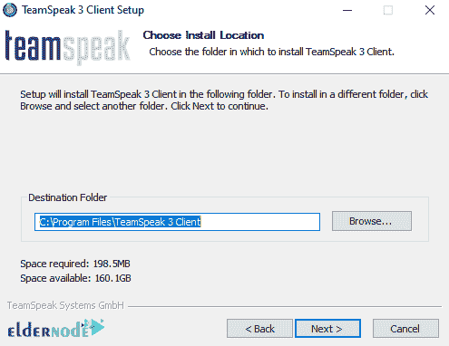

# 介绍并在 Windows 上安装 Teamspeak 3 服务器

> 原文：<https://blog.eldernode.com/install-teamspeak-3-server-on-windows/>

TeamSpeak 是两个或更多人通过互联网进行文本和语音交流的优秀软件的名字。这个软件非常简单，很受游戏玩家的欢迎。因为这些用户用这个软件互相聊天，互相询问游戏。比如他们都想在设定的时间上线玩一个游戏，就通过这个软件放在一起。本文介绍了在 Windows 上介绍和安装 Teamspeak 3 服务器。如果你想买一台 [**Windows VPS**](https://eldernode.com/windows-vps/) 服务器，你可以在 [Eldernode](https://eldernode.com/) 看到可用的软件包。

## **介绍 Teamspeak 3 服务器**

TeamSpeak 就像一个电话会议，一个专用的互联网协议语音(VoIP)应用程序，用于聊天频道上用户之间的语音通信。在本文的后续部分，我们将向您介绍如何在 [Windows](https://blog.eldernode.com/tag/windows/) 上安装 Teamspeak 3 服务器。请继续关注本文的其余部分。

### **Teamspeak 3 服务器特点**

在这一部分，我们想提一下 Teamspeak 3 服务器的一些特性。这些功能包括:

1.独特的通信体验

2.广泛的安全设置

3.文件传输

4.集成聊天

5.附加组件——皮肤、插件和工具

6.游戏内覆盖

7.免费

8.卓越的音质

9.多平台

10.也适用于移动设备

## **如何在 Windows 上安装 Teamspeak 3 服务器**

在本节中，我们将一步一步地教你如何在 Windows 上安装 Teamspeak 3 服务器。为此，只需遵循以下步骤。

第一步是访问 [Teamspeak 网站](https://www.teamspeak.com/en/downloads/)。

点击**服务器**选项卡。根据您的 Windows 操作系统版本，您必须选择一个 **32 位**或 **64 位**版本，并点击其前面的**下载**。

这样做将开始下载安装文件。

然后你需要去你下载文件的地方。右击所需文件，点击**提取此处**将其提取。

在解压后的文件夹中，点击 **ts3server** 文件，开始 Teamspeak 安装过程。

在打开的窗口中，点击**接受**。

然后可以看到登录信息，包括**登录名**、**密码**、 **API-Key、**和**服务器管理权限密钥**。

***注意:*** 将以下窗口中显示的信息保存到一个文本文件中，以备后用。

### **如何在 Windows 上运行和设置 Teamspeak 3 客户端**

到目前为止，您已经能够在 Windows 上安装 Teamspeak 3 服务器。现在，要连接到 Teamspeak 3 服务器，您需要以管理员身份安装 **Teamspeak 客户端**。为此，您必须遵循以下步骤。

要 [**下载 Teamspeak 客户端**](https://www.teamspeak.com/en/downloads/) ，点击**客户端**标签，从**窗口**部分下载您想要的版本。

回到下载文件的地方，双击它。在打开的窗口中，点击下一个的**。**

下一步，阅读**许可协议**并勾选**我接受条款……**选项。点击**下一步**继续安装。

点击下一个的**。**

在下一步中，您需要指定您想要安装文件的位置，然后单击 **Next** 。

点击下一个的**。**

最后，点击**安装**。

点击**完成**完成 Teamspeak 客户端安装。

双击桌面上的 **Teamspeak 客户端图标**来运行它。然后在打开的窗口中，你应该阅读许可证书并点击**我接受**。

现在你需要输入你的账户信息，点击**登录**。

如果您没有帐户，您可以点击**创建帐户**并创建您自己的帐户。

从**连接**选项卡中，点击**连接**。

下一步，在打开的窗口中，您必须在**服务器昵称或地址**字段中输入您想要的 **IP 地址**。然后点击**连接**按钮连接到服务器。

***注:*** 最后需要注意的是，如果你想以管理员的身份拥有访问权限，你必须输入你已经在文本文件中记下的**权限密钥**。

结论

客户端软件连接到用户选择的 TeamSpeak 服务器，用户可以从该服务器加入聊天频道。为此，在本文中，在 Windows 上安装 Teamspeak 3 服务器后，我们教你如何在 Windows 上安装 Teamspeak 客户端进行通信。

***Note:*** Finally, it should be noted that if you want to have access as an administrator, you must enter the **privilege key** that you have already noted in a text file.

## Conclusion

The client software connects to a TeamSpeak server of the user’s choice, from which the user may join chat channels. For this reason, in this article, after installing Teamspeak 3 Server on Windows, we taught you how to install Teamspeak Client on Windows to communicate.