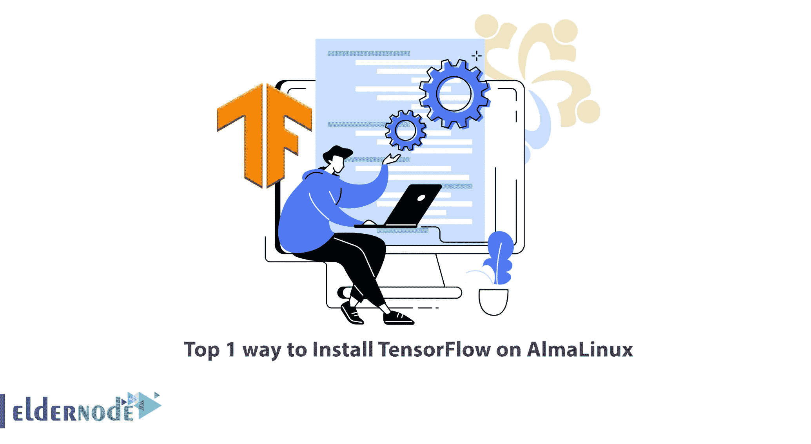

# 在 AlmaLinux 上安装 TensorFlow 的 1 大方法

> 原文：<https://blog.eldernode.com/install-tensorflow-on-almalinux/>



TensorFlow 是一个免费的开源库，用于数据流编程和各种任务的微分编程。TensorFlow 是一个符号数学库，在机器学习中有多种应用，包括神经网络的实现。在本文中，我们将教您在 AlmaLinux 上安装 TensorFlow 的 1 大方法。需要注意的是，你可以访问 [Eldernode](https://eldernode.com/) 网站上提供的套装来购买 [Linux VPS](https://eldernode.com/linux-vps/) 服务器。

## **什么是张量流？**

TensorFlow 库由谷歌大脑团队开发，供谷歌内部使用；但在 2015 年 11 月 9 日以“Apache 2.0 开源”证书发布。目前，TensorFlow 库正在谷歌用于研究和运营项目。

TensorFlow 库适用于 64 位 Linux、Windows、MacOS 以及 Android 和 iOS 等移动平台。该库具有灵活的架构，允许针对各种平台(GPU、CPU 和 TPU)进行轻松开发，从桌面到服务器集群、移动设备以及新设备和边缘设备。张量流计算表示为“有状态数据流图”。TensorFlow 这个名称来自于神经网络对称为张量的多维数据数组执行的操作。

在这篇来自 [AlmaLinux 培训](https://blog.eldernode.com/tag/almalinux/)系列的文章的续篇中，我们将教授在 AlmaLinux 上安装 TensorFlow。

## **在 AlmaLinux 上安装 tensor flow**

在上一节熟悉了 TensorFlow 之后，现在我们想在本节教你如何在 [AlmaLinux](https://blog.eldernode.com/install-and-configure-almalinux-9/) 上安装 TensorFlow。应该注意的是，TensorFlow 可以安装在系统范围内，在 Python 虚拟环境中，作为 Docker 容器，或者与 Anaconda 一起安装。

在第一步中，您需要通过运行以下命令来更新系统:

```
sudo dnf update
```

现在您需要在系统上安装 Python。为此，您可以使用以下命令:

```
sudo dnf install python3
```

安装 Python 后，下一步是导航到要保存 TensorFlow 项目的目录。现在，您可以为 TensorFlow 项目创建一个新目录。最后，运行以下命令:

```
mkdir tensorflow_project
```

```
cd tensorflow_project
```

您可以使用以下命令创建新的虚拟环境:

```
python3 -m venv venv
```

在下一步中，您可以通过运行以下命令来激活虚拟环境:

```
source venv/bin/activate
```

需要注意的一点是，在 AlmaLinux 上安装 TensorFlow 需要 pip。因此，您需要使用以下命令:

```
(venv) $ pip install --upgrade pip
```

最后，您可以使用以下命令在 AlmaLinux 上安装 TensorFlow:

```
(venv) $ pip install --upgrade tensorflow
```

现在，您可以通过运行以下命令来检查 TensorFlow 的版本:

```
(venv) $ python -c 'import tensorflow as tf; print(tf.__version__)'
```

请注意，您可以在最后禁用您的虚拟环境:

```
(venv) $ deactivate
```

## 结论

机器学习是一个复杂的领域。但机器学习模型的实现比看起来容易得多，这要归功于该领域现有的框架，如 TensorFlow。在 Tensorflow 的帮助下，收集数据、训练模型、提供预测和修正未来结果的过程变得容易得多。在本文中，我们试图教你在 AlmaLinux 上安装 TensorFlow 的 1 大方法。如果你有任何问题，可以在评论区和我们分享。