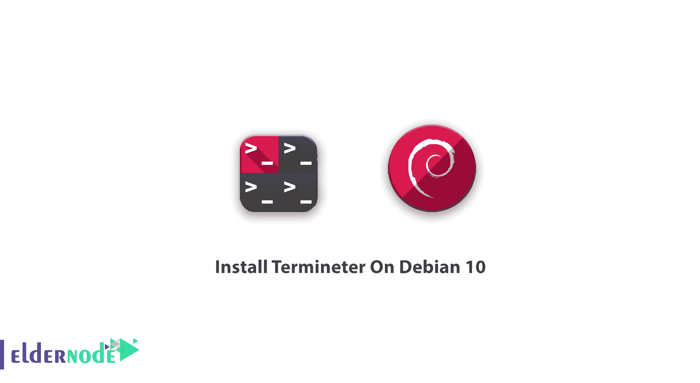

# 如何在 Debian 10 | Eldernode 上安装 Termineter

> 原文：<https://blog.eldernode.com/install-termineter-on-debian-10/>



教程如何**在 Debian 10 上安装 Termineter**。Termineter 是一个 [Python](https://www.python.org/) 框架。当你使用这个**S**mart**M**eter**S**security**T**esting**F**框架时，你就拥有了一个智能电表安全测试的平台。要安装这个应用程序，请购买一个 [Linux VPS](https://eldernode.com/linux-vps/) 并使用您的完全管理员权限。

### 工作原理

Termineter 是在 BSD 3 条款许可下发布的，通过使用带串行接口的 ANSI type-2 光学探头的连接与智能电表通信。

Termineter 通过串行连接使用 ANSI C12.18 协议与智能电表交互。正在使用的 ANSI 型光学探头必须提供串行接口。

### 使用和受众

Termineter 常用于**硬件安全**。该工具的目标用户是开发人员和安全专业人员。

|  | 

–h––v】–L{调试 ， 信息 关键}–r资源 _ 文件

–h，  ——版本 显示 程序’s版本 编号 和 退出

—L  — 日志 { 调试 ， 信息 ， 警告 ， 错误 ， 危急 —RC—FILERESOURCE _ FILE

执行RESOURCEFILE

 |

### 模块

**暴力登录**–暴力凭证

**Dump _ Tables**–将可读的 C12.19 表格从设备转储到 CSV 文件

**枚举表**–枚举设备中可读的 C12.19 表

**Get _ info**–通过读表获取基本的电表信息

**获取日志信息**–获取血糖仪日志信息

**获取调制解调器信息**–获取关于集成调制解调器的信息

**Get _ security _ info**–获取关于血糖仪访问控制的信息

**Read _ Table**–从 C12.19 表格中读取数据

**运行程序**–启动自定义程序

**设置血糖仪 id**–设置血糖仪的 id。

**设置血糖仪模式**–改变血糖仪的操作模式

**Write _ Table**–将数据写入 C12.19 表格

## 教程在 Debian 10 上安装 Termineter

众所周知，Termineter 可以在 Linux 和微软的 Windows 上工作。使用下面的命令在 Debian 10 上安装 Termineter:

```
apt-get install termineter
```

您可以通过运行 *sudo pip install termineter，使用 **pip** 从 Python 包索引中安装 termineter。*

虽然 termineter 支持 Python 2.7 和 3.4+，但建议用户使用 Python3 *。***需求**列在 requirements.txt 文件中。可以用*python 3-m pip install-r requirements . txt .*安装

### 如何安装终端

**不需要**安装或修改，只需要启动一个命令提示符，导航到 termineter 目录，使用 python 运行 termineter 即可。如果使用带 FTDI 芯片的 USB 光学探头，您可能需要加载和配置适当的串行转 USB 驱动程序，以便使用该设备。以下命令将在 Linux 上配置硬件。

**内核版本< 3.12**

```
modprobe ftdi-sio vendor=0xVVVV product=0xPPPP
```

**内核版本> = 3.12**

```
modprobe ftdi-sio  echo VVVV PPPP > /sys/bus/usb-serial/drivers/ftdi_sio/new_id
```

**注**:其中 VVVV 为厂商 ID，PPPP 为产品 ID。这些值可以从 lsusb 命令中获得。

### 终端环境配置

基本要求
推荐 Python > =3.4 **可以与 Python 2.7 兼容但必须指定**
PySerial > =2.3.1

下面总结了在配置好环境后开始使用 Termineter 的基本步骤。

**1。**将光学探头连接到智能仪表，启动终端仪表
2。配置连接选项。在 Windows 上，这可能类似于 COM1，在 Linux 上类似于/dev/ttyS0。有关更多详细信息，请检查配置连接。
**3。**使用连接命令，这也将检查血糖仪是否有响应。

## 结论

在本文中，您了解了什么是 Termineter 以及如何在 Debian 10 上安装 Termineter。从现在起，您可以使用该应用程序来测试您的智能电表的安全性。如果你有兴趣了解更多，可以找到我们关于保护服务器**[的](https://blog.eldernode.com/how-to-test-security-of-vps/)[安全措施以及如何测试 VPS](https://blog.eldernode.com/security-measures-to-protect-the-server/) 安全性的文章。**