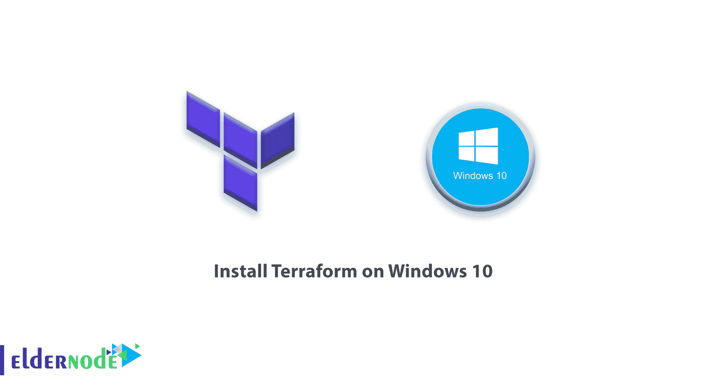
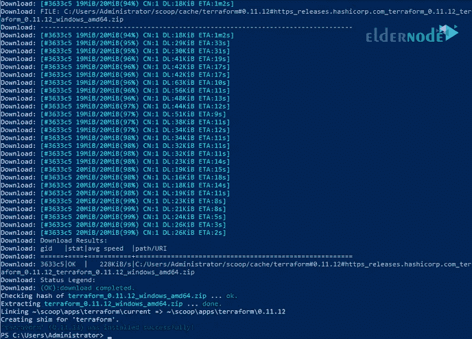
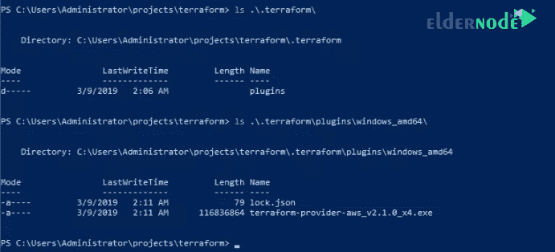
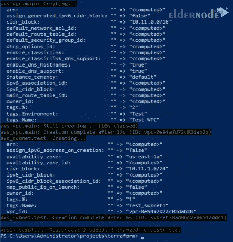
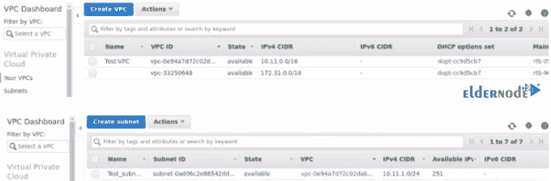
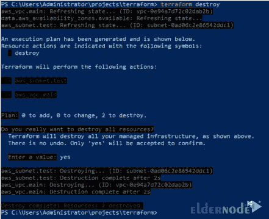
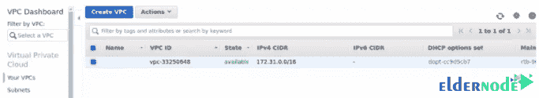

# 如何在 Windows 10 上安装 Terraform-elder node 博客

> 原文：<https://blog.eldernode.com/install-terraform-on-windows-10/>



如何在 [Windows 10](http://eldernode.com/tag/windows-10/) 和 [windows server 2019](http://eldernode.com/tag/windows-server-2019) 上安装 Terraform？Terraform 是一个了不起的工具集，用于自动化公共云和私有云的基础架构。 [Terraform](https://en.wikipedia.org/wiki/Terraform_(software)) 可以构建、更改和版本化部署在流行服务提供商上的基础设施。

本文将带你完成在 **Windows 10** 和 **Windows Server 2019** 上安装 Terraform 的步骤。

Terraform 是一款云无关的基础设施自动化工具，用于以代码形式管理云和内部资源。有了 Terraform ，你可以使用简单的声明式编程语言来管理计算、网络、DNS、数据库资源和许多其他东西。查看 Terraform 提供商的完整列表。

在本教程中跟随我们。

[***购买 Windows 虚拟专用服务器***](https://eldernode.com/windows-vps/)

### 教程在 Windows 10 / Windows Server 上安装 Terraform

使用Scoop Windows 命令行安装程序在 Windows 上**设置地形**。

```
PS C:\Users\Administrator> scoop install terraform which vim touch  WARN Scoop uses 'aria2c' for multi-connection downloads.  WARN Should it cause issues, run 'scoop config aria2-enabled false' to disable it.  Installing 'terraform' (0.11.12) [64bit]  Starting download with aria2 …  Download: [#3633c5 96KiB/20MiB(0%) CN:4 DL:245KiB ETA:1m24s]  Download: [#3633c5 1.0MiB/20MiB(5%) CN:4 DL:698KiB ETA:28s]  Download: [#3633c5 1.7MiB/20MiB(8%) CN:4 DL:688KiB ETA:27s]  Download: [#3633c5 2.0MiB/20MiB(10%) CN:4 DL:577KiB ETA:32s]  Download: [#3633c5 2.1MiB/20MiB(10%) CN:4 DL:393KiB ETA:47s]  Download: [#3633c5 2.4MiB/20MiB(12%) CN:4 DL:384KiB ETA:47s]  Download: [#3633c5 2.5MiB/20MiB(12%) CN:4 DL:352KiB ETA:51s]  Download: [#3633c5 2.7MiB/20MiB(13%) CN:4 DL:325KiB ETA:55s]  .....
```



terraform exe 文件将位于 ~ / scoop/目录中。

```
PS C:\Users\Administrator> which terraform  C:\Users\Administrator\scoop\shims\terraform.EXE
```

### 如何在 Windows 10 / Windows Server 上配置 Terraform

现在 terraform 已经安装好了，让我们创建一个测试项目。

```
> mkdir projects   Directory: C:\Users\Administrator Mode LastWriteTime Length Name ---- ------------- ------ ---- d----- 3/9/2019 1:57 AM projects PS C:\Users\Administrator> mkdir projects
```

**在项目目录下创建**一个地形文件夹。

```
PS C:\Users\Administrator> cd .\projects\   PS C:\Users\Administrator\projects> mkdir terraform   Directory: C:\Users\Administrator\projects Mode LastWriteTime Length Name ---- ------------- ------ ---- d----- 3/9/2019 1:58 AM terraform PS C:\Users\Administrator\projects> cd .\terraform\
```

**创建**一个 Terraform 主配置文件。

```
touch main.tf
```

我正在用 AWS 提供者做一个测试，但是你可以为你的项目使用其他提供者。

我的地形配置提供者部分如下:

```
PS C:\Users\Administrator\projects\terraform> cat .\main.tf  # Provider  provider "aws" {  access_key = ""  secret_key = ""  region = "us-west-1"  }
```

将您的 AWS 访问密钥和秘密密钥分别粘贴到`access_key`和`secret_key`部分。

完成后，运行`terraform init`来初始化一个 Terraform 工作目录。

```
PS C:\Users\Administrator\projects\terraform> terraform init  Initializing provider plugins…  Checking for available provider plugins on https://releases.hashicorp.com…  Downloading plugin for provider "aws" (2.1.0)…  The following providers do not have any version constraints in configuration,  so the latest version was installed.  To prevent automatic upgrades to new major versions that may contain breaking  changes, it is recommended to add version = "…" constraints to the  corresponding provider blocks in configuration, with the constraint strings  suggested below.  provider.aws: version = "~> 2.1"  Terraform has been successfully initialized!  You may now begin working with Terraform. Try running "terraform plan" to see  any changes that are required for your infrastructure. All Terraform commands  should now work.  If you ever set or change modules or backend configuration for Terraform,  rerun this command to reinitialize your working directory. If you forget, other  commands will detect it and remind you to do so if necessary.
```

Terraform 将****自动下载** 提供者配置的到`.terraform`目录。**

```
PS C:\Users\Administrator\projects\terraform> **ls**  `Directory: C:\Users\Administrator\projects\terraform` Mode LastWriteTime Length Name ---- ------------- ------ ---- d----- 3/9/2019 2:06 AM .terraform -a---- 3/9/2019 2:04 AM 42358 .main.tf.un~ -a---- 3/9/2019 2:04 AM 99 main.tf -a---- 3/9/2019 2:03 AM 59 main.tf~
```

**里面还有另一个文件夹存放由 Terraform 下载的 **插件。****

****

**现在让我们添加资源部分，通过编辑`main.tf`文件来创建 AWS VPC 和子网资源。**

```
# Provider  provider "aws" {  access_key = ""  secret_key = ""  region = ""  }    # Retrieve the AZ where we want to create network resources  data "aws_availability_zones" "available" {}    # VPC Resource  resource "aws_vpc" "main" {  cidr_block = "10.11.0.0/16"  enable_dns_support = true  enable_dns_hostnames = true  tags {  Name = "Test-VPC"  }  tags {  Environment = "Test"  }  }    # AWS subnet resource  resource "aws_subnet" "test" {  vpc_id = "${aws_vpc.main.id}"  cidr_block = "10.11.1.0/24"  availability_zone = "${data.aws_availability_zones.available.names[0]}"  map_public_ip_on_launch = "false"  tags {  Name = "Test_subnet1"  }  }
```

**在添加资源定义和设置 AWS 变量之后保存文件，然后生成并显示执行计划。**

```
`PS C:\Users\Administrator\projects\terraform> terraform plan    Refreshing Terraform state in-memory prior to plan...  The refreshed state will be used to calculate this plan, but will not be  persisted to local or remote state storage.    data.aws_availability_zones.available: Refreshing state...    ------------------------------------------------------------------------    An execution plan has been generated and is shown below.  Resource actions are indicated with the following symbols:    + create    Terraform will perform the following actions:      + aws_subnet.test        id:                               <computed>        arn:                              <computed>        assign_ipv6_address_on_creation:  "false"        availability_zone:                "us-east-1a"        availability_zone_id:             <computed>        cidr_block:                       "10.11.1.0/24"        ipv6_cidr_block:                  <computed>        ipv6_cidr_block_association_id:   <computed>        map_public_ip_on_launch:          "false"        owner_id:                         <computed>        tags.%:                           "1"        tags.Name:                        "Test_subnet1"        vpc_id:                           "${aws_vpc.main.id}"      + aws_vpc.main        id:                               <computed>        arn:                              <computed>        assign_generated_ipv6_cidr_block: "false"        cidr_block:                       "10.11.0.0/16"        default_network_acl_id:           <computed>        default_route_table_id:           <computed>        default_security_group_id:        <computed>        dhcp_options_id:                  <computed>        enable_classiclink:               <computed>        enable_classiclink_dns_support:   <computed>        enable_dns_hostnames:             "true"        enable_dns_support:               "true"        instance_tenancy:                 "default"        ipv6_association_id:              <computed>        ipv6_cidr_block:                  <computed>        main_route_table_id:              <computed>        owner_id:                         <computed>        tags.%:                           "2"        tags.Environment:                 "Test"        tags.Name:                        "Test-VPC"      Plan: 2 to add, 0 to change, 0 to destroy.    ------------------------------------------------------------------------    Note: You didn't specify an "-out" parameter to save this plan, so Terraform  can't guarantee that exactly these actions will be performed if  "terraform apply" is subsequently run.    PS C:\Users\Administrator\projects\terraform>`
```

****最后** 利用`terraform apply`的地形建造你的基础设施。**

```
`PS C:\Users\Administrator\projects\terraform> terraform apply    data.aws_availability_zones.available: Refreshing state...    An execution plan has been generated and is shown below.  Resource actions are indicated with the following symbols:    + create    Terraform will perform the following actions:      + aws_subnet.test        id:                               <computed>        arn:                              <computed>        assign_ipv6_address_on_creation:  "false"        availability_zone:                "us-east-1a"        availability_zone_id:             <computed>        cidr_block:                       "10.11.1.0/24"        ipv6_cidr_block:                  <computed>        ipv6_cidr_block_association_id:   <computed>        map_public_ip_on_launch:          "false"        owner_id:                         <computed>        tags.%:                           "1"        tags.Name:                        "Test_subnet1"        vpc_id:                           "${aws_vpc.main.id}"  ...........................`
```

****确认要进行的** 更改，并键入是开始修改。**

```
Plan: 2 to add, 0 to change, 0 to destroy.  Do you want to perform these actions?  Terraform will perform the actions described above.  Only 'yes' will be accepted to approve.  Enter a value: yes
```

**成功的平台运行应该在最后打印成功信息。**

****

**地形状态保存到`.\terraform.tfstate`，但后端可以更改。**

****注:** 您可以从 AWS 控制台确认基础设施变更。**

****

### **如何摧毁地形基础设施**

**我们已经**确认**我们在 ***视窗*** 上的地形 安装工作正常。**

**通过运行`terraform destroy`命令摧毁地形管理的基础设施。**

```
PS C:\Users\Administrator\projects\terraform> terraform destroy    aws_vpc.main: Refreshing state... (ID: vpc-0e94a7d72c02dab2b)  data.aws_availability_zones.available: Refreshing state...  aws_subnet.test: Refreshing state... (ID: subnet-0ad06c2e86542ddc1)    An execution plan has been generated and is shown below.  Resource actions are indicated with the following symbols:  - destroy    Terraform will perform the following actions:    - aws_subnet.test    - aws_vpc.main    Plan: 0 to add, 0 to change, 2 to destroy.    Do you really want to destroy all resources?  Terraform will destroy all your managed infrastructure, as shown above.  There is no undo. Only 'yes' will be accepted to confirm.    Enter a value: yes
```

****注意:** 如果不想要确认提示，使用以下命令:**

```
terraform destroy -auto-approve
```

****

****登录**到 AWS 控制台确认删除资源。**

****

****亦作，见:****

**[如何连接到 Windows VPS 服务器](https://eldernode.com/connect-to-windows-vps-server/)**

****尊敬的用户**，我们希望您能喜欢这个[教程](https://eldernode.com/category/tutorial/)，您可以在评论区提出关于本次培训的问题，或者解决[老年人节点培训](https://eldernode.com/blog/)领域的其他问题，请参考[提问页面](https://eldernode.com/ask)部分，并尽快提出您的问题。腾出时间给其他用户和专家来回答你的问题。**

**好运。**