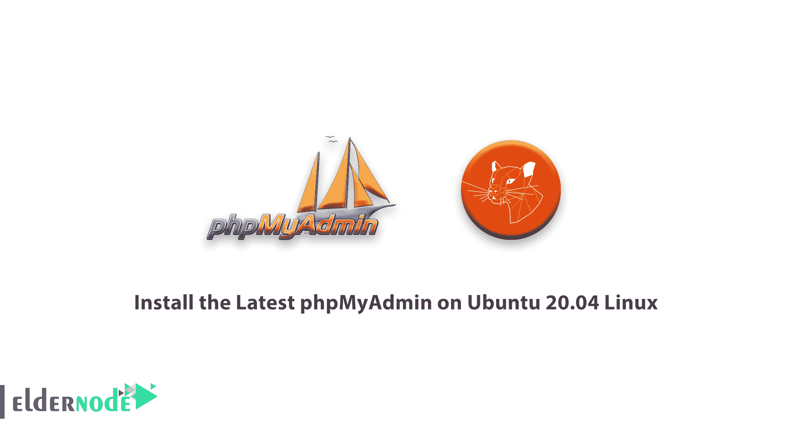

# 教程在 Ubuntu 20.04 Linux - Eldernode 上安装最新的 phpMyAdmin

> 原文：<https://blog.eldernode.com/install-the-latest-phpmyadmin-on-ubuntu-20/>



在本教程中，我们将一步一步地介绍如何在 [Ubuntu](https://blog.eldernode.com/tag/ubuntu/) 20.04 Linux 上安装最新的 phpMyAdmin。你可以在 [Eldernode](https://eldernode.com/) 中选择你最完美的 [Linux VPS](https://eldernode.com/linux-vps/) 服务器包。和我们在一起！

## 教程如何在 Ubuntu 20.04 Linux 上配置和安装最新的 phpMyAdmin

### 步骤 1)如何安装 Apache 和 PHP

首先安装其他必要的包来运行和访问 [phpMyAdmin](https://www.phpmyadmin.net/) 。

```
sudo apt install apache2 wget unzip  sudo apt install php php-zip php-json php-mbstring php-mysql 
```

安装完成后，启用并启动 Apache web 服务器:

```
systemctl enable apache2  systemctl start apache2 
```

### 步骤 2)如何在 Ubuntu 20 上安装 phpMyAdmin

使用以下命令安装 PHPMyAdmin:

```
wget https://files.phpmyadmin.net/phpMyAdmin/5.0.2/phpMyAdmin-5.0.2-all-languages.zip  unzip phpMyAdmin-5.0.2-all-languages.zip  mv phpMyAdmin-5.0.2-all-languages /usr/share/phpmyadmin 
```

现在，创建一个 tmp 目录并设置适当的权限:

```
mkdir /usr/share/phpmyadmin/tmp  chown -R www-data:www-data /usr/share/phpmyadmin  chmod 777 /usr/share/phpmyadmin/tmp 
```

### 步骤 3)如何配置 phpMyAdmin

现在，为 phpMyAdmin 创建 Apache 配置文件，并在文本编辑器中编辑它:

```
nano /etc/apache/conf-enabled/phpmyadmin.conf 
```

现在，将以下内容添加到文件中:

```
Alias /phpmyadmin /usr/share/phpmyadmin  Alias /phpMyAdmin /usr/share/phpmyadmin    <Directory /usr/share/phpmyadmin/>  AddDefaultCharset UTF-8  <IfModule mod_authz_core.c>  <RequireAny>  Require all granted  </RequireAny>  </IfModule>  </Directory>    <Directory /usr/share/phpmyadmin/setup/>  <IfModule mod_authz_core.c>  <RequireAny>  Require all granted  </RequireAny>  </IfModule>  </Directory> 
```

保存文件并关闭它。

然后，运行下面的命令:

```
sudo a2enconf phpmyadmin  sudo systemctl restart apache2 
```

### 步骤 4)如何在 Ubuntu 上调整 FirewallD

运行以下命令，为防火墙上的 web 服务器打开一个端口:

```
sudo firewall-cmd --permanent --add-service=http  sudo firewall-cmd --reload 
```

### 步骤 5–如何在浏览器上访问 phpMyAdmin

安装完成。现在在浏览器中输入 IP 地址，并查看 PHPMyAdmin 页面

```
http://ip/phpmyadmin 
```

祝你好运。