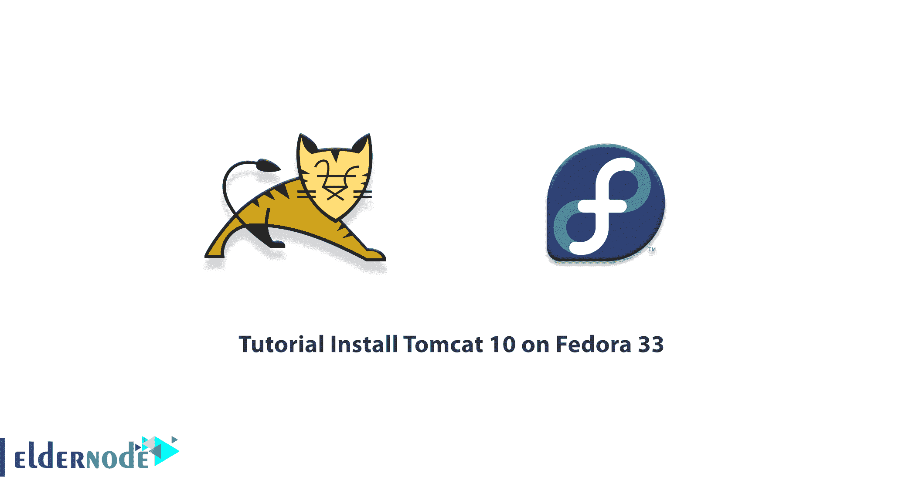

# 教程在 Fedora 33 - Eldernode 博客上安装 Tomcat 10

> 原文：<https://blog.eldernode.com/install-tomcat-10-on-fedora-33/>



Tomcat 是 Java 程序员和系统管理员常用的 web 服务器，他们需要一个优秀的 web 服务器来发布他们的 web 应用程序。Tomcat 是 Apache 开发的一个 web 服务器，它可以帮助您将 JSP 编写的基于 web 的软件运行到网站中。这是一个开源的 web 服务器，易于安装，不依赖于平台。在本文中，我们将尝试给你一个关于**在 Fedora 33** 上安装 Tomcat 10 的分步教程。需要注意的是，如果你想购买一台 **[Linux VPS](https://eldernode.com/linux-vps/)** 服务器，你可以访问 [Eldernode](https://eldernode.com/) 中提供的软件包。

## **如何在 Fedora 33 上一步步安装 Tomcat 10**

Apache Tomcat Web Server 是构建基于 Java 的网站和应用程序的最流行的选项之一。Tomcat 非常轻，可用，有很多添加剂。有趣的是，Apache Tomcat 是当今 web 应用程序开发人员中最受欢迎的软件。研究还表明，超过 60%的 Java 应用程序使用这种 web 服务器。

Apache Tomcat 是一个 servlet 容器，以其最简单的配置作为单个进程运行。这个进程运行 Java 虚拟机。应该注意，web 浏览器发送给 Tomcat 的所有 HTTP 请求都是使用单独的线程处理的。

Apache Tomcat 软件包包含配置和管理该软件的工具。但是 Tomcat 也可以通过修改其基于 XML 的配置文件来直接配置。

在接下来的几节中，加入我们来教你如何在 Fedora 33 上安装 Tomcat 10。

### **阿帕奇雄猫**的好处

1.tomcat 最大的优势就是开源。要使用该软件，您可以通过互联网轻松下载和配置，并开始使用它。

2.Apache 软件基金会提供定期更新，使其与其他软件版本兼容，并修复错误。从而使开发人员更容易使用。

3.Tomcat 支持安全套接字层(SSL ),因此可以使用 SSL 证书对其进行配置，通过提供安全连接来保护敏感数据。

4.Tomcat 还可以被配置为在不同的端口上运行多个 web 应用程序。例如，您可以运行编号为 8080、8081、9090 的三个程序。默认情况下，Apache Tomcat 使用端口号 8080。

5.它还兼容跨平台操作系统，可以在 Windows、Mac OS 和 Linux 操作系统上使用。

6.它很小。这意味着它使用更少的资源。因此，它允许程序在大多数系统上平稳运行，而不需要特殊的系统。

## **在 Fedora 33 上安装 Tomcat 10 | Fedora 32**

在这一节中，我们将一步一步教你如何在 [Fedora](https://blog.eldernode.com/tag/fedora/) 33 上安装 Tomcat 10。正如我们将在下面解释的，Apache Tomcat 10 实现了用于 Fedora 33 的 Java Servlet 5.0、JavaServer Pages 3.0、Java 统一表达式语言 4.0 以及用于 WebSocket 2.0 和 Authentication 2.0 的 Java API。

第一步是访问 Shell。因此，打开终端外壳模拟器窗口或登录到服务器。

现在您需要下载 Apache Tomcat 10 Java 服务器二进制文件。所以需要下载最新版本的 **Apache Tomcat 10 .tar.gz** 。

然后，您可以使用以下命令提取下载的文件:

```
tar xvzf ~/Downloads/apache-tomcat-10*.tar.gz -C /tmp/
```

成功提取下载的文件后，就该安装 Tomcat 10 了。然后，您必须重新定位 Apache Tomcat 10 并设置权限和所有权。因此，您必须按顺序执行以下命令:

```
sudo chown -R root:root /tmp/apache-tomcat-10*
```

```
sudo chmod -R +xr /tmp/apache-tomcat-10*
```

现在，您可以使用以下命令更改内容:

```
sudo mv /tmp/apache-tomcat-10* /opt/apache-tomcat-10
```

### **如何在 Fedora 33 上安装 Oracle Java JDK | Fedora 32**

要在 Fedora 33 上运行 Tomcat 10，需要安装 Oracle JDK。第一步是下载 [Oracle Java JDK](http://www.oracle.com/technetwork/java/javase/downloads/jdk8-downloads-2133151.html) 。

现在你必须使用下面的命令在 **/usr/local/** 中创建一个名为 java 的文件夹:

```
sudo mkdir -p /usr/local/java
```

***注意:*** 文件夹是在 root/usr/local/java 中创建的。

下一步是使用以下命令将下载的文件复制到 **/usr/local/java** 目录:

```
sudo cp -r jdk-8u40-linux-x64.tar.gz /usr/local/java
```

参考所述目录并提取复制的文件:

```
sudo tar xvzf jdk-8u45-linux-x64.tar.gz
```

成功提取文件后，现在需要找到一个名为 **jdk1.8.0_45** 的文件夹。然后运行以下命令，通过打开 **/etc/profile** 文件来更新路径文件:

```
sudo nano /etc/profile and paste the following at the end of the file:
```

```
JAVA_HOME=/usr/local/java/jdk1.8.0_45
```

```
PATH=$PATH:$HOME/bin:$JAVA_HOME/bin
```

```
export JAVA_HOME
```

```
export PATH
```

**保存**文件并退出。然后，您需要运行以下命令，通过以下命令告诉系统 Oracle Java 的新版本可用:

```
sudo update-alternatives --install "/usr/bin/java" "java" "/usr/local/java/jdk1.8.0_45/bin/java" 1
```

```
sudo update-alternatives --install "/usr/bin/javac" "javac" "/usr/local/java/jdk1.8.0_45/bin/javac" 1
```

```
sudo update-alternatives --install "/usr/bin/javaws.itweb" "javaws.itweb" "/usr/local/java/jdk1.8.0_45/bin/javaws.itweb" 1
```

现在，您可以默认使用以下 Oracle Java JDK 命令:

```
sudo update-alternatives --set java /usr/local/java/jdk1.8.0_45/bin/java
```

```
sudo update-alternatives --set javac /usr/local/java/jdk1.8.0_45/bin/javac
```

```
sudo update-alternatives --set javaws.itweb /usr/local/java/jdk1.8.0_45/bin/javaws.itweb
```

现在，您可以重新加载系统范围的路径/etc/profile:

```
source /etc/profile
```

您必须使用以下命令重新启动系统一次:

```
reboot
```

最后，您可以使用以下命令来检查 Java JDK 版本:

```
-version
```

## **如何在 Fedora 33** 上使用 Tomcat 10

在 Fedora 33 上成功安装了 Tomcat 10 和 Oracle Java JDK 之后，是时候学习如何启动和停止 Tomcat 10 了。要在 Fedora 33 上启动 Tomcat 10，可以使用下面的命令:

```
sudo /opt/apache-tomcat-10/bin/startup.sh
```

您也可以运行以下命令**停止**或**关闭**:

```
sudo /opt/apache-tomcat-10/bin/shutdown.sh
```

输入以下命令在浏览器上访问 Tomcat 服务器管理:

```
http://localhost:8080
```

## 结论

当从事 web 应用程序开发时，Tomcat 被 web 开发人员广泛使用。从高层次的角度来看，Apc tomcat 负责为 servlets 提供运行时环境。它提供了一个可以执行 Java 代码的环境。在本文中，我们在介绍了 Tomcat 之后，试图教大家如何在 Fedora 33 上安装 Tomcat 10。