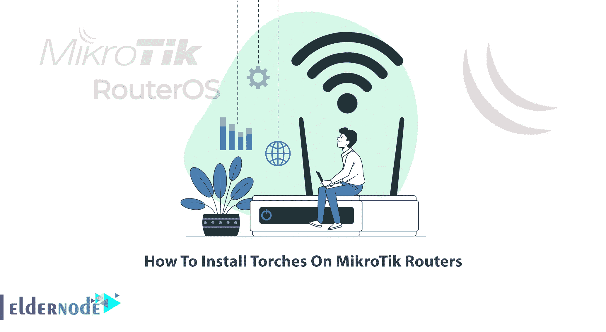
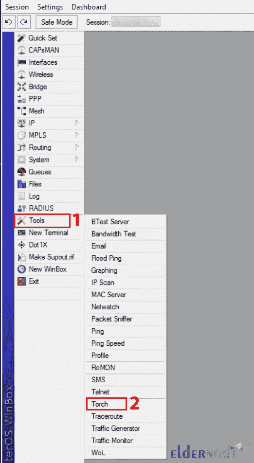
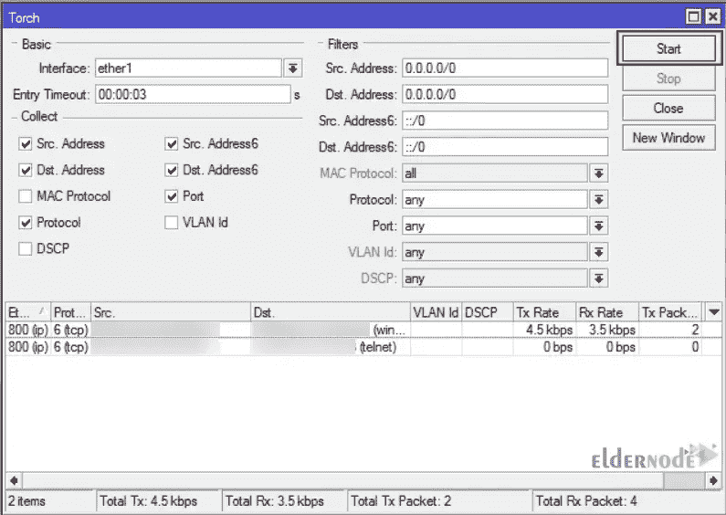

# 如何在 MikroTik 路由器上安装手电筒

> 原文：<https://blog.eldernode.com/install-torches-on-mikrotik-routers/>



也许您遇到过不同的数据包到达您的 MikroTik，或者数据包从您的网络内部发送到互联网，反之亦然。你可能想跟随他们了解更多。Torch 允许您完全跟踪数据包并找出它们的类型。这篇文章将教你如何在 MikroTik 路由器上安装火炬。如果你打算购买一台 [MikroTik VPS](https://eldernode.com/mikrotik-vps-server/) ，你可以查看 [Eldernode](https://eldernode.com/) 网站上提供的套餐。

## **教程在 MikroTik 路由器上安装火把**

Torches 是 MikroTik 中的实时流量监控工具，可用于监控通过接口的流量。它允许您监控按协议、mac 协议、端口、源地址、目的地址、mac 地址、VLAN ID 和 DSCP 分类的流量。根据您选择的协议，该工具将显示每个协议的数据发送和接收速率。

在 [MikroTik](https://blog.eldernode.com/tag/mikrotik/) 培训系列的本教程中，您将学习如何在 MikroTik 路由器上安装手电筒。

### **在 MikroTik 路由器上安装火炬**

首先，我们将教授 MikroTik 路由器上 torch 的安装过程。为此，请遵循以下步骤。

如果您是管理员，并且您想要识别堵塞网络的用户，您所要做的就是识别并烧掉 MikroTik 路由器上的 LAN 接口。您可以在 MikroTik 路由器上运行 Torch 工具，如下所示:

```
/tool torch interface=ether1 port=any
```

***注意:*** 记得更换你的接口而不是 ether1。

### **在 MikroTik 路由器上使用火把**

在本步骤中，我们将解释如何在 MikroTik 路由器上使用火炬。

首先，打开你的 [Winbox](https://blog.eldernode.com/connect-to-mikrotik-using-winbox/) ，以 root 身份登录。一旦连接到 MikroTik 服务器，导航到**工具>T5 火炬**路径:



现在你会看到下面的窗口。您所要做的就是选择一个您想要监控的接口，并检查要收集哪些信息。

**过滤器**部分允许您选择一个**源地址**和**目的地址**来过滤只有该地址、任何源地址和目的地址的流量。

如果您将源地址和目的地址保留为默认地址，它将捕获流经接口的所有流量。然后选择 **MAC 协议**、**协议**、**端口**，点击**开始**:



最后，您将看到流经路由器的连接和流量。

如果您将该协议放入 ICMP 的“过滤器”部分，它可以帮助您从流量方面排除路由器故障。

## 结论

Torch 是一个非常有用的工具，用于监控通过接口的流量。在本文中，我们教你如何在 MikroTik 路由器上安装火炬。我希望这篇教程对你有用，并帮助你在 Mikrotik 路由器上安装手电筒。如果您有任何问题或建议，可以在评论区联系我们。