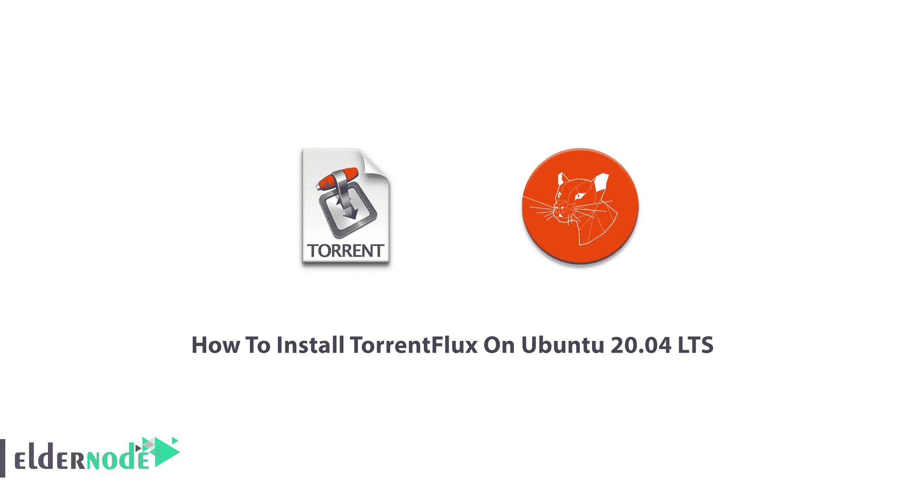

# 如何在 Ubuntu 20.04 上安装 torrent flux LTS-elder node 博客

> 原文：<https://blog.eldernode.com/install-torrentflux-on-ubuntu-20-04/>



如果您经常下载并需要从互联网上的任何地方访问下载内容，TorrentFlux 就是为您设计的。Torrentflux 是一个开源的 BitTorrent 应用程序。在本文中，你将学习如何**在 Ubuntu 20.04 LTS** 上安装 TorrentFlux。TorrentFlux 主要是为类似 Unix 的系统开发的，比如 GNU 和 [Linux](https://blog.eldernode.com/tag/linux/) ，它是一个用 PHP 语言编写的 web 界面。它还可以一目了然地查看所有种子的下载进度。您不应该选择将它安装在您的工作站计算机上，因为它需要在计算机上运行一个 web 服务器才能永久运行。准备好你自己的 [Linux VPS](https://eldernode.com/linux-vps/) 开始安装和使用这个软件。

## **教程在 Ubuntu 20.04 上安装 torrent flux**

为了让本教程更好地发挥作用，请考虑以下**先决条件**:

拥有 sudo 权限的非 root 用户。

要进行设置，请遵循我们在 Ubuntu 20.04 上的[初始服务器设置。](https://blog.eldernode.com/initial-server-setup-on-ubuntu-20/)

应该安装一些包比如 apache2，php5，php5-mysql，php5-curl，mysql-server。

但是如果你已经安装了 [LAMP](https://blog.eldernode.com/how-to-install-lamp-on-ubuntu-20-04/) (Linux，Apache，MySQL，PHP)服务器安装，你只需要安装 php5-curl 包就应该安装了。

## **在 Ubuntu 20.04 上安装 torrent flux**

虽然它停机了很长时间，但在 2007 年 11 月再次可用。正如我们提到的，Torrentflux 不会直接在您自己的计算机上运行，您应该准备一个服务器，几个客户端可以同时访问该服务器。您可以使用任何常规浏览器从任何地方远程访问 Torrentflux。虽然 Torrentflux 能够为每个人维护单独的目录，但它在多用户环境中很有帮助。我们来看看安装路径是什么。

**第一步:**

和往常一样，您将从更新服务器开始考虑安全性。

```
apt-get update
```

```
apt-get upgrade
```

**第二步:**

尽管 Torrentflux 添加了存储库，但您可以进入新立得软件包管理器并安装它。

```
sudo aptitude install torrentflux
```

**第三步:**

如果您没有安装 LAMP 栈，您可以只安装 apache2、php5 和 mysql-server 的包。这可以通过 Synaptic (Ubuntu)或 Adept (Kubuntu)实现，或者如果您喜欢运行命令行:

```
sudo aptitude install apache2
```

```
sudo aptitude install php5
```

```
sudo aptitude install mysql-server
```

```
sudo aptitude install php5-mysql
```

您可以通过创建一个简单的测试页面来检查 PHP 是否正常工作。例如创建文件:

```
sudo nano /var/www/test.php
```

并放入以下文本:

```
<html>  <head>  <title>Test Page</title>  </head>  <body>  Test page<br />  <?php   echo 'If you can see this text, then PHP is working.';  ?>  </body>  </html>
```

**第四步**:

出于安全考虑，你应该为 [MySQL](https://blog.eldernode.com/install-mysql-on-linux-ubuntu-20-04/) 设置一个[密码](https://blog.eldernode.com/how-to-create-strong-password/)，因为它没有开头。

```
mysqladmin -uroot password 'new-password'
```

**第五步:**

当端口 80 被阻塞时，你可能会面临一个让灯栈完全工作的常见障碍。ISP 或您路由器的防火墙可能阻止了此操作。你可以很容易地测试你是否被屏蔽。首先，在一个[访问网站](http://www.ipaddressworld.com/?__cf_chl_jschl_tk__=c1f3296760af21cc893d5a37d01f70a8d90c843d-1609090428-0-AWRmS6tstgPGjxA68ovE2cHxvNaDHLfa-U9CMbkFExvRQ4TSt--uhWpDGrlebNy16kBE63LDVBz_KpQozHJlmVakzmxQuXBqdHGLDh5deXQC0xnQjB0M8-xy4C0hHqMhV0frxoDxQsM8Bsp3pIF4tglG-xu3bgb3WzUEC4ai5fnnvkkJwsyaD97gAsgmK2W09Py6rxaTwYMMGDL8nQiCpNA77ITFT7xOKEOmzEEVdCTWC0kCoh3nxuw79meKmvs8R8zaGBujXqj2Y1_D5l-jE_9JIUWzVjwcevGN70kVDQLe5sCq_h_M_XI6d4YMoWXa8g)中找出你的外部 [IP 地址](https://blog.eldernode.com/find-server-public-ip-linux/)。

此外，如果你有一个路由器，你可以登录到它，并通过找到你的 IP 地址打开端口 80。为此，请运行以下命令:

```
ifconfig
```

注意找到“int addr:192.168.1.101。这是您的互联网 IP 地址，通常位于第一个输出块中，标记为“eth0”。输入您的路由器用户名和密码，以访问管理页面并找到您的特定路由器的文档。当你登录后，找到一个标有“应用&游戏”或“端口转发”等的部分。现在，按照下面的方式建立一个新规则:

```
name: http  port start: 80  port end: 80  type (TCP/UDP/Both): Both  Forward to: 192.168.1.101  Enabled: Yes
```

***注*** :记得把上面例子中的“192.168.1.101”替换成你当前的内部 IP 地址。要使更改生效，请不要忘记重启路由器。并通过访问您的*外部* IP 地址再次进行测试。

如果上述方法不起作用，这意味着端口 80 被您的 ISP 阻塞了。应该怎么做？使用非标准端口。首先，编辑 web 服务器的配置来完成这项工作。

```
sudo nano /etc/apache2/apache2.conf
```

然后，添加下面一行:

```
Listen 8080
```

由于“8080”端口是非标准端口，您可以选择任何其他端口，但要大于 1024。要使更改生效，请重新启动 apache。

```
sudo /etc/init.d/apache2 restart
```

现在，您应该修改您的路由器，以允许端口 8080 转发到您的计算机，就像您最近学到的那样。并再次测试您的 web 服务器。如果您访问了 apache 页面，发现它不起作用，请返回到步骤中，重新检查您的路径。路由器可能不支持端口转发，您可以在路由器上“刷新固件”来解决问题。

**第六步:**
要下载 Torrentflux，去它的网站。这些文件由 [SourceForge](https://sourceforge.net/projects/torrentflux/files/torrentflux/TorrentFlux%202.1/torrentflux_2.1.tar.gz/download?use_mirror=versaweb&download=) 托管。
下载后解压文件。

```
tar -xvzf torrentflux_2.1.tar.gz
```

在“torrwntflux_2.1/”目录中找到文件“INSTALL”。它包含了你在下面应该做什么的详细说明。

**第七步:**

是时候拷贝文件安装 Torrentflux 了。因为它只是一堆 PHP 文件，你只需要把它们复制到你的 web 文件夹中就可以让它们工作了:

```
sudo mkdir /var/www/torrentflux/
```

```
sudo chown user:user /var/www/torrentflux/
```

```
cd ~/Desktop/torrentflux_2.1/html/
```

```
cp -r * /var/www/torrentflux/
```

虽然用户名通常与您登录时使用的用户名相同，但请输入您的用户名和组，而不是 user: user。上述命令中的“cd”会因您解压缩文件的位置而有所不同。此外，您可能需要 MySQL 设置。要为 Torrentflux 创建数据库，请运行:

```
mysqladmin -uroot -p create torrentflux
```

之前你为 MySQL 设置了一个密码，用它登录，进入 Torrentflux 中的“SQL”子目录。

```
cd ~/Desktop/torrentflux_2.1/sql
```

然后，将 Torrentflux 结构上传到 MySQL:

```
mysql -uroot -p torrentflux < mysql_torrentflux.sql
```

如果您不喜欢在命令行上使用 MySQL，可以安装“phpmyadmin”来帮助您轻松访问 web 浏览器和 MySQL 中的所有功能。接下来，告诉 Torrentflux 你为你的 MySQL 系统设置的密码。通过运行以下命令编辑文件:

```
sudo nano /var/www/torrentflux/config.php
```

您将看到文件顶部附近的行:

```
cfg["db_user"] = "root"; // username for your MySQL database  cfg["db_pass"] = ""; // password for database
```

用您之前选择的密码修改“db_pass”行。

为了考虑更多的安全性和控制，可以给 Torrentflux 一个“非根”MySQL 访问权限。如果你有很多不同的应用程序都使用 MySQL，不要忽视这一点。使用“phpmyadmin”或同时输入以下命令。

```
mysql -uroot -p  mysql> use mysql;  mysql> INSERT INTO user (Host,User,Password) VALUES('localhost','torfluxuser',PASSWORD('secret'));  mysql> FLUSH PRIVILEGES;  mysql> GRANT SELECT,INSERT,UPDATE,DELETE,CREATE,DROP ON torrentflux.* TO 'torfluxuser'@'localhost';  mysql> exit;
```

尝试使用更好的密码，而不是“secret”。要编辑 Torrentflux 配置，请键入:

```
sudo nano /var/www/torrentflux/config.php
```

要更新这些行:

```
cfg["db_user"] = "torfluxuser"; // username for your MySQL database cfg["db_pass"] = "secret"; // password for database
```

你可以随意调用你的 Torrentflux 用户，也可以随意测试密码。MySQL 和 Torrentflux 中的条目应该匹配。现在，您应该能够使用 web 浏览器打开 Torrentflux 网站。

您在首次登录时提供的用户名和密码将成为 Torrentflux 的“管理帐户”。请仔细记住密码。您不会被迫选择与您已经创建的 MySQL 相同的密码。

然后，您将被定向到一个页面，在那里您将能够配置 Torrentflux。第一行将标记一个错误:“path 不可写—请确保您使用了 chmode +w this path”。因此，您应该更改下载文件夹的权限。

```
sudo chmod 777 /var/www/torrentflux/downloads/
```

在检查其余设置时，请考虑“端口范围”是高效 BitTorrent 的一个重要参数。选择一个范围，例如 45000-46000，并在您的路由器上打开相应的范围。这样，当你允许在那个范围内连接时，你可以在下载期间连接到更大的群，最终你会体验到更高的下载速度。

### 学习在 LTS Ubuntu 20.04 上安装 torrent flux

**第八步:**

如果您有一个[静态 ip 地址](https://blog.eldernode.com/set-ip-static-on-ubuntu-20-04-lts-server-with-netplan/)，您可以跳过这一步。家庭用户通常有一个动态的 IP 地址，他们会经常更换，甚至每天更换，甚至几个月更换一次，这取决于他们的 ISP。当你想远程连接到你的 Torrentflux 时，你不知道该去哪个 IP 地址。因此，一个合适的解决方案是使用“域重定向”服务。这个服务能够让你很容易地进入你的机器，因为它可以记住别名，比如“user.example.com”。但是，有一些程序可以自动更新您的域名重定向，帮助您更新 IP 地址。

这里有两家公司提供免费的域名重定向服务:

[account.dyn.com](https://account.dyn.com/dns/dyndns/)

[noip.com](https://www.noip.com/managed-dns)

虽然动态 IP 的真正问题是它会在没有通知的情况下改变，但是 No-IP 提供了一个软件。您可以转到“下载”部分并选择“Linux/BSD/Unix”。

```
http://www.no-ip.com/client/linux/noip-duc-linux.tar.gz
```

再次，你应该解压文件，并进入新的目录。

```
tar -xvzf noip-duc-linux.tar.gz
```

```
cd noip-2.1.3/
```

如果您运行的是一台标准的台式 PC，如“i686 machine ”,请执行以下操作:

```
cp binaries/noip2-Linux noip2
```

```
sudo make install
```

使用 noip 帐户的电子邮件/密码，回答问题。更新时间大约为 30 分钟。如果你运行的是 i686 机器，就编译这个程序。如果您没有任何编译器，请使用下面的命令来安装:

```
sudo aptitude install build-essential
```

如果您是在“noip2-2.1.3/”方向，通过运行以下命令进行编译:

```
make
```

```
sudo make install
```

通过键入以下命令运行 noip:

```
sudo noip2
```

您可以编辑“/etc/”目录中的文件“rc.local ”,以确保 noip 在每次计算机启动时启动。

```
sudo nano /etc/rc.local
```

然后，添加一行:

```
/usr/local/bin/noip2 &
```

注意将这一行放在末尾的“退出 0”行之前。一旦电脑开机，noip 就会运行，并会频繁更新你的域名。通过这种方式，当你访问“http://user . no-IP . info/torrentflux/”时，你将获得自己的个人 torrent flux 应用程序。

**第九步:**

集中你的种子搜索是 Torrentflux 的另一个简洁的特性。通过向 Torrentflux 添加模块，您可以使它能够在许多不同的跟踪器上使用搜索功能。

您可以通过下载文件来添加新模块，并将其移动到“searchEngines”文件夹中:

```
mv module.php /var/www/searchEngines/
```

### 如何卸载 Torrentflux

要卸载/删除 Torrentflux，请运行以下命令:

```
sudo apt-get remove torrentflux
```

使用以下命令删除 Torrentflux 软件包及其依赖项:

```
sudo apt-get remove --auto-remove torrentflux
```

如果您需要删除所有配置文件和数据，请仔细键入以下命令:

```
sudo apt-get purge torrentflux
```

此外，下面的命令可以做到与上面相同的事情

```
sudo apt-get purge --auto-remove torrentflux
```

不要忘记小心使用上述命令，因为它们将删除所有与 Torrentflux 包相关的配置文件和数据，并且被删除的数据将无法恢复。

## 结论

在本文中，您了解了如何在 Ubuntu 20.04 LTS 版上安装 TorrentFlux。它将通过一个方便的网络界面从任何地方管理你所有的 BitTorrent 下载。