# 如何在 Windows 10 上安装 TortoiseSVN-elder node 博客

> 原文：<https://blog.eldernode.com/install-tortoisesvn-on-windows/>

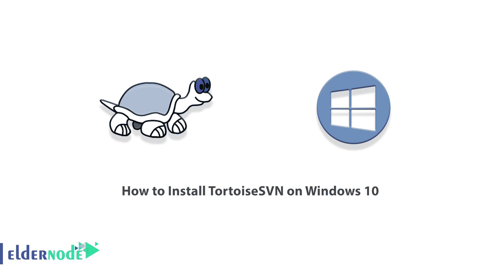

TortoiseSVN 是用于 Apache Subversion 控制系统的免费开源 Windows 客户端。换句话说，TortoiseSVN 随着时间的推移管理文件和目录。应当注意，文件存储在中央储存库中。这个存储库非常类似于一个常规的文件服务器，除了它调用对您的文件和目录所做的所有更改。在这篇文章中，我们将教你如何在 Windows 10 上安装 TortoiseSVN。如果你想买一台 [**Windows VPS**](https://eldernode.com/windows-vps/) 服务器，你可以在 [Eldernode](https://eldernode.com/) 看到可用的软件包。

## **教程在 Windows 10 上安装 TortoiseSVN**

### **陆龟简介**

在 Windows 上使用 TortoiseSVN 进行版本控制、版本控制和源代码控制非常容易。这是基于[阿帕奇](https://blog.eldernode.com/install-apache-on-windows-server/) Subversion (SVN)。有趣的是，TortoiseSVN 为 subversion 提供了一个简单的用户界面。

TortoiseSVN 是在 GPL 下开发的，对所有用户都是免费的。注意，这个软件的源代码也是免费的，所以如果你愿意，你可以扩展你的版本。该软件最重要的功能如下:

1_ 易于使用

2_ 支持所有 Subversion 协议

3_ 强大的提交对话框

4_ 大局

5_ 每个项目设置

6_ 与问题跟踪系统集成

7_ 有用的工具

8_ 有多种语言版本

9_ TortoiseSVN 稳定

## **在 Windows 10 上安装 TortoiseSVN**

在这一节，我们想教你如何一步一步地在 Windows 10 上安装 TortoiseSVN。为此，只需按顺序执行以下步骤。

第一步是下载最新版本的 [TortoiseSVN](https://tortoisesvn.net/downloads.html) 。

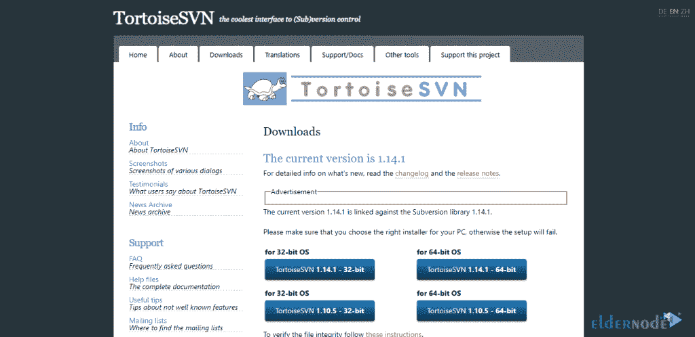

下载了 TortoiseSVN 之后，现在应该转到下载文件的位置。双击该文件，然后在打开的窗口中单击**运行**。

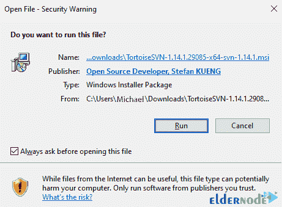

您将看到 TortoiseSVN 安装过程开始。在打开的窗口中，点击下一个的**。**

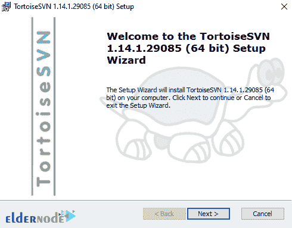

在名为最终用户许可协议的下一步中，您必须选择**我接受条款……**并点击**下一步**。

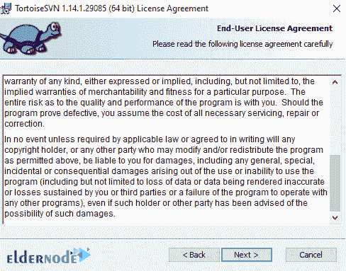

您将看到，在名为**自定义设置**的下一步中，默认情况下会选择这些设置。只需点击**下一步。**然后点击**安装**开始安装 TortoiseSVN。

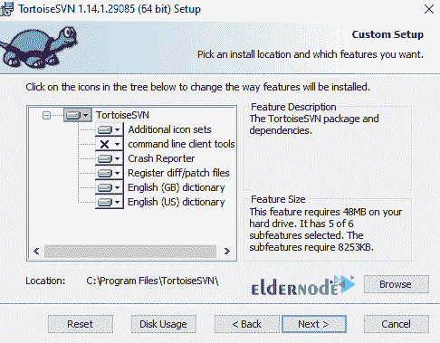

*

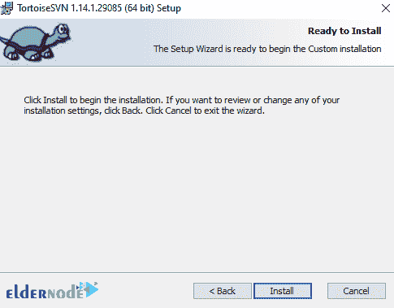

*

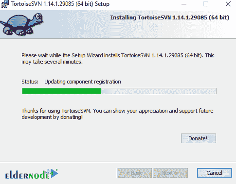

最后，点击**完成**完成 TortoiseSVN 安装。

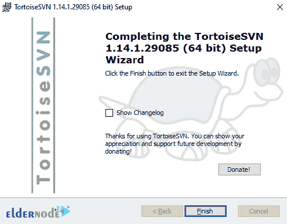

### **如何在 Windows 10 上访问 TortoiseSVN**

既然您已经在前一节中成功地安装了 TortoiseSVN，我们现在转向如何访问它。应该注意的是，通常不需要配置 TortoiseSVN，但是要访问存储库，必须执行支付操作。

以下是访问 TortoiseSVN 的方法。请注意，当您点击“ **TortoiseSVN** ”时，您可能会看到一条警告消息，指出要使用 TortoiseSVN，您必须右键单击每个文件夹并使用其功能。

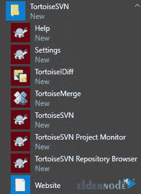

*

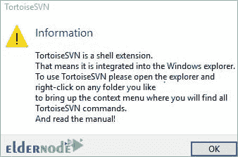

现在你必须点击 **OK** 关闭警告信息。你可以很容易地右键单击任何文件夹。这样，您将看到“**陆龟文**”菜单，其中包含以下菜单项:

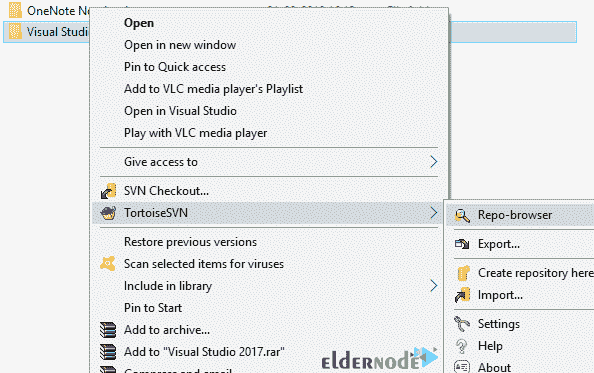

## 结论

在本文中，在全面介绍了 TortoiseSVN 及其特性之后，我们试图教您如何安装、配置和访问 TortoiseSVN。它直观且易于使用，因为它不需要运行 Subversion 命令行客户端。它是免费使用的，即使是在商业环境中。