# 用视频一步一步在 VMware 上安装 Ubuntu 20.04 LTS 服务器

> 原文：<https://blog.eldernode.com/install-ubuntu-20-04-lts-server-on-vmware/>

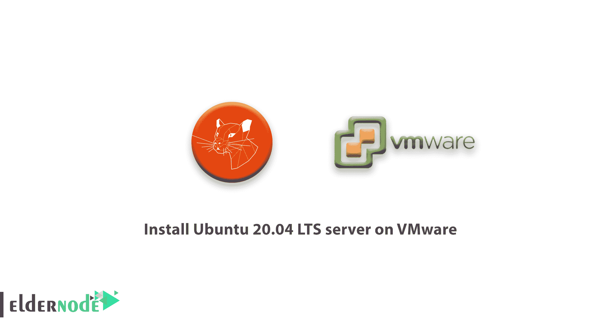

在本教程中，我们希望**在 vmware** 上安装 ubuntu 20.04 LTS 服务器。

安装步骤之前。我们需要谈谈 LTS 的 ubuntu 20.04。Ubuntu 20.04 LTS 版将于 2020 年 4 月 23 日发布，接替 Ubuntu 19.10，成为这个广受欢迎的基于 Linux 的操作系统的最新稳定版本。

好了，现在我们开始一个关于在 VMware 上安装 ubuntu 20.04 lts 服务器的教程，如果你想了解更多关于 Ubuntu 20.04 LTS 的信息，你可以去 [**介绍 Ubuntu 20.04 LTS**](https://eldernode.com/introducing-ubuntu-20/) 的文章。

太好了！让我们开始在 vmware 上安装 ubuntu 20.04 lts [服务器](https://eldernode.com/linux-vps/)

首先需要下载 [Ubuntu 20.04](https://eldernode.com/tag/ubuntu-20-04/) ISO 镜像进行安装。所以去这个链接下载 Ubuntu 服务器版吧。【T2[**下载 Ubuntu 20.04 LTS 服务器**](https://releases.ubuntu.com/20.04/) 。

## 在 VMware 上安装 ubuntu 20.04 LTS 服务器

步骤 1:创建虚拟机和 VMware 上的所有步骤之后。打开虚拟机，您将看到这一部分。

在这一步。你可以选择你的语言。

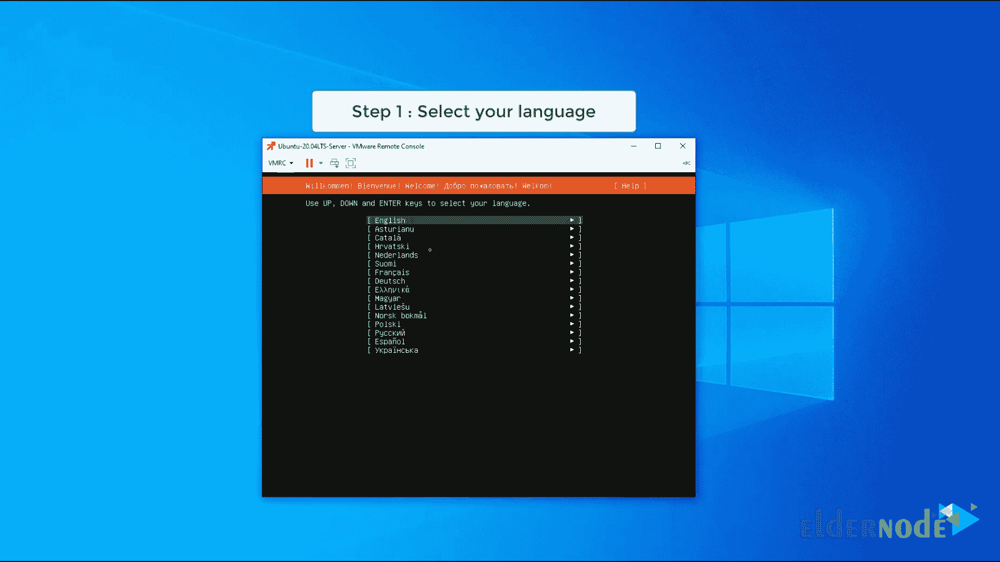

步骤 2:选择键盘布局，然后选择完成继续步骤。

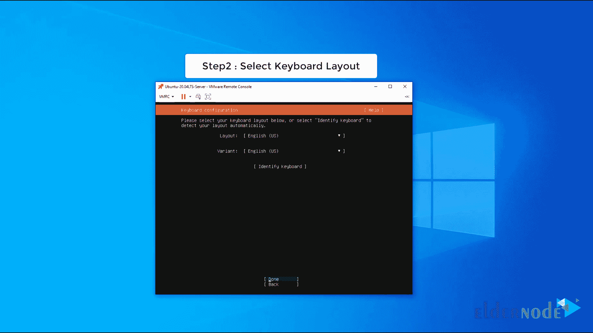

#### 在 Ubuntu 20.04 上配置网络

步骤 3:在这一步中，您可以通过选择您的网卡名称来配置网络。但是我们选择无网络和安装后。我们可以在初始设置步骤中设置所有网络配置。

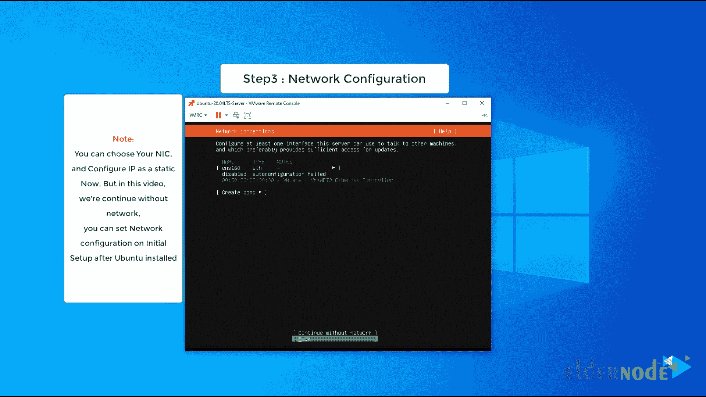

步骤 4:如果您设置了网络并使用了代理，请在此字段中键入代理名称并选择完成。

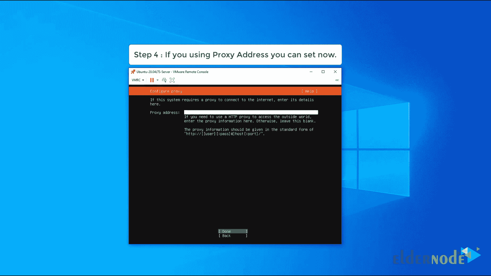

第五步:现在你必须为 Ubuntu 更新选择一个镜像地址并安装另一个包。我们只需选择“完成”继续步骤。


#### 在 Ubuntu 上引导存储布局

第 6 步:在这一步中，您可以选择存储布局的指导。

你有两个选择。

*   Ubuntu 使用整个磁盘
*   定制存储磁盘

如果你想让 ubuntu 自动在整个磁盘上创建分区，你可能会选择第一个选项。或者，如果你想让 ubuntu 安装在自定义分区上，你需要选择第二个选项。

在本教程中，我们选择“使用整个磁盘”

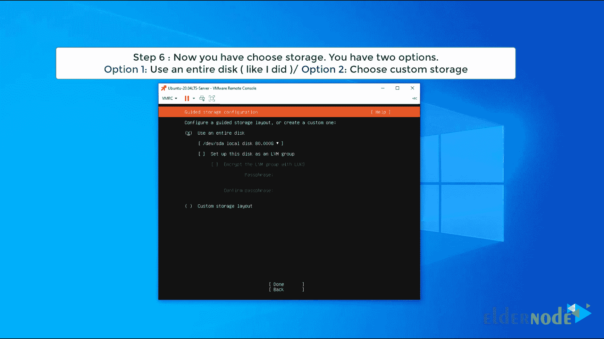

第七步:在这一步中，你会看到你的磁盘中正在发生什么，如果你确认了这一点。因此选择 Done 继续其他步骤。

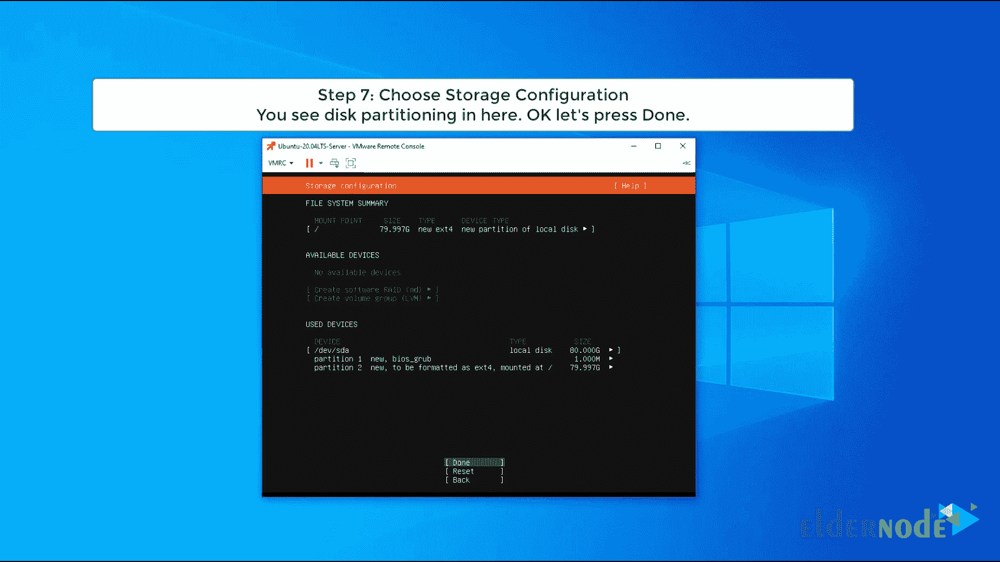

第八步:再次确认磁盘分区并选择继续。

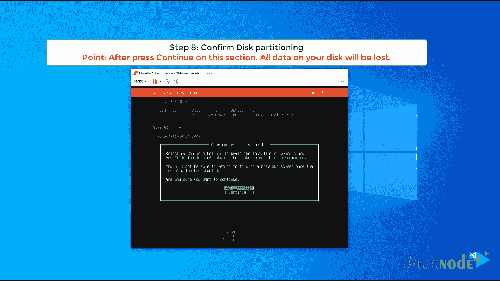

#### 设置名称和用户名

第九步:现在你需要输入你的信息。

你的名字:输入你最喜欢的名字

您的服务器名称:键入您最喜欢的服务器名称

选择用户名:输入你最喜欢的用户名。你用这个用户名登录 ubuntu 20.04

选择密码:键入您的用户密码

确认您的密码:再次键入您的密码并选择完成。

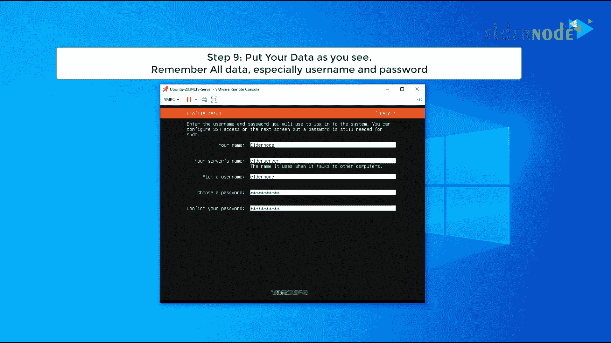

#### 在 ubuntu 上安装 OpenSSH

步骤 10:如果你想在你的 ubuntu 上安装 OpenSSH，选择 option，然后选择 done。

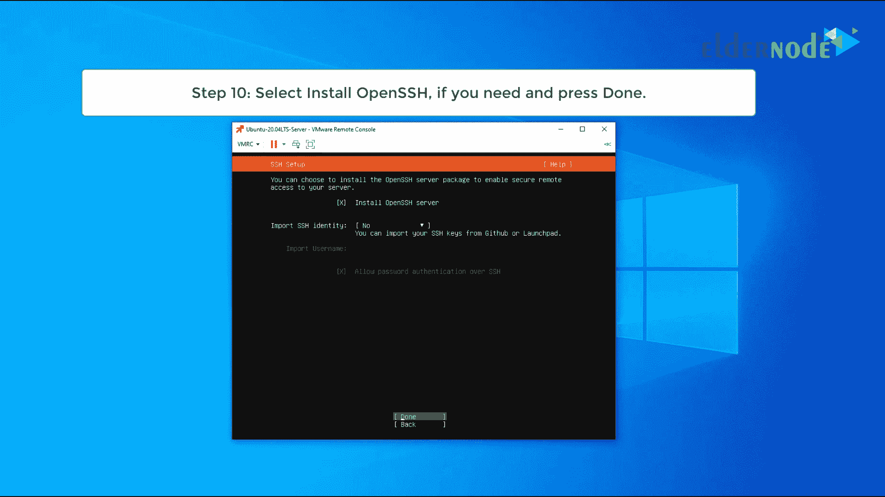

步骤 11:好，现在我们需要等待复制 ubuntu 文件和配置。

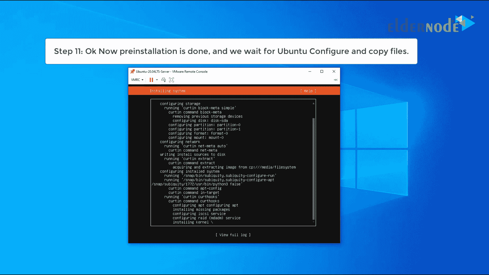

步骤 12:复制文件和另一个配置完成后。Ubuntu 提示重启。选择重新启动。


#### 登录 Ubuntu 20.04 服务器

第十三步:Ubuntu Up 后。你可以使用 Ubuntu 20.04 输入你的用户名和密码

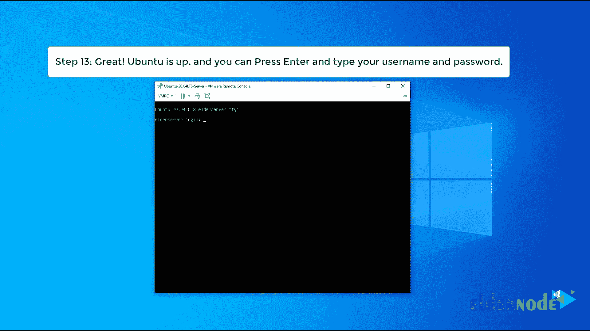

用于检查 Ubuntu 版本。您可以键入以下命令。

```
cat /etc/os-release
```

##### 结论

在本教程中，我们尝试用简单的步骤在 vmware 上安装 ubuntu 20.04 lts 服务器。

### 安装 ubuntu 20.04 LTS 服务器——视频教程

你可以看这个视频更好的理解。