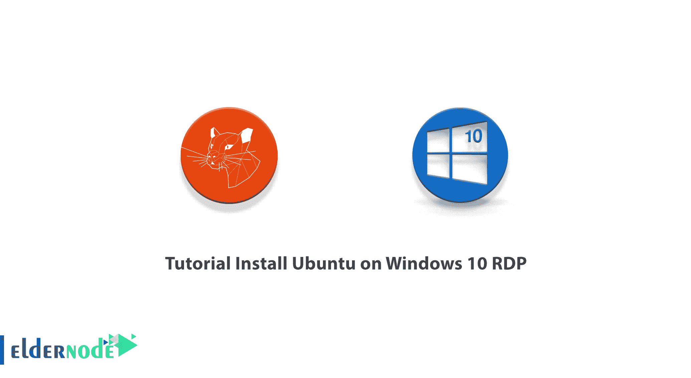
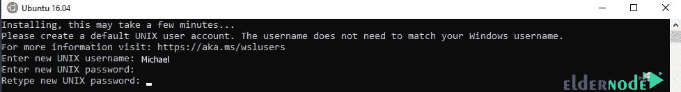

# 在 Windows 10 上安装 Ubuntu 的教程 RDP - Eldernode 博客

> 原文：<https://blog.eldernode.com/install-ubuntu-on-windows-10/>



Ubuntu 是一个流行的开源操作系统，易于安装。由于无限制的定制选项，它非常灵活，并且本质上非常安全。对于许多开发者来说，Linux 之旅始于 Ubuntu。大多数时候我们除了使用 Windows 10 还需要使用 Ubuntu，反之亦然。这就是为什么在这篇文章中，我们将教你一步一步教程**在 Windows 10 RDP** 上安装 Ubuntu。还需要注意的是，如果你想买一个 [Ubuntu VPS](https://eldernode.com/ubuntu-vps/) 服务器，你可以使用 [Eldernode](https://eldernode.com/) 中提供的软件包。

## **如何在 Windows 10 上安装 Ubuntu RDP**

在这篇文章中，我们想教你第一步如何在 Windows 10 RDP 上安装 Ubuntu。然后我们将解释如何配置它。最后，在最后一节，我们将教你如何安装 Ubuntu 软件包。请加入我们。

### **如何在 Windows 10 RDP 上启用 WSL**

在 Windows 10 上开始安装 [Ubuntu](https://blog.eldernode.com/tag/ubuntu/) 之前，必须先启用 WSL。第一步，从**开始菜单**点击**设置**。


然后在打开的窗口中点击**应用**。


在下一步中，从**应用&功能**选项卡，点击右栏中的**程序和功能**。


正如你在下图中看到的，你必须点击**打开或关闭 Windows 功能**。


下一步，在打开的窗口中，检查 Linux 选项的 **Windows 子系统，最后点击 **OK** 。然后**重启**系统一次以应用更改。**


## **在 Windows 10 上安装 Ubuntu RDP**

在这一节，我们想教你如何在 Windows 10 RDP 上安装 Ubuntu。按照下面的步骤一步一步来就可以了。你必须首先通过**开始菜单**打开**微软商店**。


如下图所示，在**微软商店**窗口的**搜索**栏，你要输入并搜索 **Ubuntu** 。您可以查看当前可用的版本，并选择您想要的版本。


选择好想要的版本后，点击**获取**如下图下载 Ubuntu。


你会注意到，过了一会儿，Ubuntu 安装就成功完成了。现在你可以点击**启动**来运行它。你也可以通过开始菜单搜索并启动 Ubuntu。


### **如何在 Windows 10 上配置 Ubuntu RDP**

在上一节成功地在 [Windows 10 RDP](https://eldernode.com/windows-10-rdp/) 上安装了 Ubuntu 之后，我们现在想要配置它。注意，在 Windows 10 上运行 Ubuntu 的时候一定要尽快配置。按照以下步骤配置 Ubuntu。你必须先按下< **回车** >。

下一步，你需要**在 Ubuntu 上创建一个账户**。如下图所示，你必须输入**用户名**，然后按**输入**。


创建用户名后，您现在必须设置您的**密码**。然后按下**，输入**。然后你必须再次输入密码并按下**键进入**。



这样，您将看到您的帐户创建成功，您可以执行您想要的命令。


### **如何安装 Ubuntu 软件包**

在这一节，我们将向你展示如何安装 Ubuntu 软件包。在本教程中，我们想教你，例如，如何安装 **htop** 包。第一步是使用以下命令更新 APT 包存储库缓存:

```
sudo apt update
```

更新完成后，您现在可以通过运行以下命令轻松地**安装 htop** :

```
sudo apt install htop
```

最后，您可以通过运行 **htop** 命令来**运行**:

```
htop
```


## 结论

Ubuntu 是一个基于 Debian 的 Linux 操作系统，它非常受用户欢迎，因为使用这个操作系统，你可以使用家庭系统或服务器，而且它有非常高的功能。在这篇文章中，我们试图教你关于在 Windows 10 RDP 上安装 Ubuntu 的教程。我们还教了你如何配置和安装 Ubuntu 软件包。