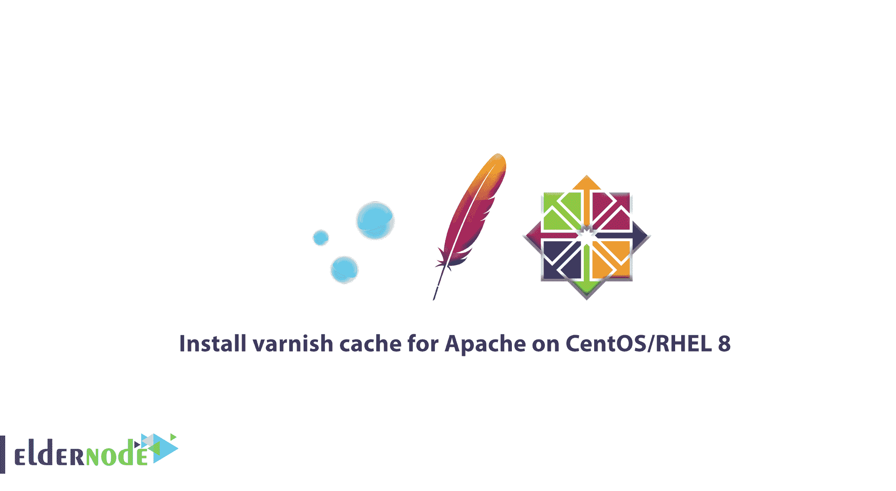

# 如何在 CentOS/RHEL 8 - Eldernode 上安装 varnish cache for Apache

> 原文：<https://blog.eldernode.com/install-varnish-apache-centos/>



在接下来的 [CentOS 8](https://eldernode.com/tag/centos-8) 教程中，我们将向你**学习如何在 CentOS/RHEL 8** 上为 Apache 安装 varnish cache。但首先，让我们知道什么是**清漆缓存。**它是一个免费的开源、现代和高性能的 web 应用程序加速器，也是一个快速反向 HTTP 代理，它通过将 web 内容存储在服务器内存(缓存)中来缓存内容以提高 web 服务器的性能。它被配置为在一个原始服务器如**Apache**(**HTTPD**)web server 的前面运行。

您可以安全地减少未来对等请求的响应时间和网络带宽消耗，因为 **Varnish** 可以在客户端请求内容的任何时候接受 **HTTP** 请求。然后，它将请求发送到源服务器，缓存返回的对象，并回复客户端请求。下一次客户端请求相同的内容时，Varnish 将从缓存中为其提供服务。

**Varnish** 的另一个有用特性是作为 **HTTP** 请求路由器、web 应用防火墙、负载平衡器等等。

#### 先决条件:

*   带有 [CentOS 8](https://eldernode.com/initial-set-up-centos-8/) 的服务器。
*   在您的系统上安装了 [RHEL 8](https://www.redhat.com/en/enterprise-linux-8/details#:~:text=Red%20Hat%20Enterprise%20Linux%208%20gives%20organizations%20a%20consistent%20OS,in%20management%20and%20predictive%20analytics.) 并启用了 Red Hat 订阅的服务器

**您可能会感兴趣:**

[教程在 Centos/RHEL 8 Linux 上安装 Python 3.8](https://eldernode.com/install-python-3-8-on-centos/)

### 如何在 CentOS/RHEL 8 上为 Apache 安装 varnish cache】

在本文中，你将向你展示如何在一个新的 **CentOS/RHEL 8** 服务器上安装 **Apache HTTPD** web 服务器和 **Varnish Cache 6** ，包括配置 Varnish 在 **HTTPD** 服务器之前运行。

### 1-在 CentOS/RHEL 上安装 Apache Web 服务器 8

首先，更新系统上安装的所有软件包。

```
dnf update
```

通过以下命令从 **AppStream** 存储库中安装 **Apache HTTP** web 服务器。

```
dnf install httpd
```

安装完成后，启动 httpd 服务，并使其在系统引导期间自动启动。记得检查它的状态，以确认它已启动并正在运行。

```
systemctl start httpd  systemctl enable httpd  systemctl status httpd
```

您需要在防火墙中打开对 HTTP 服务的访问，以允许用户访问通过 **HTTP** 运行的网站或应用程序，并且还需要重新加载防火墙设置以应用新的更改，因为 **CentOS/RHEL 8** 包括一个完全锁定的防火墙。

```
firewall-cmd --zone=public --permanent --add-service=http  firewall-cmd --reload
```

### 2-在 CentOS/RHEL 上安装清漆缓存 6.4 8

在系统上安装 **Varnish Cache** ，因为 Apache webserver 正在运行。

```
dnf module install varnish 
```

完成安装后，您可以验证系统上安装的 **Varnish** 的版本。

```
varnishd -V 
```

然后，您必须将主可执行文件安装为 **/usr/sbin/varnishd** ，您会看到 Varnish 配置文件存储在 **/etc/varnish** 目录下，其中:

**1-/etc/varnish/default . vcl**–是使用 VCL 编写的主 varnish 配置文件。

**2-/etc/varnish/secret**–是 varnish secret 文件。

接下来，您可以启动 varnish 服务，并使其在服务器重启的情况下在系统引导期间自动启动，并检查其状态以确保其启动并运行，如下所示。

```
systemctl start varnish  systemctl enable varnish  systemctl status varnish
```

### 

[**购买虚拟私服**](https://eldernode.com/vps/)

### 3-配置 Apache 使用 Varnish 缓存

在这一步中，您必须配置 **Varnish 缓存**在 Apache 服务之前运行。默认情况下，Apache 服务器被配置为监听端口 **80** 。如下所示，这是在主配置文件**/etc/httpd/conf/httpd . conf**中定义的。然后，使用您喜欢的文本编辑器并打开它进行编辑。

```
vi /etc/httpd/conf/httpd.conf 
```

找到**监听**参数。将默认端口 **80** 更改为 **8080** 或您选择的任何其他端口，以便在 Apache 服务器前面运行 **Varnish** 。(稍后，该端口将作为后端服务器的端口添加到 Varnish 配置文件中)

请考虑将通过 **Varnish** 提供服务的每个网站/应用程序的虚拟主机配置应该配置为侦听上述端口。

配置上面的端口来监听每个 web 站点/应用程序的虚拟主机配置，这些 web 站点/应用程序将通过 **Varnish 提供服务。**

```
<**VirtualHost *:8080**>      DocumentRoot "/var/www/html/eldernode.lan/"      ServerName www.eldernode.lan      # Other directives here  </VirtualHost> 
```

**请注意** :您应该注释掉文件**/etc/httpd/conf . d/welcome . conf**中的所有行，或者干脆删除该文件，以防止默认的 Apache HTTP server 测试页面被使用。

```
rm /etc/httpd/conf.d/welcome.conf
```

现在，您可以测试 httpd 配置语法是否有任何错误，如果一切都**正常**，则重新启动 httpd 服务以应用新的更改。

```
httpd -t  systemctl restart httpd
```

#### 为系统配置清漆

配置 Varnish 在默认 HTTP 端口 **80** 监听客户端请求，如下所述，并让它部署在 **HTTPD** 的前面。

请记住，必须设置**端口**清漆服务器监听的清漆服务文件中的**系统和**清漆缓存 6.0** 和更高版本中的**。所以打开它进行编辑。

```
systemctl edit --full  varnish
```

找到 **ExecStart** 线，然后将 **-a** 开关的值从 **:6081** 改为 **:80** 。

**注** : **varnishd** 如果**没有**指定地址，将监听服务器上所有可用的 **IPv4** 和 **IPv6** 接口。

```
ExecStart=/usr/sbin/varnishd -a :6081 -f /etc/varnish/default.vcl -s malloc,256m 
```

您现在可以保存并关闭文件。

#### 使用 VCL 配置 Varnish 后端服务器

是时候配置原始服务器了，在 **Varnish** 术语中称为**后端**。服务器理解 HTTP 并与 Varnish 对话，以获取内容——在本例中是 httpd。在主配置文件 **/etc/varnish/default.vcl** 中进行配置。

```
vi /etc/varnish/default.vcl 
```

您也可以将**默认**改为**服务器 1** ，因为有一个默认的**后端**配置段叫做**默认。****host**参数指向 **localhost** ，假设后台服务器默认运行在 localhost 上。现在，将端口设置为 **8080** ，这是 Apache 虚拟主机配置文件。

```
backend server1 {      .host = "127.0.0.1";      .port = "8080";  }
```

如果您的**后端**服务器运行在不同的主机上(地址为 **10.42.1.10 的另一台服务器)**，主机参数应该指向这个 IP 地址。

```
backend server1 {      .host = "10.42.1.10";      .port = "8080";  }
```

您现在可以保存并关闭文件。

接下来，重新加载 **systemd** manager 配置，以反映 Varnish 服务文件中的新更改，并重新启动 Varnish 服务以应用整体更改。

```
systemctl daemon-reload  systemctl restart varnish
```

现在，**清漆**和阿帕奇现在应该分别监听端口 **80** 和 **8080**

```
ss -tpln
```

### 4-测试清漆缓存和 Apache 设置

打开网络浏览器，使用服务器 **IP** 或 **FQDN** 进行导航，测试**清漆缓存-HTTPD** 设置。

```
http://10.42.0.144  OR  http://www.eldernode.lan
```

此时，您需要检查网页是否通过 **Varnish 缓存**提供服务。要做到这一点，行动如下。

1-右键单击显示的网页，检查 **HTTP** 标题。

2-选择**检查**打开开发者工具

3-点击**网络**标签，**重新加载**页面

4-选择一个请求来查看 HTTP 标头以确认这一点

另外，您也可以使用下面的命令来验证它。

```
curl -I http:///10.42.0.144  OR  curl -I http:///www.eldernode.lan
```

### 有用的清漆缓存实用程序

这里有一些 **Varnish Cache** 发行版附带的有用程序，包括用于 Varnish Cache 管理、显示详细日志记录和查看 Varnish 性能统计的实用程序，如下所述。

#### 瓦内萨 adm

使用 **varnishadm** 来管理一个正在运行的 **Varnish** 实例。它通过建立到 **varnishd** 的命令行接口连接来工作。

此外，它可以通过启动和停止 **varnishd** 、更改配置参数、重新加载 VCL、列出后端等等来影响正在运行的 Varnish 实例

```
varnishadm  > backend.list
```

#### varnishlog

您可以使用 **varnishlog** 来访问特定于请求的数据，作为关于特定客户端和请求的信息。最好对其进行过滤，因为它提供了大量信息。

```
varnishlog 
```

#### 警告状态

您可以使用 **varnishstat** **、**来访问总体统计数据，比如总请求数、对象数等等。

```
varnishstat 
```

#### 警报停止

而 **varnishtop** 是一个实用程序，它读取 **Varnish** 日志，并呈现最常出现的日志条目的连续更新列表。

```
varnishtop 
```

此外，您可以使用 **varnishhist** 作为一个有用的实用程序，它读取 Varnish 日志并呈现一个持续更新的直方图，显示最后的 **N** 个请求的分布情况。

# varnishhist

**好样的** ！您已经成功部署了 **Varnish Cache** 来加速您在 **CentOS/RHEL 8** 上使用 **Apache HTTP** 服务器提供的 web 应用内容。

亲爱的用户，我们希望本教程**如何在 CentOS/RHEL 8** 上为 Apache 安装 Varnish Cache 对你有所帮助，如有任何问题或查看我们用户关于本文的对话，请访问 [提问页面](https://eldernode.com/ask) 。也为了提高自己的见识，准备了这么多有用的教程 [Eldernode 培训](https://eldernode.com/blog/) 。