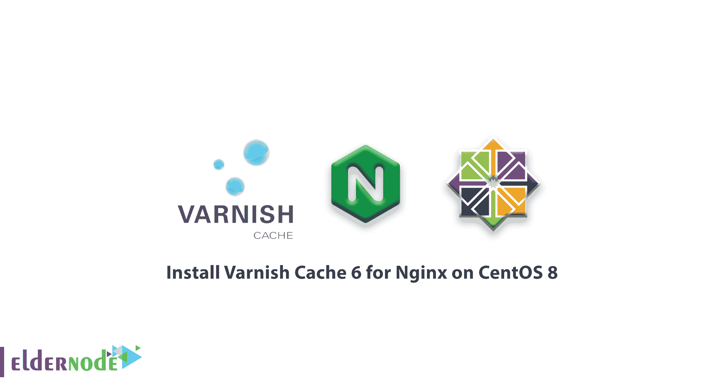

# 如何在 CentOS 8 上为 Nginx 安装 Varnish Cache 6-在 CentOS 8 上安装 Nginx

> 原文：<https://blog.eldernode.com/install-varnish-nginx-centos-8/>



你可能知道清漆。然而，在本文中，您将学习如何在 CentOS 8 上为 Nginx 安装 Varnish Cache 6。Varnish Cache 是一个开源、强大、快速的反向代理 **HTTP** 加速器，具有现代架构和灵活的配置语言。作为一个反向代理仅仅意味着它是一个你可以部署在你的网络服务器前面的软件，比如 **Nginx** 。接收客户端的 HTTP 请求并转发到源服务器进行处理。并且它将来自源服务器的响应传递给客户端。

##### 但是清漆是怎么工作的呢？

清漆在 **Nginx** 和**客户**之间充当中间人，但有一些业绩利益。它的主要目的是作为一个缓存引擎，让你的应用程序加载更快。它接收来自客户端的请求，并将它们转发到后端一次，以缓存所请求的内容。那么将来对完全相似内容的所有请求都将从缓存中得到服务。这使得您的 web 应用程序加载更快，并间接提高了您的 web 服务器的整体性能，因为 **Varnish** 将提供来自内存的内容，而不是 Nginx 处理来自存储磁盘的文件。

除了缓存， **Varnish** 还有其他几个用例，包括一个 [HTTP](https://en.wikipedia.org/wiki/Hypertext_Transfer_Protocol) 请求路由器、负载平衡器、web 应用防火墙等等。

**varnish** 使用高度可扩展的内置 **Varnish 配置语言** ( **VCL** )进行配置，这使您能够编写关于如何处理传入请求的策略。您可以使用它来构建定制的解决方案、规则和模块。

## 如何在 CentOS 8 上为 Nginx 安装 Varnish Cache 6

加入我们，浏览本指南，学习在新的 **CentOS 8** 或 **RHEL 8** 服务器上安装 **Nginx** web 服务器和 **Varnish Cache 6** 。

我们建议你设置一个完整的 **LEMP** 栈，而不是单独安装 **Nginx** 网络服务器，查看以下指南:

[如何在 CentOS 8 上安装 LEMP](https://eldernode.com/install-lemp-on-centos-8/)

还有**不要**错过一些相关文章:

[如何在 CentOS/RHEL 8](https://eldernode.com/install-varnish-apache-centos/) 上为 Apache 安装 varnish cache】

### 1-在 CentOS 8 上安装 Nginx Web 服务器

**CentOS/RHEL 8** 配有最新版本的 **Nginx** 网络服务器软件，因此请从默认存储库安装。

```
dnf update  dnf install nginx 
```

启动、启用并验证状态。安装完成后。

```
systemctl start nginx  systemctl enable nginx  ystemctl status nginx
```

要获得某个结果，请检查 Nginx TCP 套接字，默认情况下它运行在端口 80 上。

```
ss -tpln
```

正如我们在本指南开始时要求您运行防火墙，现在请确保更新防火墙。

```
firewall-cmd --zone=public --permanent --add-service=http  firewall-cmd --reload
```

### 2-在 CentOS 8 上安装清漆缓存 6

**CentOS/RHEL 8** 默认提供了一个**清漆缓存 DNF** 模块，其中包含版本 **6.0** **LTS。**

要安装模块:

```
dnf module install varnish 
```

然后，您可以确认系统上安装的**清漆**的版本。

```
varnishd -V 
```

请注意，安装**清漆缓存**后，安装在 **/usr/sbin/varnishd** 下的主可执行命令和清漆配置文件位于 **/etc/varnish/** 。

文件 **/etc/varnish/default.vcl** 是使用 **VCL** 编写的主清漆配置文件， **/etc/varnish/secret** 是清漆机密文件。

现在，启动 **Varnish** 服务，使其能够在系统启动时自动启动，并确认其已启动并运行。

### 3-配置 Nginx 使用清漆缓存

是时候向您展示如何配置**清漆缓存**在 **Nginx** 之前运行了。默认情况下，Nginx 监听端口 **80** ，通常每个服务器块(或[虚拟主机](https://eldernode.com/vps/))都被配置为监听该端口。

此外，您可以查看在主配置文件( **/etc/nginx/nginx.conf** )中配置的默认 nginx 服务器块

```
vi /etc/nginx/nginx.conf 
```

如果您想在 **Nginx、**之前运行**清漆**，您需要将默认 Nginx 端口从 **80** 更改为 **8080** 或您选择的任何其他端口。

对于您希望通过 **Varnish** 提供服务的网站或 web 应用程序，这应该在所有未来的服务器块配置文件(通常创建在 **/etc/nginx/conf.d/** 下)中完成。

例如，我们的测试站点 eldernode.lan 的服务器块是**/etc/nginx/conf . d/elder node . LAN . conf**，其配置如下。

```
server {          listen       8080;          server_name  www.eldernode.lan;          root         /var/www/html/eldernode.lan/;          location / {          }            error_page 404 /404.html;              location = /40x.html {          }          error_page 500 502 503 504 /50x.html;              location = /50x.html {          }  }
```

**点** :不要忘记通过注释掉 **/etc/nginx/nginx.conf** 文件中的配置部分来禁用默认服务器块，这使您能够开始在您的服务器上运行其他网站/应用程序，否则 nginx 将总是将请求定向到默认服务器块。

接下来，检查配置文件是否有错误，并重启 Nginx 服务以应用最近的更改。

```
nginx -t  systemctl restart nginx
```

您必须将 **Varnish** 配置为在端口 **80** 上运行，以便能够接收来自客户端的 **HTTP** 请求。与早期版本的 **Varnish 缓存**不同，在早期版本的 **Varnish** 环境文件(现已被弃用)中进行了此更改，在版本 **6.0** 及更高版本中。

之后，您应该在清漆服务文件中进行所需的更改。运行以下命令打开适当的服务文件进行编辑。

```
systemctl edit --full  varnish
```

在这里，您需要找到下面的行，并更改 -a 开关的值，该开关指定监听地址和端口。将端口设置为 **80** 。

**注意**:如果不指定地址， **varnishd** 将监听服务器上所有可用的 **IPv4** 和 **IPv6** 接口。

```
ExecStart=/usr/sbin/varnishd -a :6081 -f /etc/varnish/default.vcl -s malloc,256m 
```

您现在可以保存文件中的更改并退出。

接下来，您需要定义后端服务器， **Varnish** 将访问该服务器以获取内容。您将在 Varnish 主配置文件中执行此操作。

```
vi /etc/varnish/default.vcl
```

让我们验证默认的后端配置部分，并将字符串“ **default** ”更改为 **server1。**然后将端口设置为 **8080** 。

```
backend server1 {      .host = "127.0.0.1";      .port = "8080";  }
```

因为你在同一个服务器上运行 **Varnish** 和 **Nginx** 。如果您的 Nginx web 服务器运行在不同的主机上。例如，另一个地址为 **10.42.0.247** 的服务器，然后设置。主机参数。

```
backend server1 {      .host = "10.42.0.247";      .port = "8080";  }
```

您现在可以保存文件中的更改并退出。

接下来，由于 Varnish 服务文件中最近的更改，您需要重新加载 **systemd** manager 配置，然后重新启动 Varnish 服务以应用更改，如下所示。

```
systemctl daemon-reload  systemctl restart varnish
```

然后确认 **Nginx** 和**清漆**正在监听配置好的 **TCP** 插座。

```
ss -tpln
```

**[用 比特币](https://eldernode.com/bitcoin-vps/)** 购买 VPS

### 4-测试 Nginx 清漆缓存设置

在此步骤中，您将验证网页是否通过 **Varnish 缓存**提供，如下所示。打开 web 浏览器，使用服务器 IP 或 FDQN 导航。

使用您的服务器的 IP 地址或网站的 FQDN，或者使用 127.0.0.1 或 localhost(如果您在本地测试)。

```
curl -I http:///www.tecmint.lan
```

### 有用的清漆缓存管理实用程序

遵循这一节，让我们简要地描述一下 **Varnish Cache** 附带的一些有用的实用程序，您可以用它们来控制 **varnishd** ，访问内存中的日志和总体统计数据，等等。

#### 瓦内萨 adm

**varnishadm** 一个控制正在运行的 Varnish 实例的工具。它建立到 varnishd 的 CLI 连接。例如，您可以使用它来列出已配置的后端，如下面的屏幕截图所示。

**点**:阅读 **man varnishadm** 了解更多信息。

```
varnishadm  varnish> backend.list
```

#### varnishlog

**varnishlog** 实用程序提供对特定于请求的数据的访问。它提供关于特定客户端和请求的信息。

要点:阅读 **man varnishlog** 了解更多信息。

```
varnishlog 
```

#### 警告状态

一个**清漆统计**或**清漆统计**。它通过提供对内存中统计数据的访问，如缓存命中和未命中、关于存储的信息、创建的线程、删除的对象，让您对 Varnish 的当前性能一目了然。

要点:阅读 **man varnishstat** 了解更多信息

```
varnishstat
```

#### 警报停止

一个 **varnishtop** 实用程序读取共享内存日志，并显示最常出现的日志条目的连续更新列表。

要点:阅读 **man varnishtop** 了解更多信息。

```
varnishtop 
```

一个**varnish hist****(varnish hist**)实用程序解析清漆日志并输出一个持续更新的直方图，显示最后的 **n** 个请求的分布情况。

要点:阅读 **man varnishhist** 了解更多信息。

```
varnishhist 
```

**好样的** ！通过接触这一点，您已经完成了指南，并了解了如何安装 **Varnish Cache** 并在 **Nginx HTTP** 服务器前运行它，以加速 **CentOS/RHEL 8** 中的 web 内容交付。

了解一下**清漆缓存**的主要缺点是缺乏对 **HTTPS** 的原生支持是很有用的。要在您的网站/应用程序上启用 **HTTPS** ，您需要配置一个 SSL/TLS 终止代理与 **Varnish 缓存**协同工作来保护您的站点。

亲爱的用户，我们希望本教程能对你有所帮助，如有任何问题或想查看我们的用户关于本文的对话，请访问 [提问页面](https://eldernode.com/ask) 。也为了提高自己的见识，准备了这么多有用的教程给 [Eldernode](https://eldernode.com/blog/) 培训。