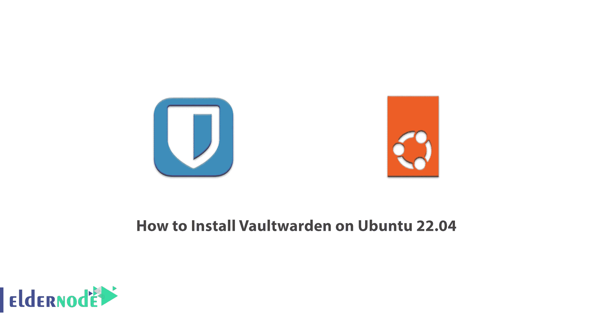

# 如何在 Ubuntu 22.04 - Eldernode 博客上安装 Vaultwarden

> 原文：<https://blog.eldernode.com/install-vaultwarden-on-ubuntu-22-04/>



有许多不同的开源密码管理器，其中之一是 Bitwarden，它集成了您用于日常操作的系统。但是，由于该服务器的设置可能不正确。因此，您可以使用 Vaultwarden 作为 Bitwarden 的替代方案，它易于设置，并与 Bitwarden 客户兼容。在本文中，我们将教你如何在 Ubuntu 22.04 上安装 Vaultwarden。 [**Ubuntu VPS**](https://eldernode.com/ubuntu-vps/) 服务器套装在 [Eldernode](https://eldernode.com/) 网站上提供，想要的可以查看购买。

## **Ubuntu 上的教程 SetupVaultwarden 22.04**

### **什么是 Vaultwarden？**

Vaultwarden 是用 Rust 编写的 [Bitwarden](https://blog.eldernode.com/install-bitwarden-on-windows-rdp/) 服务器的单进程、开源、非官方替代方案。此外，它还是一个密码管理应用程序，可以自托管并在您的基础架构上运行。由于所需资源非常少，它可以在您的浏览器和移动服务中与任何 Bitwarden 客户一起工作。

Vaultwarden 通过 Bitwarden 客户端使用支持连接，不如官方的 Bitwarden 服务资源丰富。通过运行此服务，您可以使用服务器支持的 Bitwarden 浏览器扩展和移动应用程序。

在这篇文章的后续部分，在介绍了所需的先决条件之后，将会一步一步地教你如何在 [Ubuntu](https://blog.eldernode.com/tag/ubuntu/) 22.04 上安装 Vaultwarden。

### **在 Ubuntu 22.04 上安装 Vaultwarden 的先决条件**

Ubuntu 22.04 服务器

2)拥有 sudo 权限的非 root 用户

## **在 Ubuntu 22.04 上安装 vault warden**

首先，您应该用下面的命令更新包列表:

```
sudo apt update
```

然后使用以下命令升级所有可升级的软件包:

```
sudo apt upgrade
```

更新完所需的软件包后，**在以下命令的帮助下重启系统**:

```
sudo reboot
```

您可以通过输入以下命令**删除旧包**和依赖项:

```
sudo apt autoremove
```

现在你应该**移除任何旧版本的 Docker** 和 Docker 引擎。为此，请运行以下命令:

```
sudo apt remove docker docker.io containerd runc
```

接下来，确保您的 snapd 版本已更新:

```
sudo snap install core
```

```
sudo snap refresh core
```

您可以通过运行以下命令来安装 Docker :

```
sudo snap install docker
```

### **如何在 Ubuntu 22.04** 上配置 **Vaultwarden**

首先，您需要**在您的主目录中创建一个 vaultwarden 目录**并输入它。为此，请运行以下命令:

```
mkdir ~/vaultwarden 
```

```
cd ~/vaultwarden
```

现在打开您最喜欢的文本编辑器并**创建一个新的 docker-compose.yml** 文件:

```
nano docker-compose.yml
```

然后，您应该**向文件中添加**以下几行:

```
version: '3'    services:    vaultwarden:      image: vaultwarden/server:latest      container_name: vaultwarden      restart: always      environment:        - WEBSOCKET_ENABLED=true      volumes:        - ./vw-data:/data      caddy:      image: caddy:2      container_name: caddy      restart: always      ports:        - 80:80        - 443:443      volumes:        - ./Caddyfile:/etc/caddy/Caddyfile:ro        - ./caddy-config:/config        - ./caddy-data:/data      environment:        - DOMAIN=        - EMAIL=        - LOG_FILE=/data/access.log
```

然后您应该**将域名**或子域添加到 [Caddy](https://blog.eldernode.com/introducing-the-caddy-web-server/) 环境变量中的域值中:

```
environment:    - DOMAIN=https://example.com
```

现在，您应该**将 TLS/SSL** 证书注册的电子邮件地址添加到 Caddy 环境变量下的 email 值中。为此，请输入以下命令:

```
environment:  - DOMAIN=https://example.com  - [[email protected]](/cdn-cgi/l/email-protection)
```

记得保存并退出文本编辑器。你可以通过按下“ **CTRL+X** ”，然后“ **Y** ”，再按下“ **Enter** ”来实现。

现在再次打开你最喜欢的文本编辑器，创建并打开一个新的 Caddyfile ，如下所示:

```
nano Caddyfile
```

然后，您需要将以下几行添加到文件中:

```
{$DOMAIN}:443 {    log {      level INFO      output file {$LOG_FILE} {        roll_size 10MB        roll_keep 10      }    }      # Get a cert by using the ACME HTTP-01 challenge.    tls {$EMAIL}      encode gzip      # Headers to improve security.    header {    # Enable HSTS    Strict-Transport-Security "max-age=31536000;"      # Enable cross-site filter (XSS)    X-XSS-Protection "1; mode=block"      # Disallow the site to be rendered within a frame (clickjacking protection)    X-Frame-Options "DENY"      # Prevent search engines from indexing    X-Robots-Tag "none"      # Remove Caddy branding    -Server    }      # Redirect notifications to the WebSocket.    reverse_proxy /notifications/hub vaultwarden:3012      reverse_proxy vaultwarden:80 {         header_up X-Real-IP {remote_host}    }  }
```

最后，记得**保存**和**退出**文本编辑器。

Caddy 由 Caddfile 配置。这将 HTTPS 请求从**端口 443** 转发到 Vaultwarden，并添加了额外的头以提高安全性。

### **如何在 Ubuntu 22.04 上运行 vault warden**

现在，您应该在分离模式下运行 Vaultwarden。您可以使用以下命令来完成此操作:

```
sudo docker-compose up -d
```

然后使用以下命令检查 Vaultwarden 是否正在运行:

```
sudo docker ps  STATUS  Up x seconds/minutes
```

请注意，状态应该是启动。

### **如何在 Vaultwarden** 上配置附加安全性

首先，您需要禁用注册。因为任何有权访问 Vaultwarden 实例的人都不能创建帐户。

请注意，您可以在创建帐户后禁用注册。为此，您应该在“ **docker-compose.yml** ”中将环境变量**signs _ ALLOWED**设置为 false

```
services:  vaultwarden:  ... other configuration ...  environment:  - SIGNUPS_ALLOWED=false  ... other configuration ...
```

Vaultwarden 的一个特性是，它允许注册用户邀请其他新用户在服务器上创建帐户。如果您是单个用户，这可能会带来安全风险，最好禁用它。为此，只需在“ **docker-compose.yml** ”中将环境变量 **INVITATIONS_ALLOWED** 设置为 false:

```
services:  vaultwarden:  ... other configuration ...  environment:  - INVITATIONS_ALLOWED=false  ... other configuration ...
```

Bitwarden 的密码提示通常通过电子邮件发送。Vaultwarden 密码提示可在密码帮助页面上找到，您不需要配置电子邮件服务。您可以将“ **docker-compose.yml** ”中的变量 **SHOW_PASSWORD_HINT** 设置为 false 来禁用密码提示:

```
services:  vaultwarden:  ... other configuration ...  environment:  - SHOW_PASSWORD_HINT=false  ... other configuration ...
```

***注意:*** 如果环境变量发生变化，首先您应该借助以下步骤应用这些变化。

首先，您需要借助以下命令**停止 Vaultwarden** :

```
sudo docker-compose down
```

现在**使用以下命令返回 Vaultwarden** :

```
sudo docker-compose up -d
```

就是这样！您的新配置已经应用。

您可以使用 Bitwarden 来访问 Vaultwarden 实例。您只需将服务器 URL 更改为 Vaultwarden 实例，在这种情况下，您可以使用上游 Bitwarden 客户端。

转到您的 Vaultwarden 安装并登录到您的帐户:

```
https://example.com
```

最后，您应该将您的登录名和密码添加到您的 vault 中。

## 结论

Vaultwarden 为许多 Bitwarden 应用程序和浏览器扩展提供了兼容的 API。在本文中，您学习了如何使用 Docker 和 docker-compose 在 Ubuntu 22.04 上安装 Vaultwarden。然后我们使用 Caddy 来保护配置。如有疑问，可在评论中联系我们。