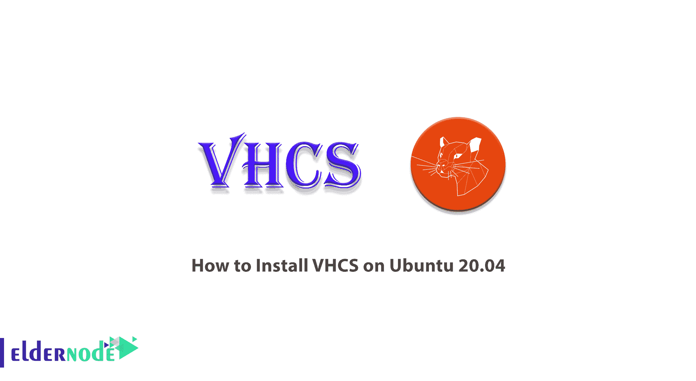

# 如何在 Ubuntu 20.04 - Eldernode 博客上安装 VHCS

> 原文：<https://blog.eldernode.com/install-vhcs-on-ubuntu-20-04/>



VHCS 是一个历史悠久的控制面板，由 moleSoftware GmbH 支持。鼹鼠软件于 1999 年推出，后来发布了 VHCS 控制面板的第一个版本。VHCS 代表虚拟主机控制系统，它有 3 个访问级别，包括服务器管理，经销商管理，域(用户)管理。在这篇文章中，我们试图向你学习如何在 Ubuntu 20.04 上安装 VHCS。你可以在 [Eldernode](https://eldernode.com/) 查看可用的包来购买 [Ubuntu VPS](https://eldernode.com/ubuntu-vps/) 服务器。

## **教程在 Ubuntu 20.04 上安装 VHCS**

VHCS 是一个开源控制面板，用于管理基于 Linux 的服务器。VHCS 管理网页，邮件(POP 和/或 IMAP)，FTP，DNS，数据库，配额，流量。还应该注意，该控制面板为管理员、供应商和域所有者提供图形用户界面。VHCS 控制面板是在 Mozilla 通用公共许可证(MPL)下发布的，可以自由使用和修改。

选择 [VHCS 控制面板](https://blog.eldernode.com/?p=21087)的理由包括开源、易用、受支持、可访问和国际化。请注意，VHCS 提供了一个完整的托管自动化设备，具有显著的安全性、总拥有成本和性能优势。在这篇文章的续篇中，加入我们来学习如何在 Ubuntu 20.04 上安装 VHCS。

## **在 Ubuntu 20.04 上安装 VHCS**

按照以下步骤开始安装 VHCS。在第一步中，您必须执行以下命令:

```
wget http://www.siemens-mobiles.org/vhcs/vhcs.sh
```

然后，您需要运行以下命令:

```
sudo sh vhcs.sh
```

在这一步中，您应该使用以下命令检查您是否拥有所有需要的存储库，这些存储库已经使用 **/etc/apt/sources.list** 进行了测试:

```
deb http://archive.ubuntu.com/ubuntu/ hoary main restricted universe multiverse
```

```
deb http://security.ubuntu.com/ubuntu/ hoary-security main restricted universe multiverse
```

```
deb http://archive.ubuntu.com/ubuntu/ hoary-updates main restricted universe multiverse
```

接下来，您需要创建一个**临时目录**来存放文件。这样做对于创造 VHCS 至关重要:

```
sudo mkdir /root/vhcs_tmp
```

```
sudo mkdir /root/vhcs_tmp/install
```

```
cd /root/vhcs_tmp/install
```

要应用已安装的系统更改，您必须使用以下命令**更新**:

```
sudo apt-get update
```

```
sudo apt-get upgrade -y
```

现在，您可以运行以下命令来删除一些干扰系统正常运行的不必要的软件包:

```
sudo apt-get remove -y lpr nfs-common portmap pidentd pcmcia-cs pppoe pppoeconf ppp pppconfig
```

您还可以从/etc/inetd.conf 文件中删除一些不必要的服务:

```
sudo update-inetd --remove daytime
```

```
sudo update-inetd --remove telnet
```

```
sudo update-inetd --remove time
```

```
sudo update-inetd --remove finger
```

```
sudo update-inetd --remove talk
```

```
sudo update-inetd --remove ntalk
```

```
sudo update-inetd --remove ftp
```

```
sudo update-inetd --remove discard
```

是时候安装必要的软件包了:

```
sudo apt-get install -y ssh postfix postfix-tls proftpd-mysql courier-authdaemon courier-base courier-imap courier-maildrop courier-pop libberkeleydb-perl libcrypt-blowfish-perl libcrypt-cbc-perl libcrypt-passwdmd5-perl libdate-calc-perl libdate-manip-perl libmime-base64-perl libdbd-mysql-perl libdbi-perl libio-stringy-perl libmail-sendmail-perl libmailtools-perl libmd5-perl libmime-perl libnet-dns-perl libnet-netmask-perl libnet-perl libnet-smtp-server-perl libperl5.8 libsnmp-session-perl libterm-readkey-perl libtimedate-perl perl perl-base perl-modules bind9 diff gzip iptables libmcrypt4 mysql-client mysql-common mysql-server patch php4 php4-mcrypt php4-mysql php4-pear procmail tar original-awk libterm-readpassword-perl libsasl2-modules libsasl2 sasl2-bin apache2 apache2-common apache2-mpm-prefork libapache2-mod-php4 bzip2
```

使用以下命令下载 VHCS 归档文件。请注意，您必须访问 VHCS 网站才能获得最新版本:

```
sudo wget http://puzzle.dl.sourceforge.net/sourceforge/vhcs/vhcs2.4.tar.bz2
```

在下一步中，下载所需的归档文件后，您必须将其解压缩到上一步中创建的目录中:

```
sudo bunzip2 vhcs2.4.tar.bz2
```

```
sudo tar -xvvf vhcs2.4.tar
```

```
cd ./vhcs-2.4
```

### **学习如何在 Ubuntu 上安装 VHCS**

成功完成前面的步骤后，您现在应该安装 vhcs。这样做会将整个文件放在 **/tmp/vhcs2** 文件夹中:

```
sudo make install
```

使用以下命令将文件复制到所需位置:

```
sudo cp -R /tmp/vhcs2/etc/* /etc
```

```
sudo cp -R /tmp/vhcs2/var/* /var
```

```
sudo cp -R /tmp/vhcs2/usr/* /usr
```

将文件转移到主目录后，您现在应该更改 mysql 的根密码:

```
mysqladmin -u root -p password "new password here"
```

如果正确完成了 vhcs 的安装和 mysql 的根更改，您应该使用以下命令更新系统以应用更改:

```
sudo apt-get update
```

```
sudo apt-get upgrade -y
```

```
sudo apt-get clean
```

您必须运行以下命令来完成 VHCS 安装:

```
sudo /var/www/vhcs2/engine/setup/vhcs2-setup
```

如果要求您提供密码和 IP 等信息，您必须输入服务器的私有 IP。到目前为止，我们已经能够成功地安装 VHCS。

现在您需要导入 apache 配置文件，然后重新启动它。首先转到 **/etc/apache2/httpd.conf** 并打开配置文件:

```
sudo pico /etc/apache2/httpd.conf
```

现在，您需要将以下指令放在配置文件的底部:

```
Include /etc/apache2/sites-available/vhcs2.conf
```

将上述命令添加到文件后，现在必须重新启动 Apache 来应用更改:

```
/etc/init.d/apache2 restart
```

最后，在完成上述所有步骤后，使用以下命令添加一个守护进程以在 Ubuntu 上启动是最后一步:

```
sudo update-rc.d vhcs2_daemon defaults
```

```
sudo update-rc.d vhcs2_network defaults
```

## 结论

VHCS 是一个免费的开源控制面板，具有简单的设置功能。这个控制面板使用 C，PHP，Perl 语言。在这篇文章中，我们试图一步一步地学习你如何在 Ubuntu 20.04 上安装 VHCS。