# 教程在你的 Mac OS X 电脑上安装 VirtualBox

> 原文：<https://blog.eldernode.com/install-virtualbox-on-your-mac-os-x/>

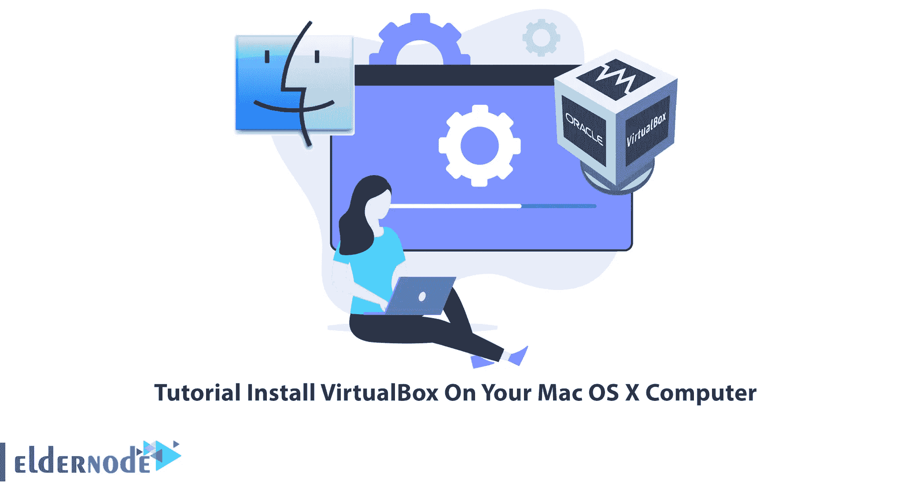

VirtualBox 是一个免费的强大程序，在 Windows、Linux、Mac 操作系统上安装来宾虚拟操作系统方面具有许多功能。VirtualBox 是 Oracle 发布的软件。该软件允许您在计算机上安装的操作系统中模拟操作系统，并运行模拟的操作系统，就像它真的在真实的硬件上运行一样。在这篇文章中，我们将教你如何在你的 Mac OS X 电脑上安装 VirtualBox。如果你想[购买 VPS](https://eldernode.com/vps/) 服务器，你可以访问 [Eldernode](https://eldernode.com/) 网站上提供的套装。

## **如何在你的 Mac OS X 电脑上安装 VirtualBox**

### **VirtualBox**的特性和功能

–轻巧、紧凑、快速执行

–人性化的优美环境

–兼容各种操作系统

–能够为客户操作系统虚拟化现有硬件

–ISO 支持在客户系统上安装或使用光驱

–Cd-DVD-[USB](https://blog.eldernode.com/install-and-enable-usb-on-virtualbox/)-floppy-com 端口支持

–主机和客户操作系统之间文件共享的可能性

–开源和免费

–你有便携式版本

–支持 32 位和 64 位操作系统

–支持 2D 和 3D 显卡模式

–同时运行多个操作系统并在它们之间切换的能力

## **在 Mac OS X 电脑上安装 VirtualBox**

在上一节熟悉了 [VirtualBox](https://blog.eldernode.com/install-and-configure-virtualbox-on-fedora/) 的功能后，我们将教你如何在 Mac OS X 上安装 VirtualBox，要做到这一点，只需按照下面的步骤。第一步是 **[下载 VirtualBox](https://www.virtualbox.org/wiki/Downloads)** 。

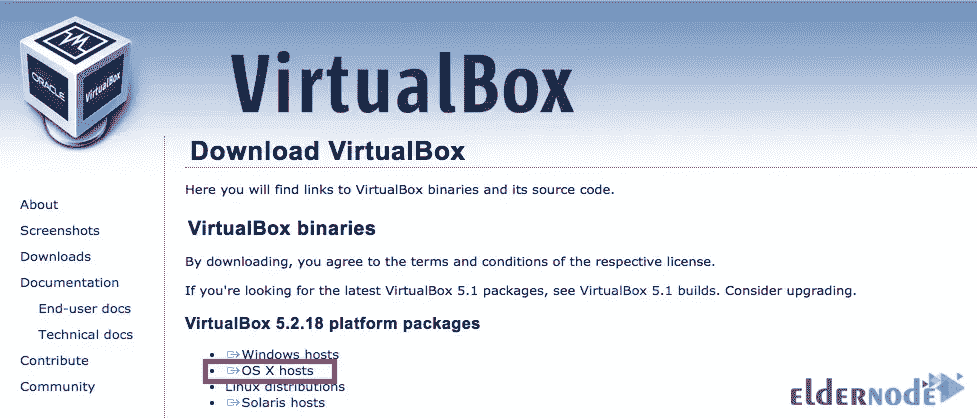

转到下载 VirtualBox 安装文件的位置，双击该文件开始安装过程:

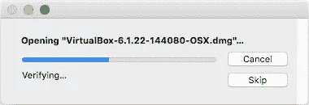

在打开的窗口中点击 **VirtualBox.pkg** ，如下图所示:

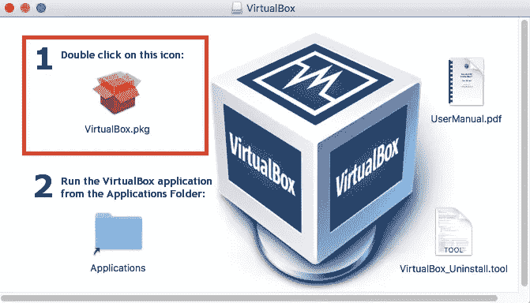

在下一步中，通过查看下图，点击**继续**:

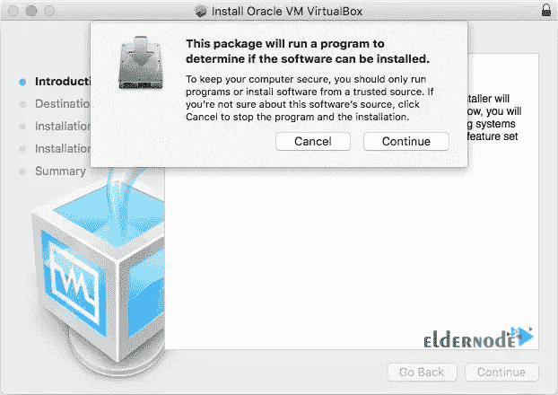

在欢迎屏幕上，再次点击**继续**:

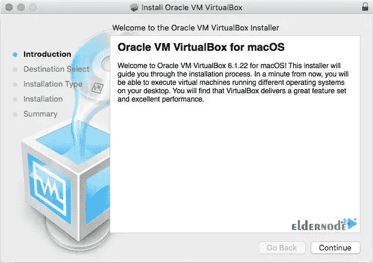

点击安装类型部分的**安装**:

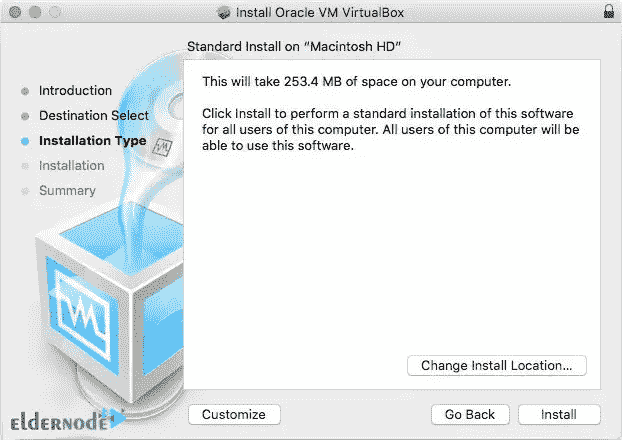

在认证页面，输入你的**用户名**和**密码**，然后点击**安装软件**:

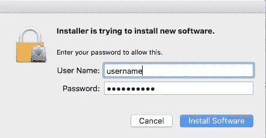

开始安装过程后，您可能会看到下图。在这种情况下，您必须点击**关闭:**

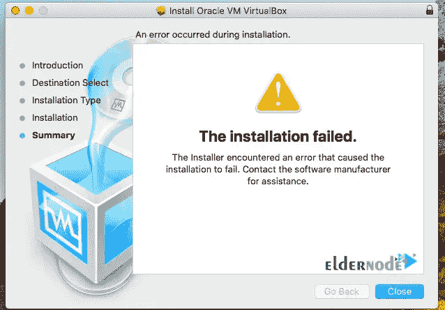

如果询问您是否要将安装程序移到回收站，请单击**保留**按钮:

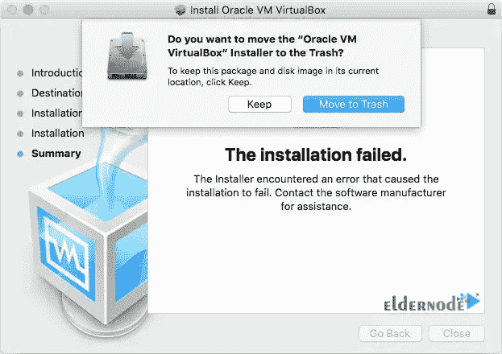

然后点击左上角的**苹果 logo** ，点击**系统偏好**:

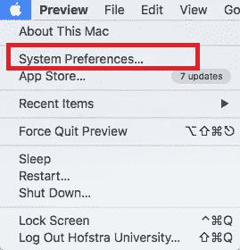

现在你需要点击**安全&隐私**:

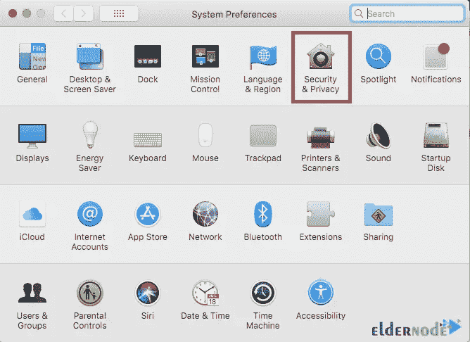

点击**允许**，如下图所示。为此，请单击锁图标:

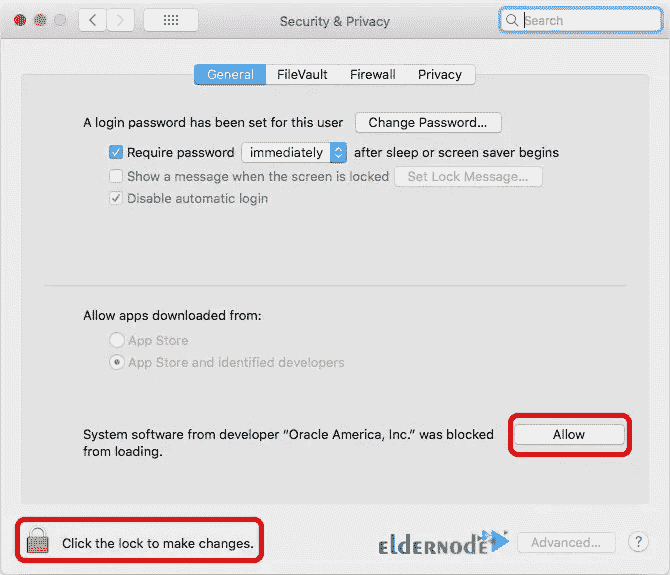

如果您正确遵循了本文中提到的所有步骤，您将看到 VirtualBox 已成功安装在您的 Mac OS X 上:

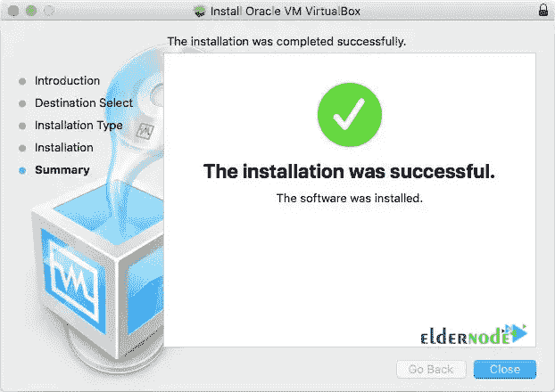

## 结论

VirtualBox 是一款虚拟机创建软件，可以帮助您在自己的操作系统上创建虚拟服务器，而无需购买新的硬件。你也可以在上面安装任何你想要的操作系统，这样它们就不会互相干扰。在本文中，我们试图教你如何在你的 Mac OS X 电脑上安装 VirtualBox。如果你有任何问题，你可以在评论区和我们分享。