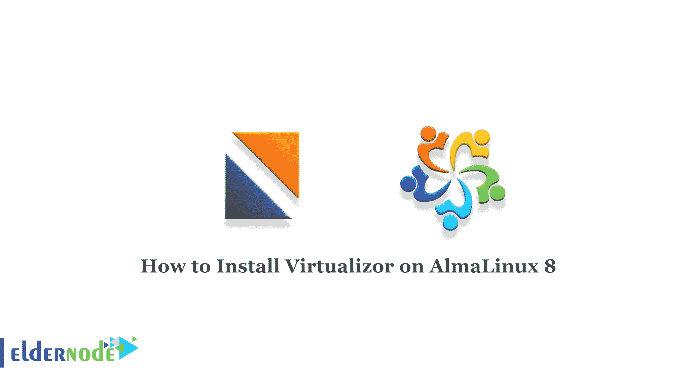
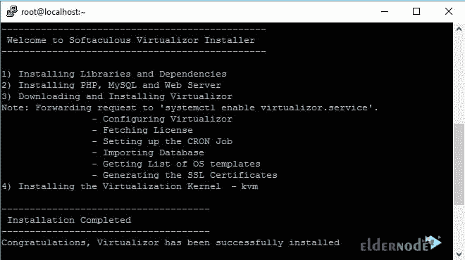
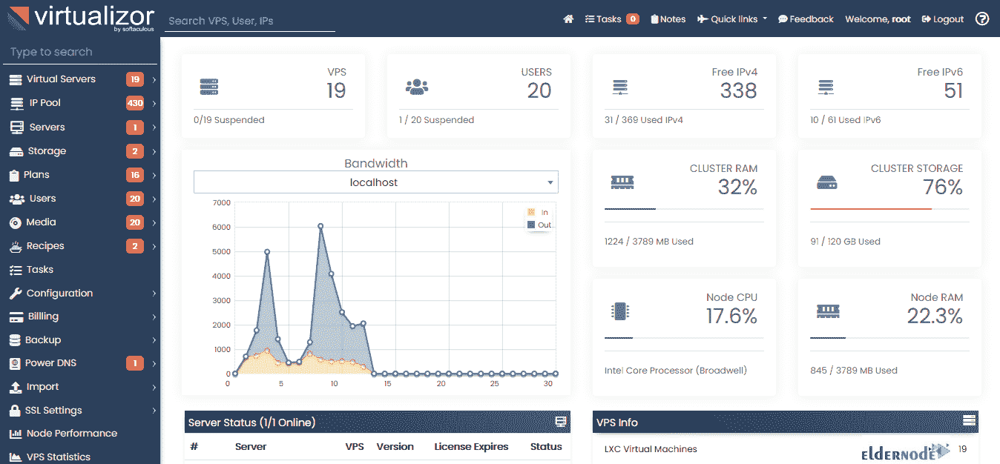

# 如何在 AlmaLinux 8 - Eldernode 博客上安装 Virtualizor

> 原文：<https://blog.eldernode.com/install-virtualizor-on-almalinux-8/>



如今，计算机的处理能力已经大大提高，借助虚拟化技术，它们可以得到最佳利用。虚拟化是虚拟主机领域最主要和最重要的角色之一。您可以使用 Virtualizor 进行虚拟化。在本文中，我们将一步步教你如何在 AlmaLinux 8.4、8.5 上安装 Virtualizor。想买一个便宜的有即时激活功能的 Linux VPS，在[的 Eldernode](https://eldernode.com/) 上订购你需要的东西。

## **教程在 AlmaLinux 上安装 Virtualizor**

Virtualizor 是 Softaculous Ltd .开发的一款功能强大的基于 web 的 VPS 控制面板。Virtualizor 非常适合操作，因为它支持 OpenVZ、Xen PV、Xen HVM、XenServer 和 Linux KVM 虚拟化。

安装先决条件

*   AlmaLinux 8
*   yum/apt-get
*   用于创建 VPS 磁盘的存储

## **在 AlmaLinux 8.4 上安装 Virtualizor | alma Linux 8.5**

首先，您应该在服务器上打开 Shell 和 SSH 终端，并输入以下命令:

```
wget -N http://files.virtualizor.com/install.sh
```

```
chmod 0755 install.sh
```

```
./install.sh [[email protected]](/cdn-cgi/l/email-protection) kernel-kvm
```

注意:不要忘记替换正确的电子邮件地址。

预计安装将立即开始。然后，您可以看到如下所示的内容:



安装完成后，按“y”重新启动系统。

如何登录虚拟管理员面板

首先，您需要访问以下 URL:

```
https://Your-Server-IP:4085/
```

```
http://Your-Server-IP:4084/
```

然后，您应该使用服务器的 root 详细信息登录。


登录后，您将看到以下仪表板:



### **如何在 AlmaLinux 上使用 Virtualizor**

由于 Virtualizor 使用 4081–4085 端口，如果防火墙对此有限制，您必须允许这些端口。

对于 [AlmaLinux](https://blog.eldernode.com/install-and-use-almalinux/) ，运行:

```
firewall-cmd --zone=public --permanent --add-port=4081-4085/tcp
```

```
firewall-cmd --zone=public --permanent --add-port=5900-6000/tcp
```

## 结论

本文一步一步地教你如何在 AlmaLinux 8.4 或 AlmaLinux 8.5 上安装 Virtualizor，你也学会了如何登录 Virtualizor 管理面板。在 Virtualizor 的帮助下，用户只需点击一下鼠标就可以在服务器上部署和管理 VPS。我希望这篇教程对你有用。