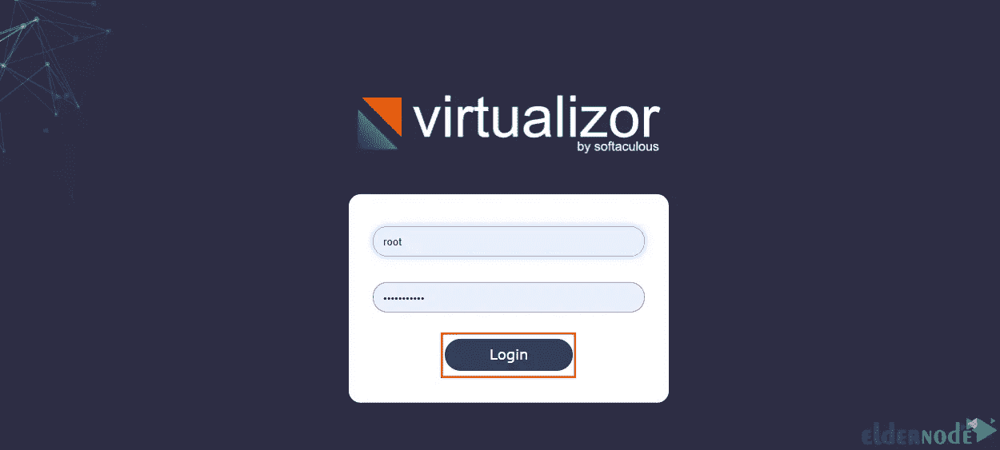
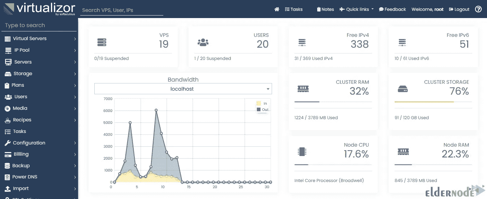

# 如何在 Rocky Linux 9 上安装 Virtualizor

> 原文：<https://blog.eldernode.com/install-virtualizor-on-rocky-linux/>


通过提高计算机的处理能力，您可以利用虚拟化技术优化它们的使用。事实上，虚拟化技术是为了更轻松、更好地管理资源而创建的。您可以使用 Virtualizor 进行虚拟化。本文将教你如何在 Rocky Linux 9 上安装 Virtualizor。如果你打算购买一台 Linux VPS 服务器，你可以在 [Eldernode](https://eldernode.com/) 网站上查看提供的软件包。

## **教程在 Rocky Linux OS 上设置 Virtualizor**

### **什么是 Virtualizor？**

Virtualizor 是一个强大的基于 web 的 VPS 控制面板，允许用户一键部署和管理 VPS 服务器。这个控制面板支持 OpenVZ、Xen PV Xen HVM、XenServer 和 Linux KVM 虚拟化器。其实这是 Softaculous 开发的一个方便易用的控制面板。它有一个强大的 API 和实时统计。管理员只需点击一个按钮就可以创建 VPS。

在这个来自 [Linux](https://blog.eldernode.com/tag/linux/) 培训系列的教程中，你将学习如何在 Rocky Linux 9 上安装 Virtualizor。

## **在 Rocky Linux 9 上安装 Virtualizor**

首先，打开您的终端，使用下面的命令下载 Virtualizor:

```
wget -N http://files.virtualizor.com/install.sh
```

然后运行安装脚本:

```
chmod 0755 install.sh
```

```
./install.sh [[email protected]](/cdn-cgi/l/email-protection) kernel-kvm lvg=vg
```

记得替换你的电子邮件地址，而不是上面命令中的[【电子邮件保护】](/cdn-cgi/l/email-protection)。

安装完成后，您应该会在输出中看到**‘祝贺您，Virtualizor 已经成功安装’**。

最后，重启你的系统。

### **访问 Rocky Linux 上的 Virtualizor 9**

成功完成安装过程后，您应该按照下面的步骤登录到 [Rocky Linux](https://blog.eldernode.com/rocky-linux-operating-system/) 上的 Virtualizor。

为此，首先打开您想要的浏览器并输入以下 URL:

```
https://IP-Address:4085/
```

然后输入您的 Rocky Linux 服务器的根详细信息以登录到 Virtualizor 控制面板:



一旦您成功登录到 Virtualizor，您应该会看到下面的仪表板:



***注意:*** Virtualizor 使用从 **4081** 到 **4085** 的端口，防火墙可能会限制它们。因此，输入以下命令来允许这些端口:

```
firewall-cmd --zone=public --permanent --add-port=4081-4085/tcp
```

就是这样！您已经在 Rocky Linux 9 上成功安装了 Virtualizor。

## 结论

Virtualizor 是一个功能强大的 VPS 控制面板，有助于在一台服务器上创建、部署、维护和管理多个虚拟专用服务器。在本文中，我们向您介绍了 Virtualizor，并一步步教您如何在 Rocky Linux 9 上安装它。我希望这篇教程对你有用，并帮助你安装 Virtualizor。如果你面临任何问题或者有任何疑问，可以在评论区联系我们。