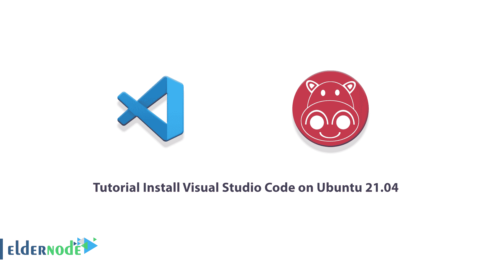
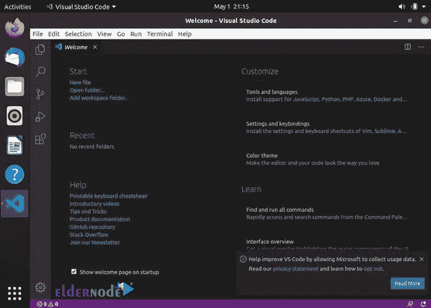

# 教程在 Ubuntu 21.04 和 20.04 上安装 Visual Studio 代码

> 原文：<https://blog.eldernode.com/install-visual-studio-code-on-ubuntu/>



Visual Studio 代码是一个轻量级但功能强大的源代码编辑器，可以在台式计算机上运行。这个代码编辑器适用于 Windows、macOS 和 Linux。该程序内置了对 JavaScript、TypeScript 和 Node.js 的支持。它还为其他语言(如 C ++、C #、Java、Python、PHP 和 Go)和运行时系统(如)提供了丰富的附加生态系统。NET 和 Unity。在本文中，我们将一步一步地教你如何在 Ubuntu 21.04 上安装 Visual Studio 代码。如果你想购买一台 [Ubuntu VPS](https://eldernode.com/ubuntu-vps/) 服务器，你可以访问 [Eldernode](https://eldernode.com/) 中提供的软件包。

## **如何在 Ubuntu 21.04 上安装 Visual Studio 代码**

Visual Studio Code 是一个流行且有用的编辑器，许多在软件和应用程序开发领域工作的人和团队使用它来构建基于不同平台的应用程序。在下一节中，我们将对 Visual Studio 代码及其特性进行定义。然后我们会教你如何在 [Ubuntu](https://blog.eldernode.com/tag/ubuntu/) 21.04 上安装和启动 Visual Studio 代码。

### **什么是 Visual Studio 代码？**

VS Code 允许开发人员添加甚至创建新的插件，包括代码链接、调试以及对 web 开发和云技术的支持。与其他文本编辑器相比，VS 代码接口允许与程序员进行大量的交互。

大多数人正确地认为 Visual Studio 代码是一个代码编辑器，甚至是一个用于编程项目或处理文本文件的开发环境。然而，插件形式的 VS 代码的灵活性允许这个编辑器除了支持编程语言或文件格式之外做更多的事情。

除了编码，VS 代码还可以支持很多其他应用。

以下四种方法用于使用 VS 代码来提高开发过程的质量，而不仅仅是纯文本编辑器:

1_ 搜索数据库

2_ API 开发和测试

3_ 合作伙伴管理

4_ 生产力跟踪

VS 代码编辑器有很多特性和功能。这些功能包括:

1.多平台支持

2.语法突出显示

3.第一行代码的缩进

4.插件

5.提供树形视图

6.集成命令行

7.显示的语言

8.颜色主题

9.网络开发设施

下一节，我们将教你如何在 Ubuntu 21.04 上安装 Visual Studio 代码。请加入我们。

## **在 Ubuntu 上安装 Visual Studio 代码 21.04 | 20.04**

在这一节，我们想教你如何在 Ubuntu 21.04 上安装 Visual Studio 代码。由于 Visual Studio 代码可以在官方的 Microsoft Apt 库中获得，您可以按照下面的说明轻松地安装它。

第一步，作为拥有 Sudo 特权的[用户，您必须**更新包索引**并安装依赖项。为此，您可以使用以下命令:](https://blog.eldernode.com/sudo-privileges-for-user-in-ubuntu-20-10/)

```
sudo apt update
```

```
sudo apt install software-properties-common apt-transport-https wget
```

然后，您需要在下一步中使用以下命令导入**微软 GPG 密钥**:

```
wget -q https://packages.microsoft.com/keys/microsoft.asc -O- | sudo apt-key add -
```

在下一部分中，您必须**启用 Visual Studio 代码库**:

```
sudo add-apt-repository "deb [arch=amd64] https://packages.microsoft.com/repos/vscode stable main"
```

最后，在激活 apt 存储库之后，您可以使用下面的命令轻松地**安装 Visual Studio 代码**包:

```
sudo apt install code
```

最后，您可以使用以下命令来应用更改:

```
sudo apt update
```

```
sudo apt upgrade
```

### **如何在 Ubuntu 21.04 上启动 Visual Studio 代码**

根据上一步中提到的说明在 Ubuntu 21.04 上成功安装了 Visual Studio 代码后，现在就可以运行它了。为此，只需在活动搜索栏中键入“ **Visual Studio 代码**”。然后你必须点击图标来启动程序。

在下图中，您可以看到 Visual Studio 代码环境的图片。换句话说，当您第一次启动 VS 代码时，应该会出现如下所示的窗口。然后，您可以轻松地开始安装 VS 代码扩展和配置。



## 结论

与 Visual Studio 相比，Visual Studio 代码是一个完全不同的产品。VS Code‌为开发者提供了多种编程语言的服务设施。因此，考虑到这个工具在用户中的重要性和受欢迎程度，我们决定在本文中教你如何在 Ubuntu 21.04 上安装 Visual Studio 代码。