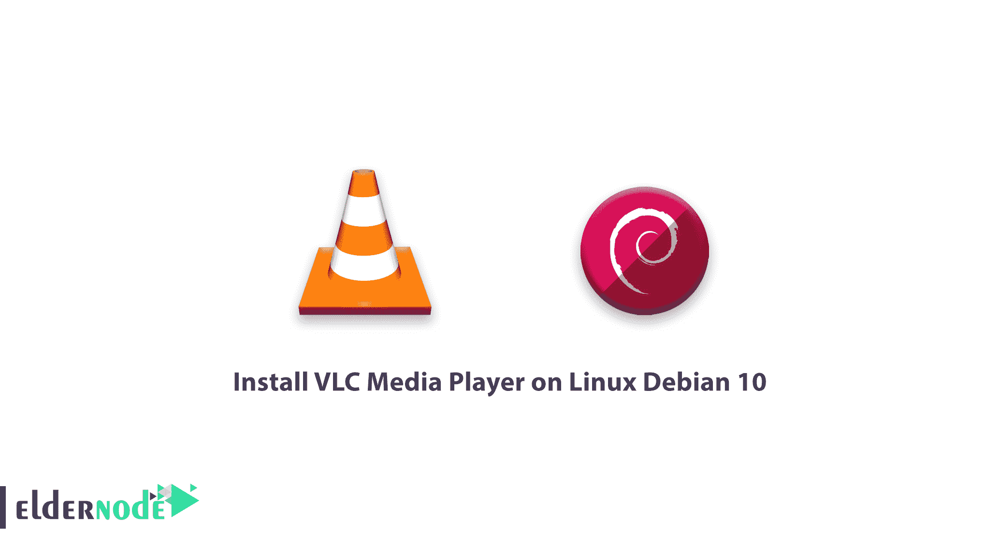

# 教程在 Linux Debian 10 - ElderNode 博客上安装 VLC 媒体播放器

> 原文：<https://blog.eldernode.com/install-vlc-on-linux-debian-10/>



VLC 是最流行的播放多媒体音乐和视频文件的软件之一。在这个[教程](https://eldernode.com/category/tutorial/)中，我们想学习如何在 Debian 10 上安装 VLC 媒体播放器。

## 在 Linux Debian 10 上安装 VLC 媒体播放器

在本教程中，我们想用 3 个步骤在 Debian 上安装 [VLC](https://www.videolan.org/) 。

### 步骤 1)如何安装 VLC

对于在 Linux Debian 上安装 VLC，首先，更新 Debian:

```
sudo apt update  sudo apt upgrade 
```

然后用下面的命令安装 VLC:

```
sudo snap install vlc 
```

### 步骤 2)运行 VLC 播放器

安装完成后，从应用程序部分搜索并运行 vlc。

### 步骤 3)如何移除 VLC 媒体播放器

您可以使用以下命令轻松删除 vlc:

```
sudo snap remove vlc 
```

如有疑问，可在[问长辈节点](https://eldernode.com/ask/)提问。