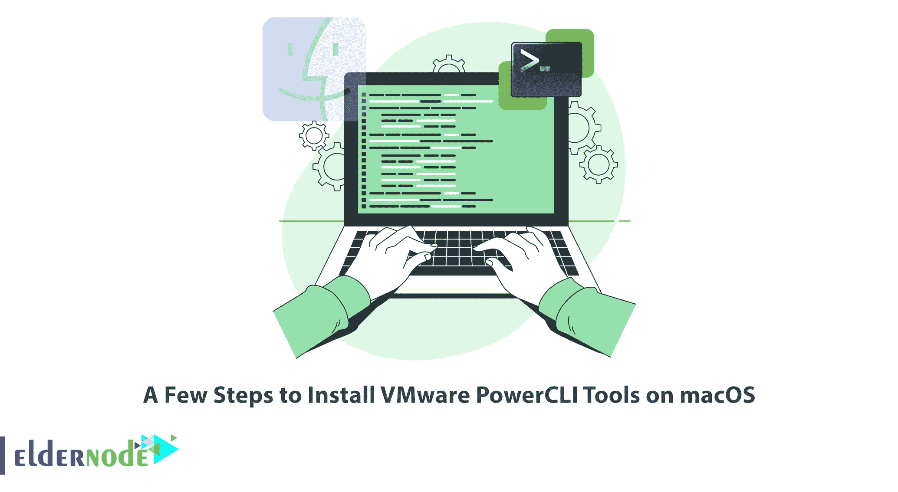

# 在 macOS 上安装 VMware PowerCLI 工具的几个步骤

> 原文：<https://blog.eldernode.com/install-vmware-powercli-tools-on-macos/>



如果您是 VMware 虚拟化管理员，您可能希望在 Mac 上安装 VMware PowerCLI，以执行大多数 vSphere 管理任务或自动执行许多操作。本文将教您在 macOS 上安装 VMware PowerCLI 工具的几个步骤。我们提供经济型 VPS 服务器，是用户的最佳选择。如果你想[购买即时 VPS](https://eldernode.com/vps/) 服务器，你可以访问 Eldernode 网站上提供的计划。

## **教程在 macOS 上设置 VMware PowerCLI 工具**

VMware PowerCLI 是一个命令行和一组 PowerShell 模块，用于管理、监控和自动化 VMware vSphere 环境中的流程。PowerCLI 的命令在 Windows PowerShell 环境中执行，这些命令称为 cmdlets，但您也可以将其安装在您的 [Mac](https://blog.eldernode.com/tag/mac/) 上。这些命令是通过 PowerShell APIs 以编程方式调用的，VMware PowerCLI 提供了 700 多个这样的命令。

### **第一步:在 macOS 上安装自制软件**

首先，你需要在 macOS 上安装 Homebrew。家酿是一个软件包管理器，它允许你直接从命令行安装像 PowerShell 这样的软件包。如果您已经安装了它，请跳过这一步。

您可以使用以下命令**下载自制软件**:

```
/bin/bash -c "$(curl -fsSL https://raw.githubusercontent.com/Homebrew/install/HEAD/install.sh)"
```

使用以下命令验证您的安装:

```
brew --version
```

### **第二步:在 macOS 上安装 PowerShell**

在这一步中，您将学习如何在 macOS 上安装 PowerShell。如前所述，您将在上一步安装的家酿软件包的帮助下在 macOS 上安装 PowerShell。

要使用自制软件安装 PowerShell，只需运行以下命令:

```
brew install --cask powershell
```

您可以使用以下命令检查 PowerShell 安装:

```
pwsh
```

要获得较新版本的 PowerShell，只需更新自制公式并升级 PowerShell，如下所示:

```
brew update 
```

```
brew upgrade powershell --cask
```

### **第三步:在 macOS 上安装 VMware PowerCLI 工具**

现在是时候在 macOS 上安装 VMware PowerCLI 工具了。

首先，**在 macOS 上打开 PowerShell** ，如下图:

```
pwsh
```

您可以通过在 PowerShell 中运行以下命令来**安装所有 PowerCLI 模块**:

```
PS /Users/eldernode> Install-Module VMware.PowerCLI -Scope CurrentUser
```

如果你得到一个关于从一个不受信任的库安装模块的警告，如下所示，只需按“ **Y** 或“ **A** 确认安装。

```
Untrusted repository  You are installing the modules from an untrusted repository. If you trust this repository, change its InstallationPolicy value by running the Set-PSRepository cmdlet. Are you sure you want to  install the modules from 'PSGallery'?  [Y] Yes [A] Yes to All [N] No [L] No to All [S] Suspend [?] Help (default is "N"): A
```

模块会自动下载并保存在正确的文件夹中。您可以使用-Scope 参数使 PowerCLI 模块对所有用户可用，如下所示:

```
PS /Users/eldernode> Install-Module VMware.PowerCLI -Scope AllUsers
```

使用下面的命令列出所有可用的模块:

```
Get-Module -ListAvailable
```

这些模块将存储在 **~/中。macOS 工作站上的本地/共享/powershell/Modules** 目录。要访问模块，请运行以下命令:

```
ls ~/.local/share/powershell/Modules
```

### **第四步:在 macOS 上使用 power CLI**

在此步骤中，我们将举例说明如何使用 VMware vSphere cmdlets 来自动管理 vSphere 环境。首先，输入以下命令以获取有关已安装的 PowerCLI 版本的详细信息:

```
PS /Users/eldernode> Get-PowerCLIVersion
```

您应该更新配置以忽略接受 SSL 连接的自签名证书。为此，请输入以下命令:

```
PS /Users/eldernode> Set-PowerCLIConfiguration -InvalidCertificateAction Ignore
```

### **第五步:连接环境**

首先，使用下面的命令建立一个新连接:

```
PS /Users/eldernode> Connect-VIServer -Server esxi01.example.com -Protocol https
```

在 CLI 中传递用户名和密码以非交互方式连接:

```
Connect-VIServer -Server <ServerIP_or_Hostname> -Protocol https -User <Username> -Password <Password>
```

通过运行 cmdlet 检索可用的数据存储区，如下所示:

```
PS /Users/eldernode> Get-Datastore
```

若要搜索 cmdlets 命令，请在 PowerCLI 中使用 regex，如下所示:

```
PS /Users/eldernode> Get-VICommand *switch
```

就是这样！

## 结论

在本文中，我们一步一步地教您如何在 macOS 上安装 VMware PowerCLI 工具。我希望本教程对您有用，并能帮助您在 macOS 上安装 VMware PowerCLI 工具。如果你在安装过程中遇到任何问题，你可以在评论区联系我们。