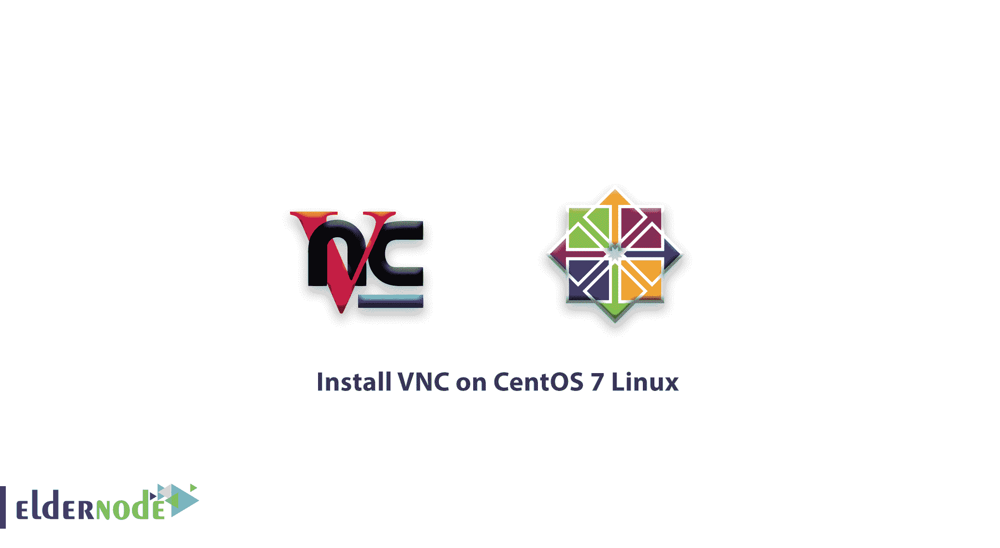
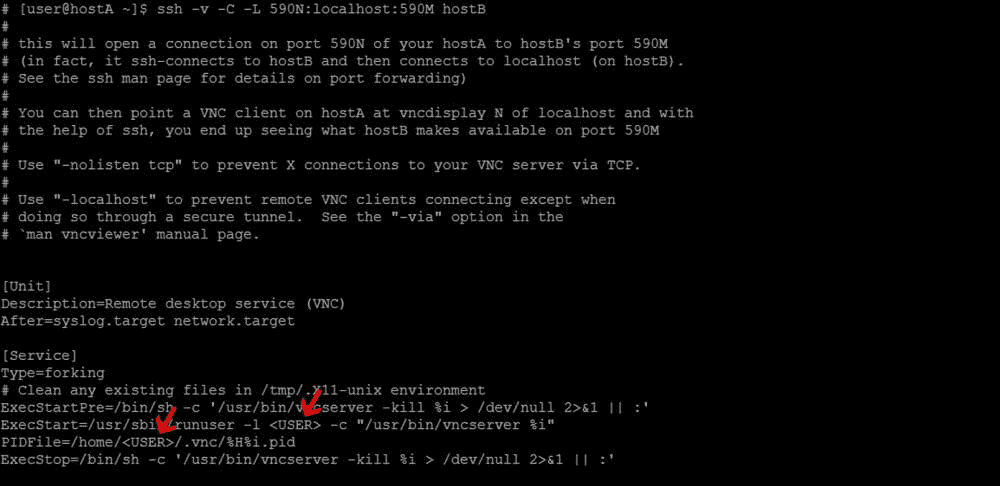

# 如何在 CentOS 7 Linux 上安装 vnc 在 CentOS 7 上设置 VNC

> 原文：<https://blog.eldernode.com/install-vnc-centos-7/>



你已经学会了如何在 CentOS 6 上安装 VNC，在这篇文章中，我们将学习**如何在 CentOS 7** Linux 上安装 VNC。用户通常使用终端环境和 [SSH 服务](https://eldernode.com/tag/install-ssh-server/)来处理 Linux 服务器。但是对于一些用户来说，使用 Linux 命令有点烦人。所以他们对在远程图形环境中使用 Linux 感兴趣。 [Linux CentOS 7](https://www.centos.org/) 以及其他 Linux 发行版默认情况下不具备从远程图形环境控制它的能力。

## 如何在 CentOS 7 Linux 上安装 VNC

在开始 VNC 安装和设置过程之前，使用下面的命令更新您的 **CentOS 7**

```
yum update
```

**1-** 首先，在 CentOS 7 Linux 上安装 Gnome graphics 环境。

```
yum groupinstall "GNOME Desktop"
```

**确保**Gnome 环境已经完全安装。

**2-** 安装**Gnome 图形环境**后，输入以下命令下载并安装 VNC。

```
yum install tigervnc-server xorg-x11-fonts-Type1
```

安装现在已经完成，我们将继续进行 CentOS 7 Linux 上的 **VNC 设置**。

### CentOS 7 Linux 上的 VNC 设置

**1-** 首先，复制 VNC 设置文件。

**请注意:**此时您需要指定 VNC 正在使用的端口。

在这个命令中，我们添加了数字 **3** ，这意味着使用端口 **5903** 。

如果要使用端口 **5901** 或 **5902** ，分别输入 1 或 2，而不是 **3** 。

```
cp/lib/systemd/system/[[email protected]](/cdn-cgi/l/email-protection)/etc/systemd/system [[email protected]](/cdn-cgi/l/email-protection):3.service
```

**2-** 在设置 VNC 之前，创建一个用户来使用它。

请记住，根用户**不能使用**连接到 VNC。

```
useradd eldernode
```

```
passwd eldernode
```

**3-** 用 **vi** 编辑器创建用户后，打开文件/ **etc/systemd/system/ [【邮件保护】](/cdn-cgi/l/email-protection) :3.service**

**4-** 在你看到单词的部分替换你建立的用户。



**5-** 转到您创建的用户界面。

```
su eldernode
```

**5-** 输入 **VNCServer** 命令，添加相应用户的 **VNC** 密码。

```
firewall-cmd --permanent --zone=public --add-port=5903/tcp firewall-cmd --reload
```

**7-** 要运行 VNC 服务，请在每次重新启动后输入以下命令。

**请注意**:VNC 服务需要在每次重启后手动启动。要自动启动，请输入以下命令

```
systemctl daemon-reload  systemctl start [[email protected]](/cdn-cgi/l/email-protection):3.service  systemctl enable [[email protected]](/cdn-cgi/l/email-protection):3.service 
```

到目前为止，您已经在 CentOS 7 Linux 上安装了 **VNC** ，下面是如何连接到它的方法。

### 安装和配置 VNC 客户端

**1-** 要连接到 **VNC 服务器**，必须使用客户端版本。

**2-** 下载程序后，运行 **VNC 客户端**。

**3-** 在顶栏中，输入 **IP** 地址和端口。

**4-** 搜索后，您将被要求输入您为 VNC 创建的用户密码。

在这里，您已经成功地连接了您的 Linux。为了更加安全，它可能会再次要求您输入密码。请不要错过我们未来的相关文章。

亲爱的用户，我们希望这篇教程能对你有所帮助，如果你有任何问题或想查看我们的用户关于这篇文章的对话，请访问[提问页面](https://eldernode.com/ask)。也为了提高你的知识，这里有很多关于[老年节点训练](https://eldernode.com/blog/)的有用教程。

**亦见**

[如何在 Windows 上安装 node . js](https://eldernode.com/install-node-js-on-windows/)

[如何在 Debian 10 上安装 node . js](https://eldernode.com/install-node-js-on-debian-10/)

[在 CentOS 7 Linux 上安装 OpenVAS](https://eldernode.com/install-openvas-centos-7/)