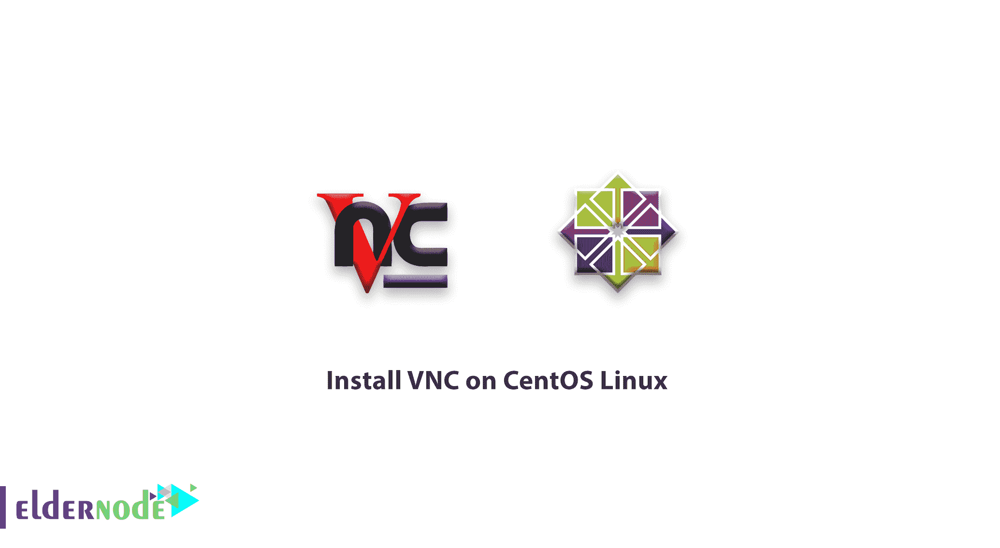

# 如何在 CentOS Linux 上安装 VNC-CentOS Linux 中的 VNC 设置

> 原文：<https://blog.eldernode.com/install-vnc-on-centos-linux/>



我们回来介绍另一个有用的 Linux 应用程序。在本教程中，你将学习如何在 CentOS Linux 上安装 [VNC](https://en.wikipedia.org/wiki/Virtual_Network_Computing) 。VNC 是一个在 [Linux](https://eldernode.com/tag/linux/) 中常用的远程应用程序。用户通常使用终端环境和 [SSH](https://eldernode.com/ssh-connection-softwares/) 服务与 Linux 服务器一起工作。但是一些用户更喜欢使用他们的 Linux 服务器来使用它的图形环境。通过使用微软视窗中的新功能远程桌面，用户可以通过图形环境轻松连接到他们的服务器。但在 CentOS Linux 和其他 Linux 发行版中，默认情况下没有 Windows 桌面遥控器这种东西，用户必须使用一种叫做 VNC 的软件。

## 如何在 CentOS Linux 上安装 VNC

请注意，这些命令可以在 **CentOS 6.5 上运行。**

首先你应该在 CentOS 上安装 **Gnome** 图形环境。

```
yum groupinstall "Desktop" "Desktop Platform" "X Window System" "Fonts"
```

**注意** : 确保 Gnome 环境安装正确。

安装 Gnome 后，输入以下命令下载并安装 VNC。

```
yum install tigervnc-server
```

**注** :现在安装完成，下面我们将继续 CentOS Linux 上的 VNC 设置。

**3**–如果您想让 VNC 服务系统**在每次重启时自动运行**，请输入以下命令。

```
chkconfig vncserver on
```

### CentOS Linux 中的 VNC 设置

**1**–首先创建一个新用户。

```
usradd eldernode
```

**2**–然后设置其密码。

```
passwd eldernode
```

**3**–然后进入用 **su** 命令创建的用户界面。

```
su - eldernode
```

**4**–运行以下命令并输入密码以连接到 VNC。

```
vncpasswd
```

输入上述命令后，会询问两次密码。

**5**–返回根用户界面。

```
su -
```

**6**–用编辑器打开/**etc/sys config/vncservers**文件。

```
nano /etc/sysconfig/vncservers
```

**7**–复制以下短语并保存。

VNCSERVER=”1:eldernode”

VNCSERVERARGS[1]=”-geometry 1024×768″

有了上面这句话，eldernode 用户在连接到你的 **CentOS Linux** 后，就拥有了一个分辨率为 1024 × 768 的桌面。

VNC 使用端口 5901 进行通信，所以在你的防火墙中打开这个端口。

```
iptables -A INPUT -p tcp --dport 5901 -j ACCEPT
```

**9**–完成上述步骤后，重启一次 Linux。

```
reboot
```

**注** :到这里为止，你已经学会了如何在你的 CentOS Linux 上安装 VNC，现在开始学习如何安装。

使用自己的服务器， **[购买 Linux VPS，](https://eldernode.com/linux-vps/)**

### 安装和配置 VNC 客户端

**1**–要连接到 VNC 服务器，您必须使用客户端版本。

**2**——下载程序后，运行 **VNC 客户端**。

**3**–在顶部栏中，输入 IP 地址和端口，如下所示。

**4**–搜索后，您将被要求输入您为 VNC 创建的用户密码。

在这里，你**连接**到你的 Linux，为了更加安全，你可能会再次询问你的密码。

亲爱的用户，我们希望您喜欢本教程，您可以在评论区提出关于本次培训的问题，或者解决[老年节点培训](https://eldernode.com/blog/)领域的其他问题，请参考[提问页面](https://eldernode.com/ask)部分并在其中提出您的问题。