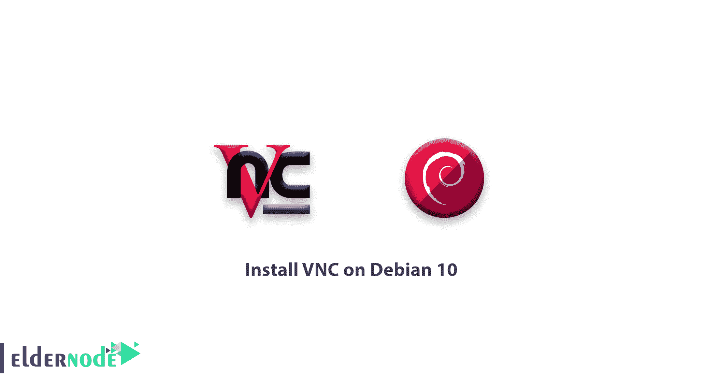

# 如何在 debian 10 上安装 VNC-VNC 设置 Debian 10

> 原文：<https://blog.eldernode.com/install-vnc-on-debian-10/>



之前，你已经在 CentOS 7 上读到过 [VNC。在这篇文章中，我们将学习如何在 Debian 10 上安装 VNC。Vnc(虚拟网络计算)是一个连接系统，使用户更容易在远程服务器上安装软件、管理文件和设置。那些不习惯命令行的人，可以使用 VNC 让他们使用键盘和鼠标与远程服务器上的图形桌面环境进行交互。接下来，你将学习如何使用](https://eldernode.com/install-vnc-centos-7/) [TightVNC](https://www.tightvnc.com/) ，一个远程控制包，在 Debian 10 服务器上建立一个 VNC 服务器，并通过 [SSH](https://eldernode.com/tag/install-ssh-server/) 隧道连接到它。

## 如何在 Debian 10 上安装 VNC

**先决条件**

如果您知道以下内容，本教程可能会更有用:

**1-** 要设置一个 Debian 10，访问 Debian 10 初始服务器设置教程，包括一个非根用户 sudo 访问和一个防火墙。

**2-** 通过 SSh 隧道支持 VNC 连接的计算机。

在 Linux 上，选择 vinagre、krdc、RealVNC 或 TightVNC 中的一个。

2-2 在 macOS 上，使用内置的屏幕共享程序，或者 RealVNC 这样的跨平台 app。

2-3 在 Windows 上，可以使用 TightVNC、RealVNC 或 UltraVNC。

### 在 Debian 10 上逐步安装和配置 VNC

**第一步**—**先安装桌面环境和 VNC 服务器**。

如您所知，Debian 10 服务器上默认不安装图形环境，所以我们将从安装开始。当然，安装最新的 Xfce 桌面环境的软件包和官方 Debian 仓库中的 TightVNC 软件包。

**更新**您的套餐列表:

```
sudo apt update
```

**在服务器上安装**Xfce 桌面环境:

```
sudo apt install xfce4 xfce4-goodies
```

如果系统提示您选择键盘布局，请选择适合您的语言的，然后按 Enter 键。然后安装将继续。安装完成后，安装 TightVNC 服务器:

```
sudo apt install tightvncserver
```

使用 vncserver 命令设置安全密码并创建初始配置文件，以完成 VNC 服务器的配置。

```
vncserver
```

然后，您必须输入并验证密码才能远程访问您的机器:

```
Output    You will require a password to access your desktops.  Password:  Verify: 
```

密码**的长度必须在 6 到 8 个字符之间。但是超过 8 个字符的密码将被自动截断。如果您使用只读密码登录，您将无法使用鼠标或键盘控制 VNC 即时。要为服务器创建默认配置文件和连接信息，请执行以下操作:**

输出

```
Would you like to enter a view-only password (y/n)? n  xauth:  file /home/noodi/.Xauthority does not exist    New 'X' desktop is your_hostname:1    Creating default startup script /home/noodi/.vnc/xstartup  Starting applications specified in /home/noodi/.vnc/xstartup  Log file is /home/noodi/.vnc/your_hostname:1.log
```

**第二步**–**配置 VNC 服务器**

VNC 需要验证它应该连接到哪个图形桌面。这些命令在中名为 xstartup 的配置文件中可用。您的主目录下的 vnc 文件夹。当您运行 vncserver 命令时，启动脚本被创建。设置 VNC 后，它在端口 5901 启动。被 VNC 称为:1 。当然，它可以在其他显示端口上启动多个实例，如 : 2， 3 。由于您可能会更改 VNC 服务器的配置方式，您应该首先使用以下命令停止运行在端口 5091 上的 VNC 服务器。

您可能会看到不同的 PID，但是，输出如下所示:

```
vncserver -kill :1 
```

通过在修改 xstartup 之前输入该命令，可以备份原始文件。

```
Output    Killing Xtightvnc process ID17648
```

**现在**创建一个新的 xstartup 文件，并在文本编辑器中打开它:

```
mv ~/.vnc/xstartup ~/.vnc/xstartup.bak
```

如果你以前没有做过，你需要 VNC 来启动你的桌面环境。将以下命令添加到文件中:

```
nano ~/.vnc/xstartup
```

。Xresources 是用户可以更改图形桌面设置的地方。您需要使 VNC 服务器可执行，以确保它能够使用这个新的启动文件。

```
~/.vnc/xstartup    #!/bin/bash     xrdb $HOME/.Xresources    startxfce4 &
```

您应该在这里重新启动 VNC 服务器。

```
sudo chmod +x ~/.vnc/xstartup 
```

输出可能显示如下。

```
vncserver
```

**第三步**–**安全连接 VNC 桌面**

```
Output    New 'X' desktop is your_hostname:1    Starting applications specified in /home/noodi/.vnc/xstartup  Log file is /home/noodi/.vnc/your_hostname:1.log
```

`您应该使用 SSH 隧道安全地连接到您的服务器，因为 VNC 不使用安全协议。因此，创建 SSH 连接来为 VNC 转发 localhost 连接。通过 Linux 或 macOS 上的终端，使用以下命令完成此操作:`

`注意:将 noodi 和 your_server_ip 替换为您服务器的非 root 用户名和 ip 地址。使用 your_server_ip 作为连接 ip，如果您使用的是图形 SSH 客户端，如 PuTTY，则设置 localhost:5901 。`

```
`ssh -L 5901:127.0.0.1:5901 -C -N -l noodi your_server_ip`
```

`一旦连接上，您将看到默认的 Xfce 桌面。`

``

`当您点击**使用默认配置**时，您将快速配置您的桌面。`

`要使用文件管理器或命令行，您可以访问您的主目录中的文件，如下所示:`

``

`您可以使用 CTRL+C 来停止 SSH 隧道，这将断开您的 VNC 会话。`

`**第四步**–**运行 VNC 作为系统服务**`

`作为 systemd 服务，您可以在设置 VNC 服务器后启动、停止和重新启动它。因此，首先使用文本编辑器创建一个名为 /etc/systemd/system/ [【电子邮件保护】](/cdn-cgi/l/email-protection) 的新单元文件。`

`如果您对符号 @ 有疑问，它允许您传入一个参数，您可以在服务配置中使用它。当您管理该服务时，您可以使用它来指定您想要使用的 VNC 显示端口。`

```
`sudo nano /etc/systemd/system/[[email protected]](/cdn-cgi/l/email-protection)`
```

`将以下几行添加到文件中。请务必更改**用户**、**组**、**工作目录**的值，以及 **PIDFILE** 的值中的用户名，以匹配您的用户名:`

`ExecStartPre 命令停止 VNC。`

```
`[Unit]  Description=Start TightVNC server at startup  After=syslog.target network.target    [Service]  Type=forking  User=noodi  Group=noodi  WorkingDirectory=/home/noodi    PIDFile=/home/noodi/.vnc/%H:%i.pid  ExecStartPre=-/usr/bin/vncserver -kill :%i > /dev/null 2>&1  ExecStart=/usr/bin/vncserver -depth 24 -geometry 1280x800 :%i  ExecStop=/usr/bin/vncserver -kill :%i    [Install]  WantedBy=multi-user.target` 
```

`ExecStart 命令启动 VNC，并将颜色深度设置为 24 位颜色，分辨率为 1280×800。`

`保存并关闭文件。`

`现在，让系统知道新的单元文件，输入下面的命令。`

`然后启用单元文件。`

```
`sudo systemctl daemon-reload`
```

`要停止 VNC 服务器的当前实例，请执行以下操作:`

```
`sudo systemctl enable [[email protected]](/cdn-cgi/l/email-protection)`
```

`要像启动任何其他 systemd 服务一样启动它:`

```
`vncserver -kill :1`
```

`验证它是用这个命令启动的。`

```
`sudo systemctl start [[email protected]](/cdn-cgi/l/email-protection)`
```

`当它正确启动时，输出应该如下所示:`

```
`sudo systemctl status [[email protected]](/cdn-cgi/l/email-protection)`
```

`输出`

`当您重新启动机器时，VNC 服务器现在将可用。`

```
`[[email protected]](/cdn-cgi/l/email-protection) - Start TightVNC server at startup     Loaded: loaded (/etc/systemd/system/[[email protected]](/cdn-cgi/l/email-protection); enabled; vendor preset: enabled)     Active: active (running) since Thu 2019-10-10 17:56:17 UTC; 5s ago    Process: 935 ExecStartPre=/usr/bin/vncserver -kill :1 > /dev/null 2>&1 (code=exited, status=2)    Process: 940 ExecStart=/usr/bin/vncserver -depth 24 -geometry 1280x800 :1 (code=exited, status=0/SUCCESS)   Main PID: 948 (Xtightvnc)  . . .`
```

`现在再次启动您的 SSH 隧道:`

`要连接到您的机器，请通过您的 VNC 客户端软件建立到 localhost:5901 的新连接。`

```
`ssh -L 5901:127.0.0.1:5901 -C -N -l noodi your_server_ip`
```

`亲爱的用户，我们希望这篇教程能对你有所帮助，如果你有任何问题或想查看我们的用户关于这篇文章的对话，请访问[提问页面](https://eldernode.com/ask)。也为了提高你的知识，有这么多有用的教程为[老年节点培训](https://eldernode.com/blog/)准备。`

`**不要错过**`

`[如何在 CentOS Linux 上安装 VNC](https://eldernode.com/install-vnc-on-centos-linux/)`

`[Webmin Linux、Ubuntu 和 Debian web 管理工具](https://eldernode.com/webmin-linux-ubuntu-and-debian/)`

`[How to install VNC on CentOS Linux](https://eldernode.com/install-vnc-on-centos-linux/)`

`[Webmin Linux, Ubuntu and Debian web management tool](https://eldernode.com/webmin-linux-ubuntu-and-debian/)`