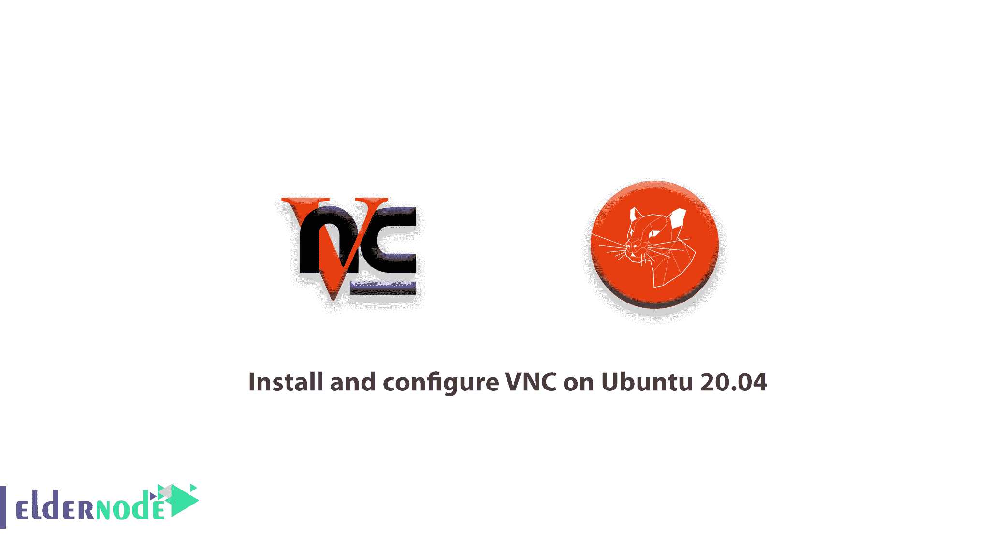
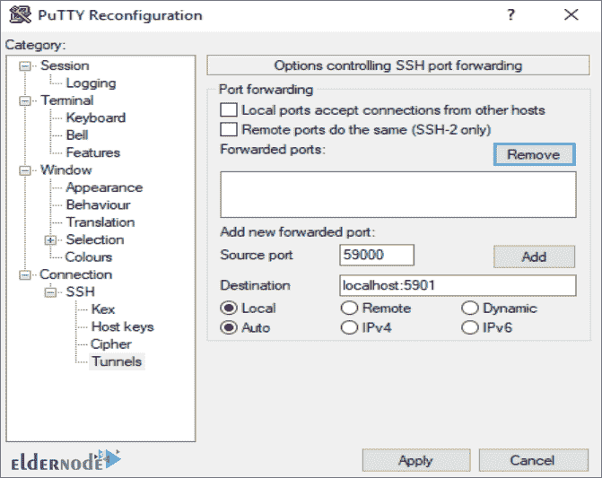

# 如何在 Ubuntu 20.04 上安装和配置 VNC-教程 VNC·Ubuntu

> 原文：<https://blog.eldernode.com/install-vnc-ubuntu-20/>



[更新日期:2021-02-06] VNC(虚拟网络计算)是一个连接系统，允许您使用键盘和鼠标与远程服务器上的图形桌面环境进行交互。对于不熟悉命令行的用户来说，它使管理远程服务器上的文件、软件和设置变得更加容易。通过介绍 VNC，我们将带你开始这个关于如何在 Ubuntu 20.04 上安装和配置 VNC 的教程。你可以在 [Eldernode](https://eldernode.com/) 看到购买 [Ubuntu VPS](https://eldernode.com/ubuntu-vps/) 服务器的套餐。

## **教程在 Ubuntu 20.04 上安装配置 VNC**

### **在 Ubuntu 20.04 上安装 VNC 的先决条件**

如果您考虑以下内容，本教程可能会更有用:

–拥有 Sudo 权限的非 root 用户

为了**设置**，按照我们的T3 在 Ubuntu 20.04T5 上的初始服务器设置

–安装了 **VNC** 客户端的本地计算机。您使用的 VNC 客户端必须支持通过 SSH 隧道的连接:

在 [Windows](https://blog.eldernode.com/tag/windows/) 上，可以使用 TightVNC、RealVNC 或者 UltraVNC。同样在 **macOS** 上，你可以使用内置的屏幕共享程序，也可以使用 RealVNC 这样的跨平台应用。在 [Linux](https://blog.eldernode.com/tag/linux/) 上，你可以从许多选项中选择，包括 Vinagre、krdc、RealVNC 或 TightVNC。

## **在 Ubuntu 20.04 上安装配置 VNC**

让我们通过本教程的步骤来学习如何在 [Ubuntu](https://blog.eldernode.com/tag/ubuntu/) 20.04 上安装和配置 VNC。所以 j 和我们一起来看看如何在 Ubuntu 20.04 服务器上用 [TightVNC](https://www.tightvnc.com/) 建立一个 VNC 服务器，并通过 SSH 隧道安全地连接到它。然后，您将在本地机器上使用 VNC 客户端程序，通过图形桌面环境与服务器进行交互。

由于 Ubuntu 20.04 服务器没有默认安装图形桌面环境或 VNC 服务器，所以你将从安装它们开始。在选择 VNC 服务器和桌面环境时，您有很多选择。

在本教程中，您将为最新的 Xfce 桌面环境安装软件包，并从官方 Ubuntu 资源库安装 TightVNC 软件包。Xfce 和 TightVNC 都以轻量级和快速而闻名，这将有助于确保 VNC 连接即使在较慢的互联网连接上也是平滑和稳定的。

### **如何安装桌面环境和 VNC 服务器**

使用 SSH 连接到您的服务器后，更新您的软件包列表:

```
sudo apt update
```

然后，安装 Xfce 和 **xfce4-goodies** 包，该包包含一些针对桌面环境的增强功能:

```
sudo apt install xfce4 xfce4-goodies 
```

您可能会看到一些提示，要求您为 Xfce 选择一个默认的显示管理器。它将允许您通过图形界面选择并登录到桌面环境。只有当你连接到 VNC 客户端时，你才会使用 Xfce，在这些 Xfce 会话中，你已经以非根 Ubuntu 用户的身份登录了。因此，出于本教程的目的，您选择的显示管理器是不相关的。选择任意一个并按下**键进入**。

接下来，安装 TightVNC 服务器:

```
sudo apt install tightvncserver 
```

要设置 VNC 访问密码，请运行 **vncserver** 命令。创建初始配置文件，并启动一个 VNC 服务器实例:

```
vncserver
```

当系统提示您输入并验证密码以远程访问您的计算机时:

**输出**

```
You will require a password to access your desktops.    Password:  Verify:
```

如您所知，[密码](https://blog.eldernode.com/how-to-create-strong-password/)的长度必须在 6 到 8 个字符之间。超过 8 个字符的密码将被自动截断。

验证密码后，您可以选择创建一个仅供查看的密码。使用只读密码登录的用户将无法使用鼠标或键盘控制 VNC 实例。如果您想向使用您的 VNC 服务器的其他人演示一些东西，这是一个有用的选项，但这不是必需的。

您可以看到该过程为服务器创建了必要的默认配置文件和连接信息。尽管如此，它在端口 5901 上启动一个默认的服务器实例。这个端口被称为显示端口，被 VNC 称为:1。VNC 可以在其他显示端口上启动多个实例，2 表示端口 5902，3 表示端口 5903，依此类推:

**输出**

```
Would you like to enter a view-only password (y/n)? n  xauth:  file /home/noodi/.Xauthority does not exist    New 'X' desktop is your_hostname:1    Creating default startup script /home/noodi/.vnc/xstartup  Starting applications specified in /home/noodi/.vnc/xstartup  Log file is /home/noodi/.vnc/your_hostname:1.log
```

***记住** :* 如果您想要更改密码或添加只读密码，可以使用 vncpasswd 命令:

```
vncpasswd
```

刚才，VNC 服务器已经安装并运行。现在让我们将其配置为启动 Xfce，并通过图形界面访问服务器。

### **如何配置 VNC 服务器**

为了帮助您学习这一步，请注意 VNC 服务器需要知道在启动时要执行哪些命令。具体来说，VNC 需要知道它应该连接到哪个图形桌面环境。

VNC 服务器在启动时运行的命令位于**中名为 **xstartup** 的配置文件中。您的主目录下的 vnc** 文件夹。启动脚本是在上一步运行 **vncserver** 命令时创建的，但是您将创建自己的脚本来启动 Xfce 桌面。因为您将更改 VNC 服务器的配置方式，所以首先使用以下命令停止在端口 **5901** 上运行的 VNC 服务器实例:

```
vncserver -kill :1
```

**输出**

```
Killing Xtightvnc process ID 17648
```

要在修改 **xstartup** 文件之前备份原始文件:

```
mv ~/.vnc/xstartup ~/.vnc/xstartup.bak 
```

然后您可以创建一个新的 **xstartup** 文件，并在文本编辑器中打开它。

```
nano ~/.vnc/xstartup 
```

现在将以下几行添加到文件中:

```
~/.vnc/xstartup
```

```
#!/bin/bash  xrdb $HOME/.Xresources  startxfce4 &
```

添加完这些行后，**保存**并关闭文件。如果你用的是 **nano** ，按下 **CTRL + X，Y** ，然后**回车**即可。然后，为了确保 VNC 服务器能够正确使用这个新的启动文件，您需要使它可执行:

```
chmod +x ~/.vnc/xstartup
```

然后，**重启**VNC 服务器:

```
vncserver -localhost 
```

***注意** :* 这次该命令包括-localhost 选项，它将 VNC 服务器绑定到您的服务器的环回接口。这将导致 VNC 只允许来自安装它的服务器的连接。

然后，您将在您的本地机器和您的服务器之间建立一个 SSH 隧道，实际上是欺骗 VNC，让他认为来自您的本地机器的连接源自您的服务器。这种策略将在 VNC 周围增加一层额外的安全性，因为只有那些已经可以通过 SSH 访问您的服务器的用户才能访问它。

**输出**

```
New 'X' desktop is your_hostname:1    Starting applications specified in /home/noodi/.vnc/xstartup  Log file is /home/noodi/.vnc/your_hostname:1.log
```

### **如何安全连接 VNC 桌面**

VNC 本身在连接时不使用安全协议。为了安全地连接到您的服务器，您将建立一个 SSH 隧道，然后告诉您的 VNC 客户端使用该隧道进行连接，而不是直接连接。

在您的本地计算机上创建一个 SSH 连接，该连接将安全地转发到 VNC 的本地主机连接。您可以通过 Linux 或 macOS 上的终端使用以下 ssh 命令来实现这一点:

```
ssh -L 59000:localhost:5901 -C -N -l noodi your_server_ip 
```

看看这个 ssh 命令的选项意味着什么:

**-L 59000:localhost:5901:**-L 开关指定将本地计算机上的给定端口(59000)转发到目标服务器上的给定主机和端口(localhost:5901，表示目标服务器上的端口 5901，定义为 your_server_ip)。请注意，您指定的本地端口有些随意；只要该端口尚未绑定到其他服务，您就可以将其用作隧道的转发端口。

**-C:** 此标志启用压缩，这有助于最小化资源消耗并加快速度。

**-N:** 这个选项告诉 ssh 你不想执行任何远程命令。当您只想转发端口时，此设置很有用。

**-l noodi your _ server _ IP:**-l 开关允许您指定连接到服务器后要登录的用户。一定要换掉诺迪

**your_server_ip** 包含您的非根用户名称和您的服务器 ip 地址。

**阅读更多内容**:这个命令建立一个 SSH 隧道，通过每台机器上的端口 22(SSH 的默认端口)将信息从 VNC 服务器上的端口 5901 转发到本地机器上的端口 59000。假设您遵循了 Ubuntu 20.04 的先决条件[初始服务器设置指南，您将添加一个 UFW 规则来允许通过 OpenSSH 连接到您的服务器。](https://blog.eldernode.com/initial-server-setup-on-ubuntu-20/)

这比简单地打开服务器的防火墙允许连接到端口 5901 更安全，因为这将允许任何人通过 VNC 访问您的服务器。通过 SSH 隧道连接，您将 VNC 访问限制在已经可以通过 SSH 访问服务器的机器上。

此外，如果您使用 PuTTY 连接到您的服务器，您可以通过右键单击终端窗口的顶部栏来创建 SSH 隧道，然后单击**更改设置…** 选项。

当您通过最后一个部分时，在 PuTTY 重新配置窗口左侧的树形菜单中找到**连接**分支。展开 **SSH** 分支，点击**隧道**。在**选项控制 SSH 端口转发**屏幕上，输入 59000 作为**源端口**，输入 localhost:5901 作为**目的端口**，如下所示:



当你访问这个窗口时，点击**添加**按钮，然后**应用**按钮实现隧道。

一旦隧道运行，使用 VNC 客户端连接到 **localhost:59000** 。您将看到使用您在步骤 1 中设置的密码进行身份验证的提示。

当您连接时，您将看到默认的 Xfce 桌面。

此外，您可以使用文件管理器或从命令行访问主目录中的文件。

在本地终端中按下 **CTRL+C** 来停止 SSH 隧道并返回到您的提示符。这也将断开您的 VNC 会话。

**最后**，现在您可以配置您的 VNC 服务器作为 systemd 服务运行。

### **运行 VNC 作为系统服务**

您可以像任何其他服务一样，根据需要启动、停止和重启它。因此，当您设置 VNC 服务器作为 systemd 服务运行时。您还可以使用 systemd 的管理命令来确保 VNC 在服务器启动时启动。

但是首先，创建一个新的单元文件，名为 **/etc/systemd/system/ [【邮件保护】](/cdn-cgi/l/email-protection) :**

```
sudo nano /etc/systemd/system/[[email protected]](/cdn-cgi/l/email-protection) 
```

关于更多的解释，名称末尾的@符号将让我们传入一个可以在服务配置中使用的参数。您将使用它来指定管理服务时要使用的 VNC 显示端口。将以下几行添加到文件中。请务必更改**用户**、**组**、**工作目录的值。**和 **PIDFILE** 的值中的用户名来匹配您的用户名:

```
/etc/systemd/system/[[email protected]](/cdn-cgi/l/email-protection)
```

```
[Unit]  Description=Start TightVNC server at startup  After=syslog.target network.target    [Service]  Type=forking  User=noodi  Group=noodi  WorkingDirectory=/home/noodi    PIDFile=/home/noodi/.vnc/%H:%i.pid  ExecStartPre=-/usr/bin/vncserver -kill :%i > /dev/null 2>&1  ExecStart=/usr/bin/vncserver -depth 24 -geometry 1280x800 -localhost :%i  ExecStop=/usr/bin/vncserver -kill :%i    [Install]  WantedBy=multi-user.target
```

而且让我们更了解上面的命令。如果 VNC 已经在运行，ExecStartPre 命令会停止它。ExecStart 命令启动 VNC，并将颜色深度设置为 24 位颜色，分辨率为 1280×800。您也可以修改这些启动选项来满足您的需要。还要注意的是， **ExecStart** 命令再次包含了 **-localhost** 选项。您现在可以保存并关闭文件，然后让系统知道新的单元文件:

```
sudo systemctl daemon-reload
```

要启用单位文件:

```
sudo systemctl enable [[email protected]](/cdn-cgi/l/email-protection) 
```

让我们再次解释一下,@符号后面的 1 表示服务应该出现在哪个显示号上，在这种情况下，默认为步骤 2 中讨论的 1。

要停止当前仍在运行的 VNC 服务器实例，请执行以下操作:

```
vncserver -kill :1 
```

然后像启动任何其他 systemd 服务一样启动它:

```
sudo systemctl start [[email protected]](/cdn-cgi/l/email-protection) 
```

您可以使用以下命令验证它是否已启动:

```
sudo systemctl status [[email protected]](/cdn-cgi/l/email-protection) 
```

**输出**

```
● [[email protected]](/cdn-cgi/l/email-protection) - Start TightVNC server at startup       Loaded: loaded (/etc/systemd/system/[[email protected]](/cdn-cgi/l/email-protection); enabled; vendor preset: enabled)       Active: active (running) since Thu 2020-05-07 17:23:50 UTC; 6s ago      Process: 39768 ExecStartPre=/usr/bin/vncserver -kill :1 > /dev/null 2>&1 (code=exited, status=2)      Process: 39772 ExecStart=/usr/bin/vncserver -depth 24 -geometry 1280x800 :1 (code=exited, status=0/SUCCESS)     Main PID: 39795 (Xtightvnc)  ...
```

至此，只要您的服务器启动，VNC 服务器就可以使用了，您可以像管理任何其他 systemd 服务一样使用 **systemctl** 命令来管理它。

然而，在客户端不会有任何不同。要重新连接，请再次启动 SSH 隧道。

```
ssh -L 59000:localhost:5901 -C -N -l noodi your_server_ip 
```

然后，为了连接到您的服务器，使用您的 VNC 客户端软件建立一个到 **localhost:59000** 的新连接

## 结论

VNC，被许多人称为控制台，用于在网络中断和无法访问时监控服务器状态。使用 VNC，您可以查看服务器的状态。并检查无法访问您的服务器的问题是什么。许多服务器在启动时会挂起，或者 sshd 服务可能无法在 Linux 服务器上正常工作。有了 VNC，你可以进入服务器，用它来检查和解决问题。我们试图一步一步地教你如何在 Ubuntu 20.04 上安装和配置 VNC。现在，您将能够通过用户友好的图形界面管理您的文件、软件和设置。你还可以远程运行图形软件，比如网络浏览器。