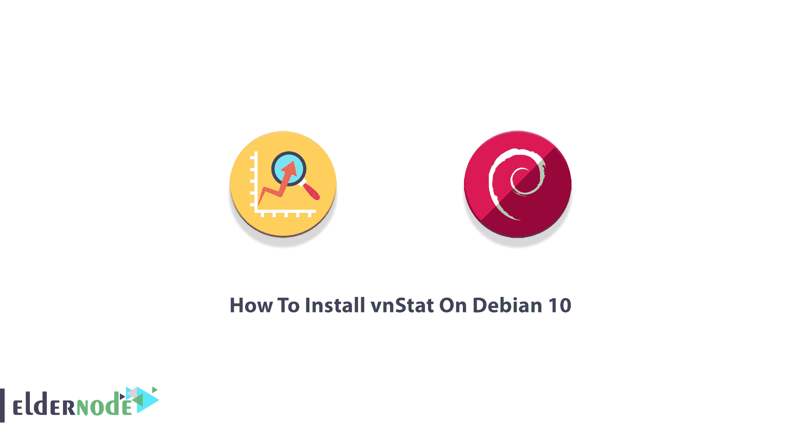
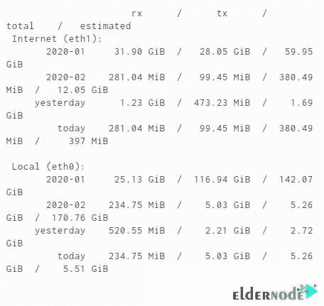
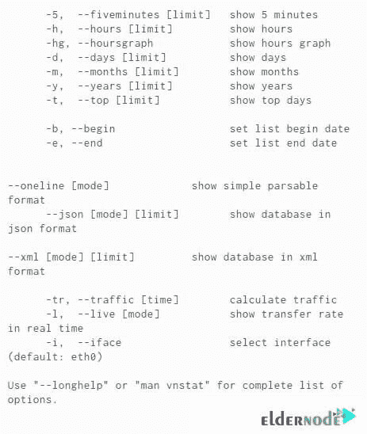

# 如何在 Debian 10[完整版] - Eldernode 博客上安装 vnStat

> 原文：<https://blog.eldernode.com/install-vnstat-on-debian-10/>



作为管理员，您可能需要一个工具来监控网络带宽，统计网络设备上的传输和接收，然后检查保存在数据库中的数据。VnStat 是一个命令行网络监控实用程序。这样，您可以在监视服务器的同时检查其性能。在本文中，您将学习如何在 Debian 10 上安装 vnStat。要开始这个教程，你需要有一个运行 Debian 10 的云服务器。因此，在 [Eldernode](https://eldernode.com/) 上订购您喜欢的软件包，购买您自己的 **[Linux VPS](https://eldernode.com/linux-vps/)** 。

## **教程在 Debian 10 上一步步安装 vnStat**

vnStat 是一个用于 Linux 的网络流量监视器。它是一个开源的轻量级实用程序，为选定的接口保存网络流量日志，并使用内核提供的网络接口统计信息作为信息源。您可以使用 vnStat 来收集系统重新启动过程中的持续统计数据，并提供 5 分钟、每小时、每天、每月、每周、每年的使用情况摘要，以及显示其历史记录中使用最多的天数。您也可以在没有 root 权限的情况下使用 vnStat **并检查存储在数据库中的流量统计数据。它还按网络接口呈现，并且所有网络接口都有自己的数据库。**

### 在 Debian 10 上安装 vnStat 并检查 vnStat 特性

我们来看看 vnStat 有什么特点。以下是它们的列表:

–同时监控多个网络接口

–一旦系统重新启动，统计数据仍然可用

–多种输出选项

–使用 JSON 进行输出

–按小时、天、月、周对数据进行排序，或获取前 10 天的数据

–接口带宽将自动检测

–生成输出的 png 图形

–针对 vnStat.cgi 的内容定位和图像背景颜色的可定制选项

–配置“月”,以跟进您可能拥有的不同计费周期

–非常轻–消耗很少一部分系统资源

–无论产生多少流量，CPU 使用率都很低

–安装和运行快速简单

–数据保留期限完全由用户动态配置

–无论流量如何，CPU 使用率都一样低

–无需 root 权限即可使用

–在线颜色配置编辑器

## **在 Debian 10 上安装 vnStat**

您现在可能有兴趣使用 vnStat 并使用它的特性。所以，让我们来看一下本指南的步骤，并回顾一下在 [Debian](https://blog.eldernode.com/tag/debian/) 10 上安装 vnStat 的过程。

*第一步:*

正如您在上一篇关于在 Ubuntu 上安装 vnStat 的文章中所了解到的，vnStat 可以从 Debian/Ubuntu 官方仓库获得。要安装它的软件包，您只需运行以下命令:

```
sudo apt-get install vnstat
```

*第二步:*

vnStatd 守护程序将在安装后自动启动。当 Debian 启动时，它会自动启动。要使用 systemctl 检查并启动服务，请键入:

```
sudo systemctl start vnstat.service
```

*第三步:*

现在，使用下面的命令确保 vnStat 在引导时自动启动:

```
sudo systemctl enable vnstat.service
```

### **如何在 Debian Linux 上使用 vnStat**

从现在开始，vnStat 将开始捕获服务器接口上的流量数据和统计信息。还有，你在等收到数据报告。但是 vnStat 在显示数据之前需要建立一些数据。不要担心！只需运行以下命令来查看 vnStat 的标准报告:

```
vnstat
```

该报告可能如下所示:



接下来，如果希望获得更具体的数据输出，可以使用标志。如果将这些标志附加到 vnStat 命令，就可以得到如下所述的特定输出:



### **如何为网络接口创建数据库**

正如我们在本文开始时提到的，在 Debian 10 上安装 vnStat 之后，将会为每个网络接口自动初始化一个数据库。 **/var/lib/vnstat** 是 vnstat 的数据库目录:

```
ls /var/lib/vnstat/ eth0 eth1
```

使用以下命令创建一个新数据库。记得用应该监控的接口替换 **eth0** :

```
vnstat --create -i eth0
```

### **如何为一个接口删除数据库**

您也可以删除您创建的数据库。同样，不要忘记用不想监控的接口替换 eth0。因此，运行以下命令删除数据库:

```
vnstat --delete -i eth0
```

守护程序 vnStatd 负责数据检索和存储，而 vnStat 命令提供了一个接口，用于查询存储在特定于网络接口的数据库中的流量信息。

## 结论

在本文中，您了解了如何在 Debian 10 上安装 vnStat。如果您已经仔细地完成了这些步骤，那么您现在已经有了一个 vnStat 的工作安装。开始使用 vnStat 并监控服务器在多个接口上的流量。如果您有兴趣了解更多信息，请查找我们关于在 Centos 7 上使用 vnStat 监控网络流量的相关文章[。](https://blog.eldernode.com/monitor-network-traffic-with-vnstat-on-centos/)