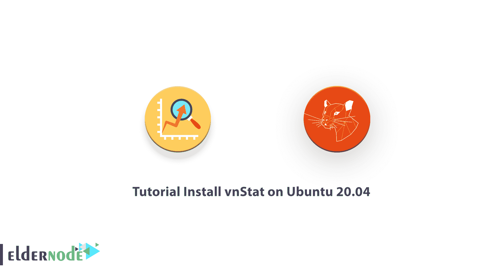

# 教程在 Ubuntu 20.04 上安装 vnStat-elder node 博客

> 原文：<https://blog.eldernode.com/install-vnstat-on-ubuntu-20-04/>



**v**view**n**network**Stat**istics 是一款用于网络流量监控的命令行工具。它还使用 sames 控制键，帮助您记录和查看不同时间段的网络统计数据。这个网络实用程序用于 Linux 操作系统和基于控制台的网络流量监视器。因为流量信息是从 proc 文件系统中分析的，所以可以在没有 root 权限的情况下使用 vnStat。使用 vnStat，您可以以详细表格或命令行统计视图的形式查看每小时、每天、每月的统计信息。和我们一起阅读本指南，来回顾一下在 Ubuntu 20.04 上安装 vnStat 的教程**。要购买全面管理但价格低廉的 **[Ubuntu VPS](https://eldernode.com/ubuntu-vps/)** ，请选择一个软件包或通过 [Eldernode](https://eldernode.com/) 联系我们。**

## **如何一步步在 Ubuntu 20.04 上安装 vnStat**

作为开发人员或系统管理员，您需要监控网络流量或带宽使用情况，以监控共享互联网带宽的各种系统上的流量。通过这种方式，vnStat 可以帮助您监控各种网络参数，如带宽消耗和流入/流出的流量。在本文中，您将了解更多关于 vnStat 的信息，它是可以做到这一点的工具之一，并且在接下来的内容中，将教授在 [Ubuntu](https://blog.eldernode.com/tag/ubuntu/) 20.04 上安装 vnStat 的过程。

### **vnStat 特性**

以下是使用 vnStat 的最重要的好处:

–同时监控多个接口

–安装和运行快速简单

–收集的统计数据会在系统重启后继续存在

–多个输出选项

–数据保留期限完全由用户动态配置

–可以将月份配置为遵循计费周期

–轻，资源使用最少

–无论流量如何，CPU 使用率都一样低

–无需 root 权限即可使用

–在线颜色配置编辑器

## **在**上安装配置 vnStat**Ubuntu 20.04 | Ubuntu 18.04**

vnStat 在 Ubuntu 默认存储库中可用。因此，使用下面的命令来安装它。

```
sudo apt update
```

```
sudo apt install vnstat
```

现在，vnStat 已经安装完毕，可以开始运行了。要测试它是否已安装，可以在终端中键入“vnstat”。因此，您不会看到任何类似“找不到 vnstat”的错误。此外，您可以使用下面的命令来获取所有网络接口的基本统计信息。

```
vnstat
```

### **如何在** **Ubuntu 20.04** 上设置并运行 vnStat

要确保 vnStat 正在运行，请使用以下命令:

```
sudo systemctl status vnstat
```

在确保 vnStst 安装并正确运行之后，您需要找到并设置您希望监视的网络接口。因此，要查看系统上可用网络接口及其名称的列表，请运行:

```
ifconfig
```

现在，为了告诉 vnStat 要监视的网络接口，我们来看一个有线接口，例如“ens33”和一个无线接口“wlan0”。在终端中键入以下命令。

```
vnstat -u -i ens33
```

您已经通过运行上述命令激活了对该接口的监控。如果这是您第一次运行它，您将面临错误:'*无法读取数据库"**/var/lib/vnstat/ens 33***" '。你必须做的唯一反应就是忽略这一点。

如果您有 WLAN，请使用以下命令设置无线网络接口。

```
vnstat -u -i wlan0
```

运行以下命令，查看系统中所有可用的网络接口。

```
vnstat --iflist
```

至此，您已经知道了所有想要监控的接口。因此，如果您对该接口名称使用上述命令，就可以监控流量。然后，使用以下命令启动 vnStat 守护程序。

```
sudo service vnstat start
```

您可以检查守护进程的状态。要从所有注册接口接收每月的总网络流量摘要，请运行以下命令。

```
ps -f | grep vnst
```

使用“-i”选项允许您监控特定网络接口的特定但基本的使用。因此，ens33 的命令如下:

```
vnstat -i ens33
```

***注意*** :将上述命令中的“ens33”替换为任何其他接口，如“eth0”或“wlan0”，将给出该接口的统计信息。在每个表的末尾，vnStat 提供了该月的估计网络使用情况。要控制带宽使用，您可以将此作为 vnStat 的许多有用特性之一。

### **如何在**上使用 vnStat**Ubuntu Linux**

您可以使用 vnStat 监控特定时间段和特定接口的流量。这里，我们仍然继续以 ens33 为例。

**每小时统计视图**

要以基于控制台的图表形式查看每小时统计信息，后面是表示过去 24 小时使用情况的表格，请运行:

```
vnstat -h -i ens33
```

要获得结果，请将“wlan0”替换为“eth0”。

**月度统计视图**

此外，您可以使用“-m”选项查看每月统计数据:

```
vnstat -m -i ens33
```

**每周统计视图**

使用“-w”选项查看接口的每周统计数据:

```
vnstat -w -i ens33
```

### **如何使用 vnStat 制作图形图像**

使用 vnStat 还允许您生成以图形形式表示网络流量的图形图像。要从 vnStat 创建图形并将它们存储在指定的位置，它需要所需的信息。

**一个接口的摘要输出**

使用 vnStati 的"-s "选项获取特定接口的输出。因此，要获得输出并将其作为一个名为“summary.png”的图像存储在主文件夹中，请键入:

```
vnstati -s -i ens33 -o ~/summary.png
```

**每小时显示统计数据**

要获得每小时显示的输出，请使用“-h”选项。为此，请运行以下命令。

***注*** :显示始终为最近 24 小时。

```
vnstati -h -i ens33 -o ~/summary2.png
```

**累计产量**

还有，如果结合多个接口的流量分析，会得到总输出。

看下面的例子，然后检查命令。

“eth0+eth1”通过汇总 eth0 和 eth1 的统计数据得出流量输出。类似地，我们可以添加任意数量的接口，如“eth0+eth1+eth2”或“eth0+wlan0”等。

```
vnstati -s -i wlan0+eth0 -o ~/summary3.png
```

## 结论

在本文中，您了解了如何在 Ubuntu 20.04 上安装 vnStat。vnStat 为您提供各种信息，您可以通过监控网络流量来记录、分析和生成信息，并准备准确的结果。如果您有兴趣了解更多，请找到我们关于 [Linux 服务器监控命令](https://blog.eldernode.com/linux-server-monitoring-commands/)的文章。