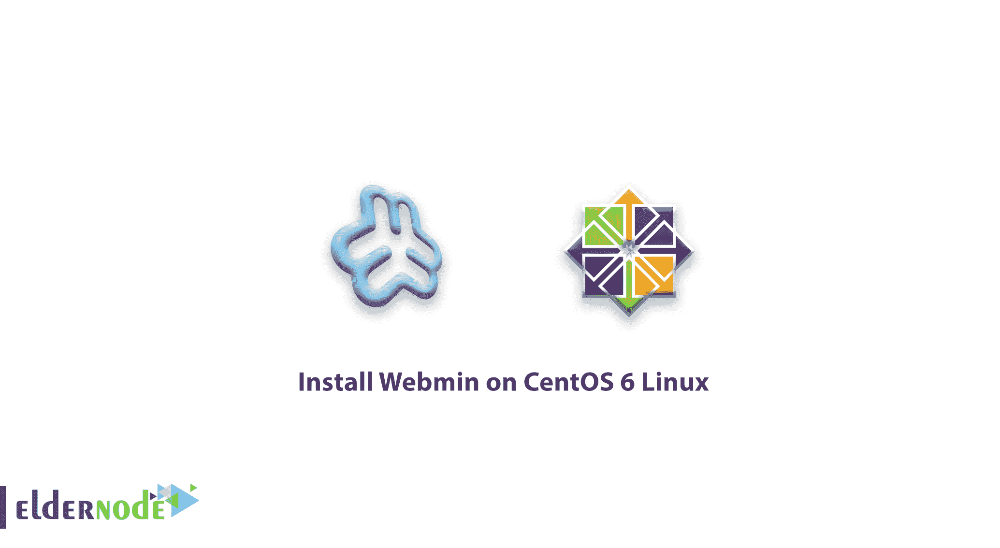
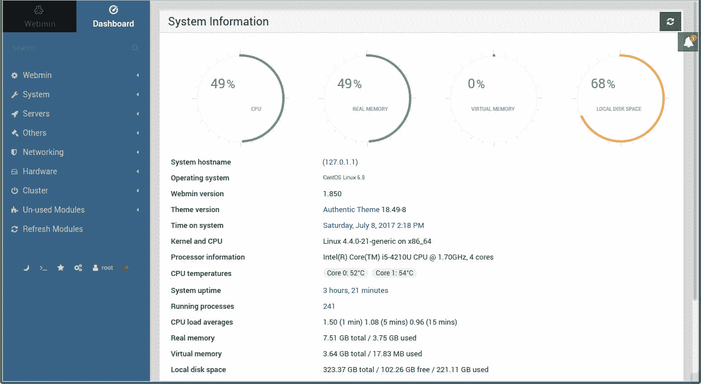

# 如何在 CentOS 6 Linux 上安装 Webmin-Webmin 面板功能 CentOS

> 原文：<https://blog.eldernode.com/install-webmin-centos-6/>



作为服务器管理员，您可以使用系统设置管理工具。在本文中，您将学习如何在 CentOS 6 Linux 上安装 Webmin。 [Webmin](http://www.webmin.com/) 是安装在 Linux 上的基于网络的系统设置管理工具，允许用户访问一些 Linux 设置以及游戏文本工具，如 **Apache** 和 **PHP** 。

## 如何在 CentOS 6 Linux 上安装 Webmin

### 什么是 Webmin

这个工具是由 Webmin 社区在 1997 年开发的。今天，这个 **Linux 控制面板**非常受欢迎， [Linux](https://blog.eldernode.com/tag/linux/) 用户可以使用 Webmin 图形化地设置和接收他们的服务器状态。在这篇文章中，我们将解释 Webmin 的特性，并最终学习如何安装 Webmin。

### Webmin 面板功能

-Apache 管理
-Bind 管理
-管理 IPtables 之类的 Linux 防火墙
-备份
-带宽监控
-操作系统管理控制
-更改密码和管理用户
-集群管理和创建
-网卡设置
-磁盘管理和文件系统
-文件管理
-创建 VPN 连接
-更新服务
-服务管理
-创建和管理电子邮件服务器
-MySQL 和

这些只是部分的 **Webmin 特性**，你可以通过安装它来使用所有的特性。

[购买 CentOS 虚拟专用服务器](https://eldernode.com/centos-vps/)

### CentOS 6 Linux 上的 Webmin 安装教程

**1-** 首先，进入你的 Linux 终端环境。

**2-** 输入以下命令下载 Webmin。

```
wget http://software.virtualmin.com/gpl/scripts/install.sh -O /root/virtualmin-install.sh
```

**请注意**下载完包后，会看到以下语句。

```
2013-07-06 11:03:57 (129 KB/s) – `/root/virtualmin-install.sh’ saved [45392/45392]
```

**3-** 输入以下命令安装 **Webmin** 。

```
sh /root/virtualmin-install.sh
```

**4-** 过一会儿，安装就结束了。

**5-** 在你的系统浏览器中，输入你的 **IP** 地址和**端口 10000** 进入 **Webmin 登录**页面。

例如，输入 192.168.1.10:10000。

```
5.1 Open the port 10000 on your firewall, if the login page **does not** open.    **6-** Log in with your user and password to do **Webmin settings**.
```

**注**:在新版本和你学会安装的版本中， **Webmin tools** 会和 **Virtualmin** 一起安装。

在下图中，您将看到 Webmin 环境的视图。



亲爱的用户，我们希望你喜欢如何在 CentOS 6 Linux 上安装 Webmin 的教程，你可以在评论区提出关于这次培训的问题，或者解决 [Eldernode 培训](https://eldernode.com/blog/)领域的其他问题，请参考[提问页面](https://eldernode.com/ask)部分并在其中提出你的问题。

**亦见**

[virtual min、webmin 和 usermin 的对比](https://eldernode.com/virtualmin-webmin-and-usermin/)

[Webmin Linux、Ubuntu 和 Debian web 管理工具](https://eldernode.com/webmin-linux-ubuntu-and-debian/)

[Comparison of virtualmin, webmin and usermin](https://eldernode.com/virtualmin-webmin-and-usermin/)

[Webmin Linux, Ubuntu and Debian web management tool](https://eldernode.com/webmin-linux-ubuntu-and-debian/)