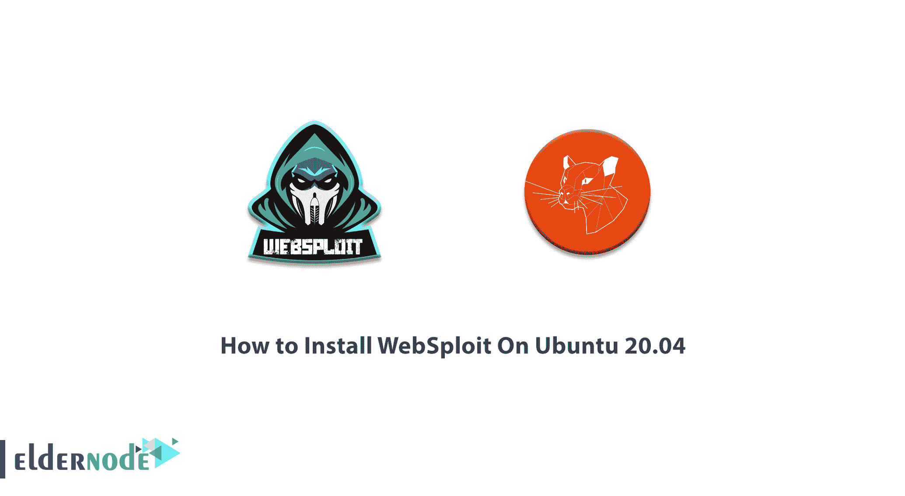

# 如何在 Ubuntu 20.04 - Eldernode 博客上安装 WebSploit

> 原文：<https://blog.eldernode.com/install-websploit-on-ubuntu/>



随着与黑客和安全相关的专有工具和平台的发展，我们正在见证强大工具的发展。这些工具为专业人员的渗透测试操作提供了便利。另一方面，它被许多黑客用来实施恶意攻击。大多数黑客和安全工具都是双刃剑。也就是说，它既用于黑客攻击，也用于安全和入侵测试。因此，所用工具的类型完全取决于用户。最强大的双刃工具之一是 WebSploit 工具。一些人可能认为它是强大的 Metasploit 工具的竞争对手。在本文中，我们将教**如何在 Ubuntu 20.04** 上安装 WebSploit。需要注意的是，你可以访问 [Eldernode](https://eldernode.com/) 提供的包来购买 [Ubuntu VPS](https://eldernode.com/ubuntu-vps/) 服务器。

## **教程在 Ubuntu 20.04 上一步一步安装 web sploit**

如果要参考 Github 网站上对 WebSploit 工具的定义，只写了一句话。[中间人攻击](https://blog.eldernode.com/man-in-the-middle-attack/)的强大框架。可以肯定地说，这个定义只显示了这个强大工具的一个特征，因为它有许多功能。用 Python 编写的 WebSploit 在 [Kali Linux](https://blog.eldernode.com/tag/kali-linux/) 上默认可用，但也可以安装在其他发行版上。在这篇文章的续篇中，加入我们的教程如何在 [Ubuntu](https://blog.eldernode.com/tag/ubuntu/) 20.04 上安装 WebSploit。

### **Websploit 工具功能**

Websploit 工具(如 Metasploit 框架)有许多模块，您可以根据自己的目的进行选择。然后通过设置目标和运行模块来发起攻击。Websploit 有许多功能。该工具可以与 Metasploit 通信以执行攻击。它还能够借助 Metasploit 工具的 Wmap 插件进行扫描和爬行。这个工具的重要之处在于，它支持网络攻击，并扫描和分析 web。该工具的其他功能包括 XSS 钓鱼攻击、Wi-Fi 网络拒绝服务攻击和 ARP 拒绝服务攻击。在本文的后续部分，加入我们学习如何在 Ubuntu 上安装 Websploit。

### **在 Ubuntu 20.04 上安装 WebSploit | Ubuntu 18.04**

在这一节，我们想教你如何在 Ubuntu 20.04 上安装 WebSploit。为此，只需运行以下命令来更新系统:

```
sudo apt-get update
```

现在，您可以使用以下命令轻松安装 Websploit 框架:

```
sudo apt-get install websploit
```

成功安装该工具后，只需运行以下命令即可运行它:

```
websploit
```

## 结论

WebSploit 是一个开源项目，用于远程扫描和分析系统，以找到各种漏洞。这个工具非常强大，支持几个漏洞。在这篇文章中，我们试图教如何在 Ubuntu 20.04 上安装 WebSploit。如果你愿意，可以参考文章[介绍如何在 Kali Linux](https://blog.eldernode.com/introducing-and-install-websploit-on-kali/) 上安装 WebSploit。